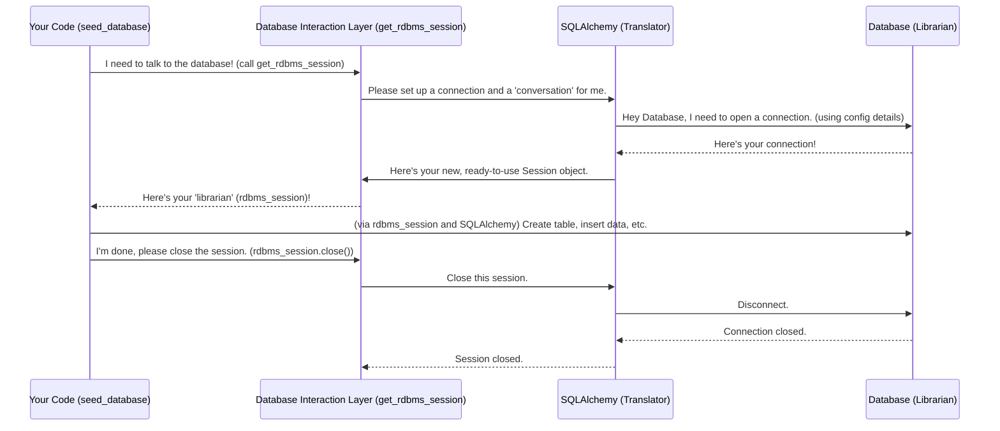

# Chapter 1: Database Interaction Layer

Imagine you're building a special library for your project, `data_seeds`. This library doesn't store physical books; it stores *data* in a database. Now, how do you talk to this database? How do you ask it for specific pieces of information, or tell it to store new data, or even make sure it creates the right shelves (tables) for your books?

This is where the **Database Interaction Layer** comes in! It's like having a super helpful and organized librarian who knows exactly how to communicate with the database. You don't need to learn the complex language of the database; you just tell your "librarian" what you want, and they handle all the tricky details.

In `data_seeds`, our main goal is to "seed" the database. This means filling it with all the initial data it needs to start working. To do this, we need a reliable way to:
1.  **Connect** to the database.
2.  **Send commands** (like creating tables or adding new data).
3.  **Make sure changes are saved** properly.
4.  **Disconnect** safely.

The Database Interaction Layer is the trusty bridge that makes all of this possible, safely and consistently.

## What is a Database Session?

Think of a "session" as a single, continuous conversation you have with your database librarian. When you start a session, you're essentially saying, "Okay, I'm ready to do some work now." During this conversation, you can ask for data, add new data, or make changes.

The `data_seeds` project uses a powerful tool called **SQLAlchemy** to manage these conversations. SQLAlchemy acts as a universal translator, allowing your Python code to talk to many different types of databases without you needing to learn the specific dialect of each one.

### Getting a Database Session

To start our conversation with the database, we first need to get a session. `data_seeds` provides a handy function for this: `get_rdbms_session()`.

Let's look at how we get a session in `scripts\seed_database.py`:

```python
# scripts\seed_database.py (simplified)

from sqlalchemy.orm import Session
# ... other imports ...
from itapia_common.dblib.session import get_rdbms_session

def seed_database():
    """Main function to seed the database."""
    # This line starts our 'conversation' with the database!
    rdbms_session: Session = next(get_rdbms_session())

    try:
        # We'll do database operations here...
        pass
    finally:
        # IMPORTANT: Always close the conversation when done.
        rdbms_session.close()

if __name__ == "__main__":
    seed_database()
```

In this snippet:
*   `get_rdbms_session()` is a special function that knows how to create and manage database sessions.
*   `next(...)` is used here to get the actual `Session` object. Don't worry too much about `next` for now, just know it gives us our "librarian" object.
*   The `rdbms_session` variable now holds our active "conversation" object.
*   The `finally` block is crucial: `rdbms_session.close()` ensures that we always politely end our conversation with the database, even if something goes wrong. This is important for keeping your database healthy and efficient!

## Performing Database Operations: Transactions

Once you have a session, you can start telling the database what to do. This could be creating new tables (like setting up new shelves in our library) or inserting data (like placing new books on those shelves).

When you make changes to a database, you typically do so within a **transaction**. A transaction is like a temporary workspace where you gather all your changes. It's a fundamental concept for ensuring data safety and consistency.

### Commit and Rollback

Imagine you're trying to add a new set of books to several shelves. You wouldn't want to leave half the books on the floor if something unexpected happened, right?

*   **Commit:** If all the changes (all the books are on their shelves correctly) are successful and you're happy, you `commit` them. This makes the changes permanent in the database.
*   **Rollback:** If something goes wrong while you're making changes (e.g., you drop half the books!), you can `rollback`. This completely undoes *all* the changes you made in that transaction, bringing the database back to how it was before you started. It's like saying, "Oops, let's pretend that never happened!"

Let's see this in action from `scripts\seed_database.py`:

```python
# scripts\seed_database.py (simplified)

from sqlalchemy import text
# ... other imports ...

def execute_sql_file(session: Session, file_path: str):
    """Execute a SQL file using the provided database session."""
    print(f"Executing {file_path}...")
    with open(file_path, 'r', encoding='utf-8') as f:
        sql_content = f.read()

    # Imagine splitting SQL content into individual commands like:
    # "CREATE TABLE users (id INT, name TEXT);"
    # "INSERT INTO users (id, name) VALUES (1, 'Alice');"
    statements = sql_content.split(';') # Simplified
    
    for statement in statements:
        statement = statement.strip()
        if statement: # Make sure it's not an empty statement
            try:
                session.execute(text(statement)) # Send the command to the database
                session.commit() # 🎉 Success! Make the change permanent.
            except Exception as e:
                print(f"Error executing statement: {e}")
                session.rollback() # 😟 Something went wrong, undo ALL changes in this transaction!
                raise # Re-raise the error to stop the process
```

In this simplified `execute_sql_file` function:
*   `session.execute(text(statement))` is how we send a raw SQL command (like `CREATE TABLE` or `INSERT INTO`) to the database through our session. `text()` simply tells SQLAlchemy to treat our string as a plain SQL command.
*   After each command, we try to `session.commit()`. If it works, the change is saved.
*   If *any* error occurs (caught by `except Exception as e:`), we immediately call `session.rollback()`. This ensures that if creating a table or inserting data fails, no partial changes are left behind, keeping our database clean and consistent.

## Behind the Scenes: How the Session is Created

The `get_rdbms_session()` function is part of our Database Interaction Layer. It hides all the complex setup needed to connect to a database.

Here's a simplified look at what happens when `get_rdbms_session()` is called, using our librarian analogy:



The `get_rdbms_session()` function itself, likely found in a file like `itapia_common/dblib/session.py`, would look something like this:

```python
# itapia_common/dblib/session.py (simplified for illustration)
from sqlalchemy import create_engine
from sqlalchemy.orm import sessionmaker, Session

# In a real project, this would come from a secure configuration
DATABASE_URL = "sqlite:///./my_project.db" # Example: a simple SQLite database file

# 1. Create the 'Engine': This is how SQLAlchemy knows how to talk to your specific database.
# Think of it as setting up the 'phone line' to the librarian.
engine = create_engine(DATABASE_URL, connect_args={"check_same_thread": False})

# 2. Create a 'SessionLocal' factory: This is what we use to get new sessions.
# It's like having a receptionist who can get you a new librarian for your conversation.
SessionLocal = sessionmaker(autocommit=False, autoflush=False, bind=engine)

def get_rdbms_session():
    """
    Provides a SQLAlchemy session.
    This is a 'generator' function, allowing us to easily open and close sessions.
    """
    session = SessionLocal() # Get a new session (start a new conversation)
    try:
        yield session # Hand over the session to the caller (e.g., seed_database)
    finally:
        session.close() # Ensure the session is closed when done (end the conversation)
```

In this simplified version:
*   `create_engine()` sets up the connection details for our database. In this example, it's a simple SQLite database file.
*   `sessionmaker()` creates a "factory" (`SessionLocal`) that we can use to easily produce new `Session` objects.
*   The `get_rdbms_session()` function uses `yield session`. This is a Python feature that lets the function "pause," give the `session` to the `seed_database` function, and then resume later to run the `finally` block and close the session. This is a very clean way to manage resources like database connections!

## Conclusion

You've just learned about the **Database Interaction Layer**! This crucial part of `data_seeds` handles all the complex bits of talking to a database. It ensures that when you're seeding data:
*   You establish a safe "conversation" (a **session**) with the database.
*   All your changes (like creating tables or inserting data) are handled within **transactions**, which means they are either fully saved (**committed**) or completely undone (**rolled back**) if something goes wrong.
*   Database connections are opened and closed properly using **SQLAlchemy**, a powerful translation tool.

In essence, the Database Interaction Layer is your reliable librarian, managing your data conversations meticulously. Now that we understand how to talk to the database, our next step is to understand *what* data to put into it and *how* to organize that process.

Let's move on to how `data_seeds` orchestrates the entire seeding process!

[Chapter 2: Database Seeding Orchestrator](02_database_seeding_orchestrator_.md)

---

Generated by [AI Codebase Knowledge Builder](https://github.com/The-Pocket/Tutorial-Codebase-Knowledge)