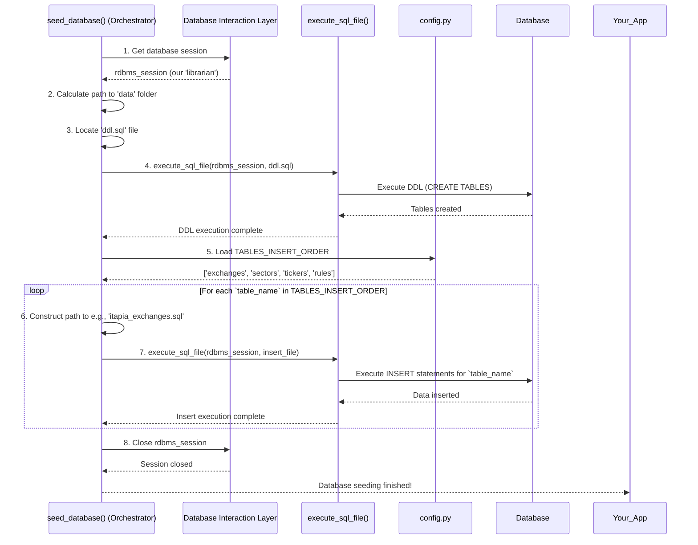

# Chapter 2: Database Seeding Orchestrator

In [Chapter 1: Database Interaction Layer](01_database_interaction_layer_.md), we learned how `data_seeds` talks to the database, like having a super-smart librarian for our data. We saw how to open a "conversation" (a session), send commands, and ensure changes are saved correctly. Now, imagine you've just bought a brand-new house, and you need to set it up from scratch. You wouldn't just throw furniture in randomly, right? You'd first make sure the house itself is built (foundation, walls, roof), and *then* you'd carefully place the furniture in the right rooms.

This is exactly the problem the **Database Seeding Orchestrator** solves for our database! It's like the project manager for setting up our database with all the initial data it needs to start working.

## What is a Database Seeding Orchestrator?

Think of the Database Seeding Orchestrator as the **master chef** or **construction project manager** for your database. Its job is to make sure everything is prepared and put into the database in the correct order, so your application can start running smoothly from day one.

Our main goal with `data_seeds` is to fill a brand-new database with *initial* data. For example, we need to create tables for things like `exchanges`, `sectors`, `tickers`, and `rules`, and then put some default information into them. The Orchestrator ensures this complex process happens reliably and without errors.

## Why is "Order" So Important?

Imagine we have two tables: `Sectors` (like "Technology" or "Finance") and `Tickers` (like "AAPL" or "MSFT"). A `Ticker` *belongs* to a `Sector`. This relationship is enforced by something called a **foreign key constraint** in the database.

It means:
*   You **must** create a `Sector` record (e.g., "Technology") *before* you can create a `Ticker` record (e.g., "AAPL") that links to that `Sector`.
*   If you try to insert "AAPL" into the `Tickers` table and link it to "Technology" *before* "Technology" exists in the `Sectors` table, the database will raise an error!

The Orchestrator's most crucial role is to prevent these errors by always doing things in the right sequence.

## How the Orchestrator Works: Two Main Steps

The Database Seeding Orchestrator breaks down the setup process into two logical and ordered phases:

1.  **Build the Foundation (DDL Execution):** This involves executing **DDL** (Data Definition Language) SQL commands. These commands are like the blueprints for your house: they create the structure. In our case, they create all the necessary tables (like `exchanges`, `sectors`, `tickers`) in the database.
2.  **Furnish the House (Data Insertion):** Once the tables are built, the Orchestrator then inserts the default data into them. Crucially, it does this in a very specific order to respect those foreign key relationships we talked about. For instance, it would insert `Sectors` data *before* `Tickers` data.

Let's see how `data_seeds` uses the Orchestrator in practice.

## Using the Database Seeding Orchestrator

The heart of our Database Seeding Orchestrator is the `seed_database()` function, located in `scripts\seed_database.py`. This is the function you'd call to kick off the entire seeding process.

Here’s a simplified look at how it works:

### Step 1: Get Your Database Session

First, just like we learned in [Chapter 1: Database Interaction Layer](01_database_interaction_layer_.md), we need to get an active "conversation" with our database.

```python
# scripts\seed_database.py (simplified)
from itapia_common.dblib.session import get_rdbms_session
# ...

def seed_database():
    """Main function to seed the database."""
    # This line gets our 'librarian' (the database session)
    rdbms_session = next(get_rdbms_session())

    try:
        # ... Orchestrator's work will happen here ...
        pass
    finally:
        # Always close the session when done!
        rdbms_session.close()
```
This snippet ensures we have a dedicated connection to the database ready for our operations.

### Step 2: Build the Database Foundation (Execute DDL)

Next, the Orchestrator finds and executes the SQL file that defines all our tables. This file is typically named `ddl.sql` and contains `CREATE TABLE` statements.

```python
# scripts\seed_database.py (simplified)
import os
# ...

def seed_database():
    # ... (get rdbms_session)
    try:
        # Find the 'data' folder where our SQL files are
        script_dir = os.path.dirname(os.path.abspath(__file__))
        data_dir = os.path.join(script_dir, 'data')

        # Locate the DDL file
        ddl_file = os.path.join(data_dir, 'ddl.sql')

        print("Executing DDL to create tables...")
        # Run the DDL file to create all tables
        execute_sql_file(rdbms_session, ddl_file)
        # ...
```
Here, `execute_sql_file()` is a helper function that takes the database session and a SQL file path, then runs all the SQL commands inside that file. After this step, all your database tables are created, but they are still empty!

### Step 3: Furnish with Data (Insert Data in Order)

Now that the tables exist, it's time to fill them with initial data. This is where the Orchestrator's intelligence about "order" really shines. It uses a predefined list to ensure data is inserted correctly.

```python
# scripts\seed_database.py (simplified)
# Import the list that defines the order of insertion
from config import TABLES_INSERT_ORDER
# ...

def seed_database():
    # ... (get rdbms_session, execute DDL)
    # ...
        print("Inserting data in specified order...")
        # Loop through the list of table names
        for table_name in TABLES_INSERT_ORDER:
            # Construct the path to the insert SQL file for this table
            file_name = f'itapia_{table_name}.sql' # e.g., 'itapia_exchanges.sql'
            file_path = os.path.join(data_dir, file_name)

            # Execute the insert file for the current table
            execute_sql_file(rdbms_session, file_path)
        print("Database seeding completed successfully!")
    # ... (finally block)
```

In this crucial part:
*   `TABLES_INSERT_ORDER` (which comes from `scripts\config.py`) is a list that explicitly tells the Orchestrator the sequence for inserting data.
*   The `for` loop goes through each table name in that exact order.
*   For each table, it constructs the path to its corresponding SQL file (e.g., `itapia_exchanges.sql` for the `exchanges` table) and runs it using `execute_sql_file()`. This ensures that, for instance, `sectors` data is inserted *before* `tickers` data.

## Behind the Scenes: How the Orchestrator Manages Everything

Let's visualize the entire flow of the `seed_database()` function, our Database Seeding Orchestrator, in action:



### The Configuration that Guides the Orchestrator

The critical piece of information that guides the Orchestrator's data insertion phase is the `TABLES_INSERT_ORDER` list. This list is defined in `scripts\config.py`:

```python
# scripts\config.py
from typing import List

# Define the order in which tables should be inserted
# This is important due to foreign key constraints
TABLES_INSERT_ORDER: List[str] = [
    'exchanges', # Insert exchanges first
    'sectors',   # Then sectors
    'tickers',   # Then tickers (which might link to exchanges/sectors)
    'rules',     # And finally rules (which might link to tickers)
]
```
This simple list is extremely powerful because it dictates the entire sequence of data insertion, ensuring that dependent data is always inserted *after* the data it depends on.

## Conclusion

The **Database Seeding Orchestrator** is your reliable project manager for setting up your database. It ensures that your database tables are created first (the "foundation") and then filled with initial data in the correct sequence (the "furnishings"), respecting all dependencies and preventing errors. By coordinating the execution of DDL and data insertion files, it brings your database to a functional starting state efficiently.

Now that we understand *how* the orchestrator sets up the database, let's dive into *what* kind of data is prepared for insertion.

[Chapter 3: Data Insertion Blueprint](03_data_insertion_blueprint_.md)

---

Generated by [AI Codebase Knowledge Builder](https://github.com/The-Pocket/Tutorial-Codebase-Knowledge)