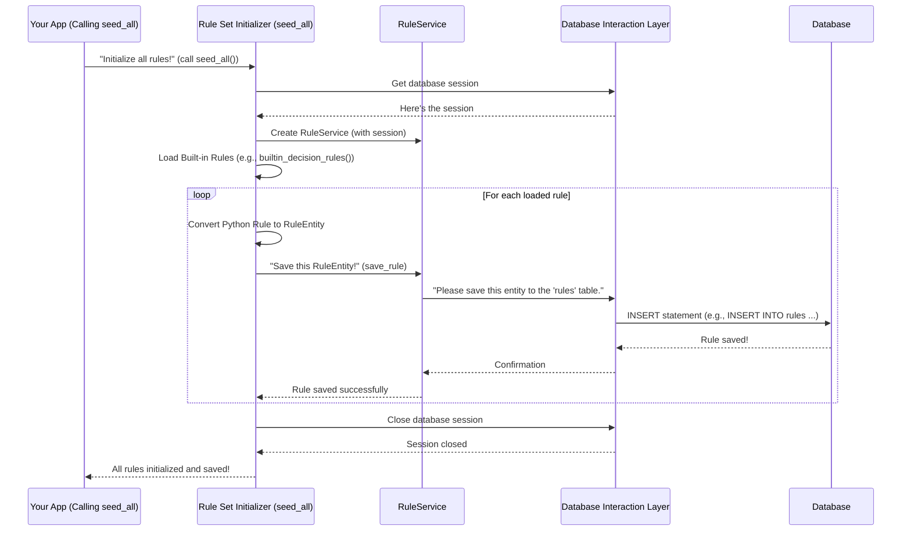

# Chapter 4: Rule Set Initializer

In [Chapter 1: Database Interaction Layer](01_database_interaction_layer_.md), we learned how to talk to our database. In [Chapter 2: Database Seeding Orchestrator](02_database_seeding_orchestrator_.md), we saw how the "project manager" orchestrates creating tables and inserting data in the right order. And in [Chapter 3: Data Insertion Blueprint](03_data_insertion_blueprint_.md), we understood that an ordered plan (our blueprint) is crucial for furnishing our database correctly.

Now, let's talk about a special kind of "furniture" for our database: **rules**. Imagine you're building a video game. The game needs to know things like:
*   "If a player collects 10 coins, they earn an extra life." (A decision rule)
*   "If a player falls into a pit, they lose health." (A risk rule)
*   "If a player discovers a hidden area, they get bonus points." (An opportunity rule)

These are not just random pieces of data; they are the fundamental logic that makes the game work! Our `data_seeds` project has similar critical "rules" for our application. We need to make sure these essential rules are present in the database from day one.

This is where the **Rule Set Initializer** comes in!

## What is a Rule Set Initializer?

The Rule Set Initializer is a specific part of our seeding process dedicated *only* to setting up these predefined "rules" for our system. It's like having a specialized chef whose only job is to prepare the game's rulebook and make sure it's stored safely in the database.

Its main responsibilities are:
1.  **Identify Default Rules:** Know where to find all the predefined decision, risk, and opportunity rules that the application needs to start with.
2.  **Use a Dedicated Service:** Employ a special tool (called a `RuleService`) that knows exactly how to talk to the database to save these complex rule structures.
3.  **Ensure Completeness:** Guarantee that the system starts with all the necessary rules, so your application can immediately make decisions, assess risks, and identify opportunities.

Without the Rule Set Initializer, our application would be like a game with no instructions – confusing and non-functional!

## How to Use the Rule Set Initializer

In `data_seeds`, the Rule Set Initializer is implemented through a Python script called `scripts\seed_rules.py`. This script contains the functions responsible for loading and saving our application's built-in rules.

Let's look at the main function `seed_all()` which kicks off the rule seeding:

```python
# scripts\seed_rules.py (simplified)
from itapia_common.dblib.session import get_rdbms_session
from itapia_common.dblib.services.rules import RuleService
# ... other imports for rules ...

def seed_all():
    """Main function to seed all built-in rules into the database."""
    # 1. Get our database 'librarian' (session)
    rdbms_session = next(get_rdbms_session())
    
    # 2. Create a special 'RuleService' to handle rule-specific database tasks
    rule_service = RuleService(rdbms_session)

    print("Seeding built-in decision rules...")
    # 3. Call a helper function to seed specific rule types
    seed_rules(rule_service, builtin_decision_rules())

    print("Seeding built-in risk rules...")
    seed_rules(rule_service, builtin_risk_rules())

    print("Seeding built-in opportunity rules...")
    seed_rules(rule_service, builtin_opportunity_rules())

if __name__ == "__main__":
    seed_all()
```
When you run `seed_all()`:
*   It first gets a database session, just like we learned in [Chapter 1: Database Interaction Layer](01_database_interaction_layer_.md).
*   Then, it creates a `RuleService`. Think of this as a special messenger who knows *only* how to deliver rule-related messages to the database.
*   Finally, it calls the `seed_rules` function three times, once for each type of rule (decision, risk, opportunity), using specific lists of built-in rules.

## The `seed_rules` Helper Function

The `seed_rules` function is the core logic that takes a list of rule objects and actually saves them using our `RuleService`.

```python
# scripts\seed_rules.py (simplified)
from typing import List
from itapia_common.rules.rule import Rule
from itapia_common.schemas.entities.rules import RuleEntity

def seed_rules(rule_service: RuleService, rules: List[Rule]):
    """Iterates through a list of Rule objects and saves them."""
    for rule in rules:
        # Convert the Python rule object into a database-friendly format
        rule_dict = rule.to_entity()
        rule_entity = RuleEntity.model_validate(rule_dict)
        
        # Ask the RuleService to save this rule to the database
        rule_service.save_rule(rule_entity)
        print(f"  Saved rule: {rule_entity.name}") # Example output
```
This function does the following for each rule in the list:
1.  **Transforms the Rule:** Our rules are first defined as Python objects (`Rule`). Before they can go into the database, they need to be converted into a format (`RuleEntity`) that the database understands and can store. `rule.to_entity()` and `RuleEntity.model_validate()` handle this transformation.
2.  **Saves via Service:** It then hands this `rule_entity` to the `rule_service.save_rule()` method. This is where the actual database magic happens, ensuring the rule is correctly inserted into the `rules` table.

## Behind the Scenes: How Rules Are Initialized

Let's visualize the journey of a rule from being a Python object to being stored in your database:



### The `RuleService` and Database Interaction

The `RuleService` is the key piece that connects our Rule Set Initializer to the database. It's a specialized class designed to handle all database operations related to rules. It uses the underlying [Database Interaction Layer](01_database_interaction_layer_.md) (like SQLAlchemy sessions) to perform its tasks.

Here's a very simplified idea of what `RuleService` might look like internally:

```python
# itapia_common/dblib/services/rules.py (simplified)
from sqlalchemy.orm import Session
# ... other imports like RuleEntity, your ORM models ...

class RuleService:
    def __init__(self, session: Session):
        self.session = session # The database 'librarian'

    def save_rule(self, rule_entity: RuleEntity):
        """Saves a RuleEntity to the database."""
        try:
            # Imagine 'RuleModel' is how SQLAlchemy represents your 'rules' table
            db_rule = RuleModel(
                name=rule_entity.name,
                description=rule_entity.description,
                # ... map other fields from rule_entity to db_rule ...
            )
            self.session.add(db_rule) # Add the new rule to the session
            self.session.commit()    # Permanently save it to the database
            print(f"Rule '{rule_entity.name}' committed.")
        except Exception as e:
            self.session.rollback() # If something goes wrong, undo!
            print(f"Error saving rule '{rule_entity.name}': {e}")
            raise # Re-raise the error to stop the process
```
In this simplified `RuleService`:
*   It takes a `session` (our database "librarian") when it's created.
*   The `save_rule` method maps the `RuleEntity` data to a `RuleModel` (which represents our actual database table structure).
*   `self.session.add(db_rule)` tells the librarian "here's a new rule I want to add."
*   `self.session.commit()` makes the change permanent in the database, just like we learned about **transactions** in [Chapter 1: Database Interaction Layer](01_database_interaction_layer_.md).
*   And if any error occurs, `self.session.rollback()` ensures that the database remains clean and consistent.

## Conclusion

The **Rule Set Initializer**, primarily embodied by the `seed_rules.py` script and the `RuleService`, is a crucial component of `data_seeds`. It acts as the specialized "rulebook manager," ensuring that our application's fundamental decision-making, risk assessment, and opportunity identification rules are correctly loaded and saved into the database right from the start. By leveraging a dedicated service and our powerful [Database Interaction Layer](01_database_interaction_layer_.md), it makes sure your application has its essential "game rules" in place from day one.

---

Generated by [AI Codebase Knowledge Builder](https://github.com/The-Pocket/Tutorial-Codebase-Knowledge)