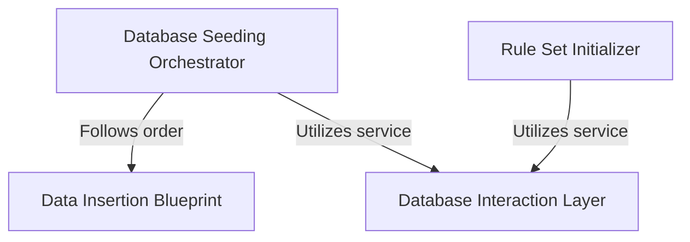

# Tutorial: data_seeds

This project, `data_seeds`, is responsible for **initializing a database** with all its necessary starting information. It acts like a builder that first sets up the *structure* by creating tables, then carefully *furnishes* it by adding default data in a specific, integrity-preserving order. Crucially, it also ensures that all *predefined operational rules* are loaded, enabling the application to function correctly from its very first run.

**Source Repository:** [None](None)

## Chapters

1. [Database Interaction Layer
](01_database_interaction_layer_.md)
2. [Database Seeding Orchestrator
](02_database_seeding_orchestrator_.md)
3. [Data Insertion Blueprint
](03_data_insertion_blueprint_.md)
4. [Rule Set Initializer
](04_rule_set_initializer_.md)

---

Generated by [AI Codebase Knowledge Builder](https://github.com/The-Pocket/Tutorial-Codebase-Knowledge)