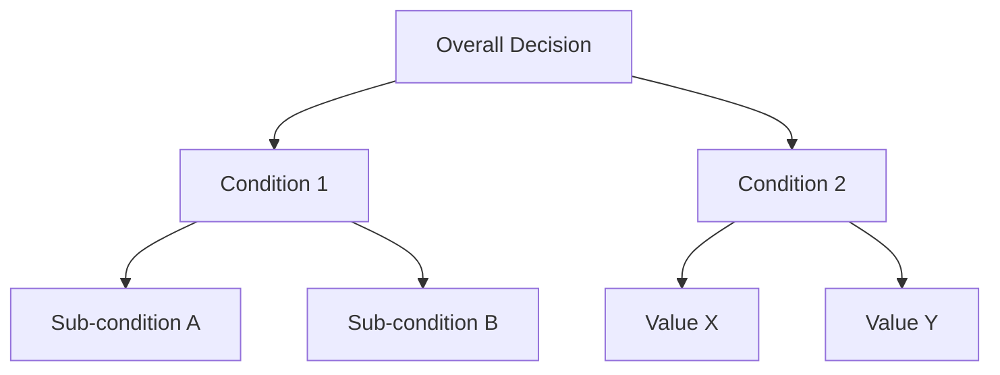
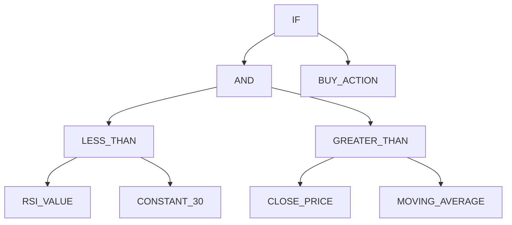
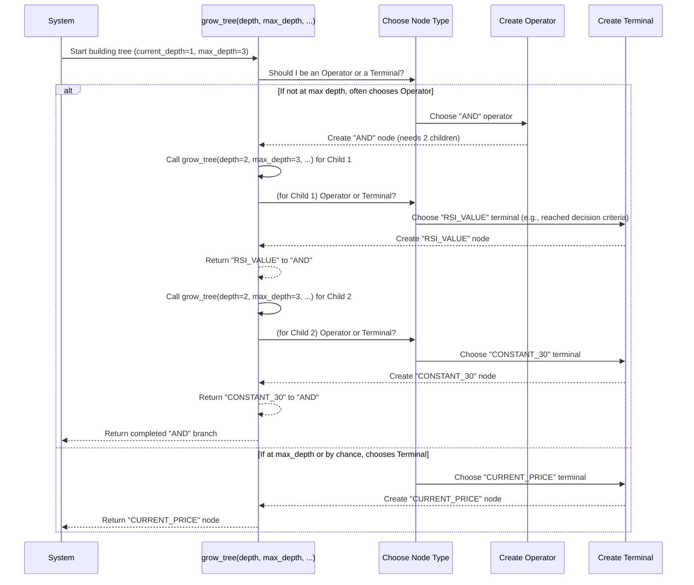

# Chapter 1: Rule Tree Structure

Welcome to the `evo_worker` project! In this journey, we'll explore how this system intelligently generates and refines trading strategies. Our first stop is understanding the very foundation of these strategies: the "Rule Tree Structure."

### The Problem: Complex Trading Decisions

Imagine you want to create a sophisticated trading bot. A simple rule might be: "Buy if the price goes above the 20-day moving average." That's easy to write as a simple `if` statement.

But what if your strategy becomes more complex? You might want something like: "Buy if (RSI is below 30 AND the Close Price is above the Moving Average) OR (Volume is very high AND MACD crosses up)."

Writing these complex, nested rules as traditional `if/else` code can quickly become messy, hard to read, and even harder to change or optimize. If we want our system to *automatically generate* and *evolve* such rules, we need a smarter, more flexible way to represent them.

### The Solution: Rule Tree Structure

This is where the "Rule Tree Structure" comes in! Instead of linear code, `evo_worker` represents trading rules as **hierarchical decision trees**. Think of it like a decision-making flowchart, but built with digital building blocks that our system can easily arrange and rearrange.

Let's break down this idea into its core components:

#### 1. It's a "Tree"

Just like a family tree or the folder structure on your computer, a rule tree has a starting point (the "root") and branches out. Each point on a branch is called a **node**.


*Above: A simple illustration of a tree structure.*

#### 2. Nodes: The Building Blocks

Every piece of our trading rule – whether it's an action, a piece of data, or a logical comparison – is a node in the tree. There are two main types of nodes:

*   **Operators**: These nodes perform actions or combine other decisions. They are like the "verbs" or "connectors" of our rule.
    *   **Examples**: "AND", "OR", "IF", "GREATER_THAN", "ADD" (for mathematical operations).
    *   **Key Feature**: Operators usually have "children" nodes, which are the inputs they use for their operation. For example, "AND" needs two conditions to combine.

*   **Terminals**: These nodes represent actual values, indicators, prices, or constants. They are the "nouns" or "raw data" of our rule.
    *   **Examples**: "RSI_VALUE", "CURRENT_PRICE", "MOVING_AVERAGE", "CONSTANT_30" (the number 30), "BUY_ACTION".
    *   **Key Feature**: Terminals are always "leaf" nodes; they have no children because they represent the final piece of information.

Let's see a simple example of how you might conceptually create these nodes:

```python
# Imagine a simplified node class for illustration
class SimpleTreeNode:
    def __init__(self, name: str, children: list = None):
        self.name = name
        self.children = children if children is not None else []

# Creating a Terminal node (no children)
rsi_value_node = SimpleTreeNode("RSI_VALUE")
constant_30_node = SimpleTreeNode("CONSTANT_30")

# Creating an Operator node (combines the two terminals as its children)
less_than_operator = SimpleTreeNode(
    "LESS_THAN", children=[rsi_value_node, constant_30_node]
)

print(f"Operator Node: {less_than_operator.name}")
print(f"Its Children: {[c.name for c in less_than_operator.children]}")
# Output:
# Operator Node: LESS_THAN
# Its Children: ['RSI_VALUE', 'CONSTANT_30']
```
*Explanation:* This code snippet shows how we can represent a "LESS_THAN" operation that checks if "RSI_VALUE" is less than "CONSTANT_30". The `LESS_THAN` node is an Operator, and `RSI_VALUE` and `CONSTANT_30` are Terminals.

### Building a Complex Rule with a Rule Tree

Let's revisit our complex trading rule and see how it would look as a tree:

**Rule:** `IF (RSI < 30 AND Close Price > Moving Average) THEN Buy`


*Above: A rule tree representing a complex trading strategy.*

In this diagram:
*   `IF`, `AND`, `LESS_THAN`, `GREATER_THAN` are **Operators**. They combine or act upon their children.
*   `RSI_VALUE`, `CONSTANT_30`, `CLOSE_PRICE`, `MOVING_AVERAGE`, `BUY_ACTION` are **Terminals**. They represent specific data points or actions.

The beauty of this structure is its flexibility. We can swap out any sub-tree (a node and all its children) for another compatible sub-tree, or even add new branches, allowing our [Evolutionary Engine](03_evolutionary_engine_.md) to explore many different rule combinations.

### Under the Hood: How `evo_worker` Builds a Rule Tree

Our `evo_worker` system doesn't manually construct these trees. Instead, it uses intelligent algorithms to **grow** them automatically. The core function responsible for this is aptly named `grow_tree`.

Let's walk through a simplified, step-by-step process of how `grow_tree` might build a part of a rule:


*Above: A sequence of how `grow_tree` recursively builds a rule tree.*

#### Diving into the `grow_tree` Code (Simplified)

The actual `grow_tree` function, found in `app/algorithms/tree.py`, is a bit more complex as it handles different data types (`SemanticType`) and ensures the tree is logically sound. However, its core logic is straightforward:

```python
import random
# ... other imports for _TreeNode, create_node, etc.

# Simplified representation for demonstration
class _TreeNode:
    def __init__(self, name, children=None):
        self.name = name
        self.children = children if children is not None else []

def create_node(name, children=None):
    return _TreeNode(name, children)

# Assume we have lists of possible operators and terminals
example_operators = ["AND", "OR", "LESS_THAN", "GREATER_THAN"]
example_terminals = ["RSI_VALUE", "CLOSE_PRICE", "CONSTANT_30", "MOVING_AVERAGE"]

def grow_tree(
    current_depth: int, # How deep we are currently
    max_depth: int,     # The maximum allowed depth for the tree
    random_ins: random.Random, # A random number generator
) -> _TreeNode:
    """
    A simplified version of evo_worker's grow_tree function.
    It recursively builds a tree by deciding whether to create
    an Operator or a Terminal node.
    """
    is_max_depth = current_depth >= max_depth # Are we at the deepest allowed level?

    # Decide whether to create a Terminal (leaf node) or an Operator (internal node)
    # We must create a terminal if we're at max_depth.
    # Otherwise, there's a chance (e.g., 30%) to create a terminal anyway.
    if is_max_depth or random_ins.random() < 0.3:
        # --- Create a Terminal Node ---
        node_name = random_ins.choice(example_terminals)
        return create_node(node_name) # Terminals have no children
    else:
        # --- Create an Operator Node ---
        op_name = random_ins.choice(example_operators)
        
        # For demonstration, assume all operators need 2 children
        num_children_needed = 2 
        
        children = []
        for _ in range(num_children_needed):
            # Recursively call grow_tree to build each child branch
            child_node = grow_tree(
                current_depth=current_depth + 1, # Go one level deeper for the child
                max_depth=max_depth,
                random_ins=random_ins,
            )
            children.append(child_node)
        
        return create_node(op_name, children=children)

# --- Example Usage ---
random_seed = random.Random(42) # Using a seed for reproducible results
# Let's grow a tree with a maximum depth of 3
root_of_my_rule = grow_tree(current_depth=1, max_depth=3, random_ins=random_seed)

# A simple way to print the tree structure
def print_tree_structure(node, level=0):
    print("  " * level + "- " + node.name)
    for child in node.children:
        print_tree_structure(child, level + 1)

print("\nGenerated Rule Tree:")
print_tree_structure(root_of_my_rule)
# Expected Output (will vary slightly due to randomness, but structure is similar):
# Generated Rule Tree:
# - AND
#   - GREATER_THAN
#     - CLOSE_PRICE
#     - CONSTANT_30
#   - MOVING_AVERAGE
```
*Explanation:* The `grow_tree` function makes a decision at each step: should this node be an Operator or a Terminal?
*   If it decides on an **Operator** (like `AND`), it then recursively calls `grow_tree` for each of that operator's "children" (its inputs), increasing the `current_depth` each time. This builds the branches.
*   If it decides on a **Terminal** (like `CLOSE_PRICE`), it creates that node, and that branch of the tree stops growing there.
*   The `max_depth` parameter acts as a control, forcing the function to create Terminal nodes when it reaches the specified depth limit, preventing infinite or overly complex trees.

This automatic tree-growing process is how `evo_worker` generates a vast number of diverse and potentially complex trading rules without any human needing to write them line by line!

### Conclusion

You've just learned about the "Rule Tree Structure," the fundamental way `evo_worker` represents trading strategies. We saw that rules are built like flowcharts using **Operator** nodes (like `AND`, `IF`) that perform actions and **Terminal** nodes (like `RSI_VALUE`, `CLOSE_PRICE`) that provide raw data. This hierarchical design allows for incredible flexibility and complexity.

This robust and adaptable structure is crucial for the heart of our system: the evolutionary algorithms that will generate and optimize these rules. Next, we'll see how these rule trees are encapsulated into something called an [Individual](02_individual___population_.md) and how many of these individuals form a [Population](02_individual___population_.md), setting the stage for evolution!

---

Generated by [AI Codebase Knowledge Builder](https://github.com/The-Pocket/Tutorial-Codebase-Knowledge)