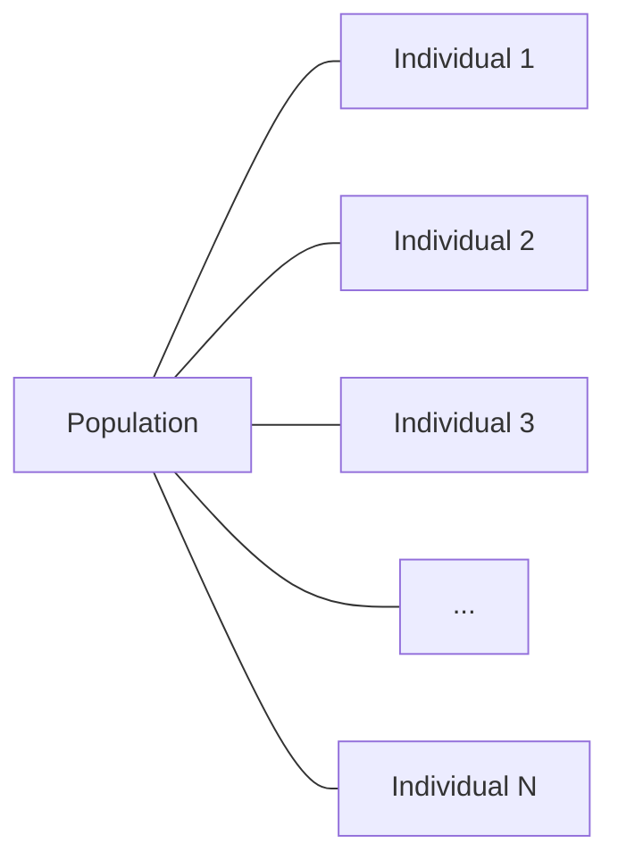
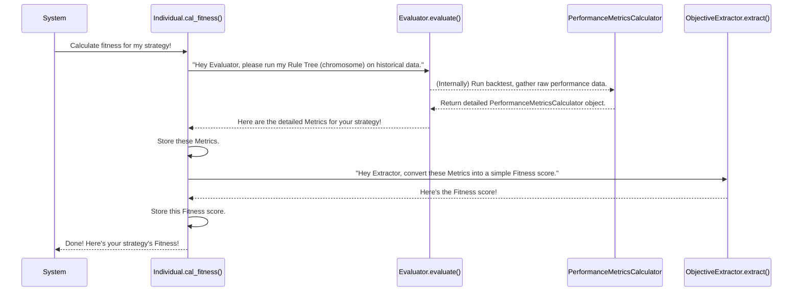

# Chapter 2: Individual & Population

In [Chapter 1: Rule Tree Structure](01_rule_tree_structure_.md), we learned how `evo_worker` represents a single trading strategy as a flexible "Rule Tree." This tree is like a blueprint for how a trading bot might make decisions. But having just one blueprint isn't enough to build the best house or find the best strategy!

### The Problem: Managing and Improving Strategies

Imagine you're trying to find the *best* possible trading strategy. You could generate one rule tree, then another, and another. But how do you:

1.  **Keep track of each unique strategy?**
2.  **Figure out how *good* each strategy is?** (Does it make money? Is it stable?)
3.  **Manage a whole collection of these strategies** so you can compare them and, eventually, improve them over time?

This is where the concepts of "Individual" and "Population" come in. They provide the structure to hold, evaluate, and evolve our trading strategies.

### What is an "Individual"?

In `evo_worker`, an **Individual** represents a single, complete candidate trading strategy. Think of it as a single entry in a design competition for houses. Each entry (Individual) has:

*   **Its Blueprint (Genetic Code):** This is the `Rule` (the rule tree from Chapter 1) that defines the strategy. It's the unique instruction set for how this particular strategy behaves.
*   **Its Performance Score (Fitness):** After running the strategy against historical market data, we get a "score" that tells us how good it is. This `fitness` value helps us compare different strategies.
*   **Its Detailed Report (Metrics):** Beyond just a single score, we also collect detailed information about its performance, like how much profit it made, its risk level, or its consistency. These are called `metrics`.

Here's how we might think about an `Individual`:

```mermaid
graph TD
    A[Individual] --> B{Chromosome (Rule Tree)}
    A --> C{Fitness (Score)}
    A --> D{Metrics (Details)}

    B --> B1[Operator Nodes]
    B --> B2[Terminal Nodes]
    C --> C1[e.g., Profit/Loss]
    D --> D1[e.g., Max Drawdown]
    D --> D2[e.g., Win Rate]
```
*Above: An Individual holds its strategy blueprint, a performance score, and detailed statistics.*

### What is a "Population"?

If an `Individual` is a single entry in our design competition, then a **Population** is simply the *entire collection* of all the entries submitted so far.

The `Population` is a diverse pool of different trading strategies (Individuals). Some might be good, some might be bad, and some might be truly innovative! This collection is what will undergo the evolutionary process, where the best strategies survive and combine to create even better ones.


*Above: A Population is a collection of many Individuals.*

### Solving Our Use Case: Building and Evaluating Strategies

Let's see how `evo_worker` uses `Individual` and `Population` to manage and evaluate strategies.

#### 1. Creating an Individual from a Rule

First, we need to wrap our `Rule` (the tree structure from Chapter 1) inside an `Individual` object.

```python
from app.algorithms.pop import Individual
# from app.algorithms.tree import grow_tree # From Chapter 1
# from itapia_common.rules.rule import Rule # The Rule class

# Imagine you have a rule tree generated from Chapter 1
# For simplicity, let's just make a placeholder rule
class DummyRule:
    def to_entity(self): return {"name": "dummy_rule_entity"}
    @classmethod
    def from_entity(cls, entity): return cls()

my_strategy_rule = DummyRule() # This would be a real 'Rule' object from Chapter 1!

# Create an Individual object for this strategy
strategy_individual = Individual.from_rule(my_strategy_rule)

print(f"Created Individual with rule: {strategy_individual.chromosome}")
# Output: Created Individual with rule: <app.algorithms.pop.DummyRule object at 0x...>
```
*Explanation:* The `Individual.from_rule()` class method takes our `Rule` (which is the actual "genetic code" or blueprint) and creates a new `Individual` object, storing the rule in its `chromosome` attribute.

#### 2. Calculating an Individual's Performance (Fitness & Metrics)

Once we have an `Individual`, the next crucial step is to figure out how good its strategy is. This is done by simulating its trades on historical data (backtesting). This process calculates its `metrics` and then extracts a `fitness` score.

```python
# from app.backtest.evaluator import Evaluator
# from app.algorithms.objective import SingleObjectiveExtractor

# Dummy classes for demonstration (these would be real evo_worker components)
class DummyEvaluator:
    def evaluate(self, rule):
        print(f"Evaluating rule: {rule}")
        # In a real scenario, this runs the backtest and returns real metrics
        class DummyMetrics:
            def get_metric(self, name): return 0.5 # Example metric
        return DummyMetrics()

class DummyObjectiveExtractor:
    def extract(self, metrics):
        print("Extracting fitness from metrics...")
        # In a real scenario, this would use the metrics to calculate a fitness score
        return 0.75 # Example fitness score

# Let's create our dummy components
my_evaluator = DummyEvaluator()
my_objective_extractor = DummyObjectiveExtractor()

# Calculate fitness for our strategy_individual
calculated_fitness = strategy_individual.cal_fitness(
    my_evaluator, my_objective_extractor
)

print(f"Individual's Fitness: {calculated_fitness}")
print(f"Individual's Metrics: {strategy_individual.metrics}")
# Output:
# Evaluating rule: <app.algorithms.pop.DummyRule object at 0x...>
# Extracting fitness from metrics...
# Individual's Fitness: 0.75
# Individual's Metrics: <__main__.DummyEvaluator.DummyMetrics object at 0x...>
```
*Explanation:* The `cal_fitness` method on our `Individual` object does two main things:
1.  It uses an `Evaluator` (which we'll cover in [Performance Metrics Calculator](05_performance_metrics_calculator_.md)) to run the strategy and get detailed `metrics`.
2.  It then uses an `ObjectiveExtractor` (from [Fitness Objective Extractor](06_fitness_objective_extractor_.md)) to turn those detailed `metrics` into a simple `fitness` score.

These `fitness` and `metrics` are then stored directly within the `Individual` object.

#### 3. Collecting Individuals into a Population

Now that we have Individuals, we put them into a `Population`.

```python
from app.algorithms.pop import Population

# Create a few more dummy individuals
another_individual = Individual.from_rule(DummyRule())
yet_another_individual = Individual.from_rule(DummyRule())

# Create a Population to hold our individuals
# We tell it what type of Individual it will hold
my_population = Population(ind_cls=Individual, max_population_size=10)

# Add our individuals to the population
my_population.add_ind(strategy_individual)
my_population.add_ind(another_individual)
my_population.add_ind(yet_another_individual)

print(f"Current Population Size: {my_population.population_size}")
# Output: Current Population Size: 3
```
*Explanation:* The `Population` object acts like a container. We specify the `ind_cls` (Individual class) it will manage and optionally a `max_population_size`. The `add_ind` method simply adds an `Individual` to its internal list.

#### 4. Evaluating the Entire Population

We can then easily calculate the fitness for *all* individuals in the population at once.

```python
# Assuming my_population, my_evaluator, my_objective_extractor are already set up

# Calculate fitness for every individual in the population
my_population.cal_fitness(my_evaluator, my_objective_extractor)

print("\nFitness values for individuals in the population:")
for i, ind in enumerate(my_population.population):
    print(f"  Individual {i+1} Fitness: {ind.fitness}")
# Output (will show example fitness values for each):
#   Individual 1 Fitness: 0.75
#   Individual 2 Fitness: 0.75
#   Individual 3 Fitness: 0.75
```
*Explanation:* The `Population`'s `cal_fitness` method simply loops through all its contained `Individual` objects and calls `cal_fitness` on each one, ensuring every strategy's performance is assessed.

### Under the Hood: How an Individual's Fitness is Calculated

Let's take a quick peek at the sequence of actions when an `Individual` calculates its fitness.


*Above: The process of calculating an Individual's fitness.*

This diagram shows that the `Individual` itself doesn't know *how* to backtest or *how* to calculate fitness. It relies on other specialized components (`Evaluator` and `ObjectiveExtractor`) to do those jobs, storing the results.

### Diving Deeper into the Code

Let's look at simplified versions of the actual `Individual` and `Population` classes from `app/algorithms/pop.py`.

#### The `Individual` Class

```python
# File: app/algorithms/pop.py (simplified)
from app.performances.metrics import PerformanceMetricsCalculator
from itapia_common.rules.rule import Rule # Our Rule Tree from Chapter 1

class Individual:
    def __init__(self):
        self.chromosome: Rule = None # The rule tree (blueprint)
        self.fitness: float = None   # The overall score (how good it is)
        self.metrics: PerformanceMetricsCalculator = None # Detailed performance data

    @classmethod
    def from_rule(cls, rule: Rule):
        new_ind = cls()
        new_ind.chromosome = rule
        return new_ind

    def cal_fitness(self, evaluator, obj_extractor):
        # 1. Use the Evaluator to get detailed performance metrics
        self.metrics = evaluator.evaluate(self.chromosome)
        
        # 2. Use the ObjectiveExtractor to get the final fitness score
        self.fitness = obj_extractor.extract(self.metrics)
        return self.fitness
```
*Explanation:*
*   The `__init__` method sets up the `Individual` with placeholders for its `chromosome` (the `Rule` tree), `fitness`, and `metrics`.
*   `from_rule` is a convenient way to create an `Individual` directly from a `Rule` object.
*   The `cal_fitness` method orchestrates the evaluation, calling external tools (`evaluator` and `obj_extractor`) to fill in its `metrics` and `fitness` values. Notice how `self.chromosome` (the Rule Tree) is passed to the `evaluator`.

#### The `Population` Class

```python
# File: app/algorithms/pop.py (simplified)
from typing import List, Type

class Population:
    def __init__(self, ind_cls: Type[Individual], max_population_size: int = None):
        self.max_population_size: int = max_population_size if max_population_size else 1000
        self.population: List[Individual] = [] # A list to hold all individuals
        self.ind_cls: Type[Individual] = ind_cls # What kind of Individual this population holds

    @property
    def population_size(self) -> int:
        return len(self.population)

    def add_ind(self, ind: Individual) -> bool:
        if self.population_size == self.max_population_size:
            return False # Can't add if population is full
        self.population.append(ind)
        return True

    def cal_fitness(self, evaluator, obj_extractor):
        for ind in self.population: # Loop through every individual
            ind.cal_fitness(evaluator, obj_extractor) # And calculate its fitness
```
*Explanation:*
*   The `__init__` method creates an empty list `self.population` to store `Individual` objects. It also keeps track of the maximum size and the type of `Individual` it contains.
*   `population_size` is a simple way to get the current number of individuals.
*   `add_ind` allows us to add a single `Individual` to the collection.
*   `cal_fitness` for the `Population` is just a loop that calls the `cal_fitness` method on each `Individual` within it.

### Conclusion

You've now understood the core concepts of "Individual" and "Population" in `evo_worker`. An **Individual** encapsulates a single trading strategy (its rule tree, fitness, and metrics), acting like a single blueprint for a house design. A **Population** is a collection of these Individuals, forming a diverse pool of strategies ready for exploration and improvement.

This structure allows `evo_worker` to systematically manage, evaluate, and compare numerous strategies. With a clear understanding of what an Individual is and how Populations hold them, we are ready to move on to the heart of the system: the process that uses these concepts to find ever-better trading strategies.

Next up, we'll dive into the [Evolutionary Engine](03_evolutionary_engine_.md), which orchestrates the entire process of generating and improving these strategies!

---

Generated by [AI Codebase Knowledge Builder](https://github.com/The-Pocket/Tutorial-Codebase-Knowledge)