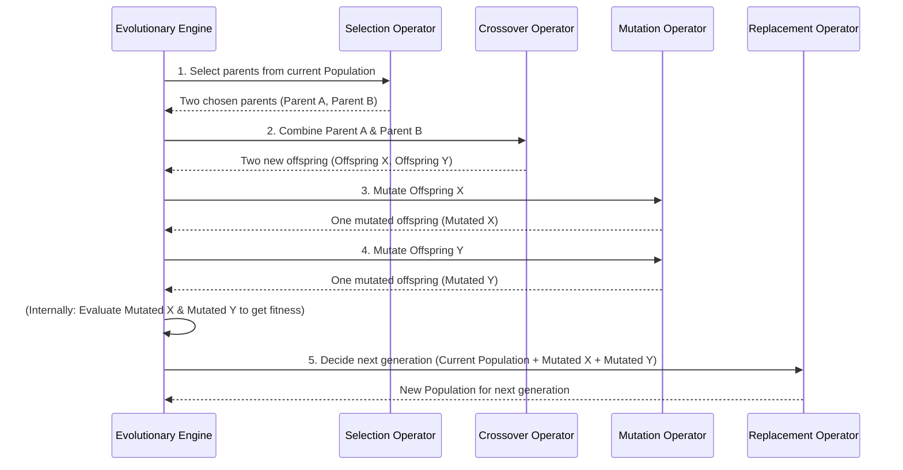

# Chapter 4: Genetic Operators

Welcome back! In [Chapter 3: Evolutionary Engine](03_evolutionary_engine_.md), we learned that the Evolutionary Engine is the brain orchestrating the improvement of our trading strategies. It manages the entire process of generating, evaluating, and selecting strategies over many generations.

### The Problem: How Do We "Breed" Better Strategies?

The Evolutionary Engine knows *when* to improve strategies, but it doesn't know *how*. It needs specific tools to:

1.  **Create** brand new, diverse strategies to start with.
2.  **Combine** good parts from existing strategies to make potentially even better ones.
3.  **Introduce small, random changes** to strategies to explore new possibilities.
4.  **Decide which strategies get to "live on"** to the next generation.

Think of it like an architect firm trying to design the best possible house. They need tools for:
*   **Drawing initial sketches** (creating new plans from scratch).
*   **Combining successful elements** from two different blueprints (e.g., this roof from one, that floor plan from another).
*   **Making minor adjustments** to a design (e.g., changing a window style, adding a small room).
*   **Choosing which designs** are good enough to proceed to the next round of development.

This is exactly where **Genetic Operators** come in!

### The Solution: Genetic Operators

**Genetic Operators** are the fundamental actions that drive the evolutionary process in `evo_worker`. They are the "tools" the Evolutionary Engine uses to create, combine, and refine the [Rule Tree Structure](01_rule_tree_structure_.md) of our [Individuals](02_individual___population_.md).

Inspired by how life evolves in nature, these operators introduce variation and allow good traits to be passed on. There are several key types:

#### 1. Initialization (Construction)

*   **What it is**: This operator creates the very first set of strategies (our initial [Population](02_individual___population_.md)) from scratch. It essentially "grows" new [Rule Tree Structure](01_rule_tree_structure_.md) randomly, within certain limits (like maximum depth).
*   **Analogy**: The architect's first batch of preliminary sketches, drawing entirely new house plans.

```python
from app.algorithms.operators.construct import RandomMaxDepthInitOperator
from itapia_common.schemas.entities.rules import SemanticType
from app.algorithms.pop import Individual # Our Individual from Chapter 2

# Assume these are pre-defined lists of building blocks for our rules
terminals = {SemanticType.BOOLEAN: ["TRUE", "FALSE"]}
operators = {SemanticType.BOOLEAN: ["AND", "OR"]}

# Create an initializer that makes rule trees with a BOOLEAN output
# (e.g., deciding "Buy" or "Not Buy")
init_operator = RandomMaxDepthInitOperator(
    purpose=SemanticType.BOOLEAN, # The type of output our rule should have
    ind_cls=Individual,          # The type of Individual to create
    terminals_by_type=terminals,
    operators_by_type=operators,
    max_depth=3 # Max depth for the randomly grown rule tree
)

# Use the operator to create a new Individual (a new strategy)
new_strategy_individual = init_operator()

print(f"Created a new individual with rule: {new_strategy_individual.chromosome.root.node_name}")
# Output: Created a new individual with rule: AND (or TRUE, or OR, etc. - depends on randomness)
```
*Explanation*: The `RandomMaxDepthInitOperator` is given the types of building blocks (`terminals_by_type`, `operators_by_type`) and a `max_depth`. When called (`init_operator()`), it uses the `grow_tree` function (from [Chapter 1: Rule Tree Structure](01_rule_tree_structure_.md)) to create a new, random [Rule Tree Structure](01_rule_tree_structure_.md) and wraps it in an [Individual](02_individual___population_.md).

#### 2. Selection

*   **What it is**: This operator chooses a subset of individuals from the current [Population](02_individual___population_.md) to become "parents" for the next generation. These are usually the individuals that performed well (had high [fitness](02_individual___population_.md)).
*   **Analogy**: The firm picks the top 10 most promising house designs to move on to the next round of refinement.

```python
from app.algorithms.operators.selection import TournamentSelectionOperator
from app.algorithms.pop import Individual
from app.algorithms.comparator import DominanceComparator # For comparing individuals

# Assume we have a population of individuals (from Chapter 2)
# For simplicity, let's create a few dummy ones with fitness
ind1 = Individual.from_rule("RuleA"); ind1.fitness = [0.8, 0.2]
ind2 = Individual.from_rule("RuleB"); ind2.fitness = [0.7, 0.3]
ind3 = Individual.from_rule("RuleC"); ind3.fitness = [0.9, 0.1]
current_population = [ind1, ind2, ind3]

# Create a selection operator
selection_operator = TournamentSelectionOperator(
    ind_cls=Individual,
    comparator=DominanceComparator(), # How to decide who "wins" a tournament
    k=2 # Tournament size: pick 2 individuals and compare
)

# Select 2 parents from the population
selected_parents = selection_operator(current_population, num_selections=2)

print(f"Selected parent rules: {[p.chromosome for p in selected_parents]}")
# Output: Selected parent rules: ['RuleA', 'RuleC'] (or similar, depends on fitness/randomness)
```
*Explanation*: The `TournamentSelectionOperator` takes a `population` and a `num_selections`. It repeatedly picks a small group of `k` individuals (the "tournament") and selects the best one among them (using the `comparator`) until the desired number of parents is chosen.

#### 3. Crossover (Recombination)

*   **What it is**: This operator takes two "parent" individuals and combines parts of their [Rule Tree Structure](01_rule_tree_structure_.md) to create one or more "offspring" individuals. It's like mixing and matching genetic material.
*   **Analogy**: Taking the successful kitchen layout from House Plan A and combining it with the energy-efficient wall design from House Plan B to create a new plan.

```python
from app.algorithms.operators.crossover import SubtreeCrossoverOperator
from app.algorithms.pop import Individual

# Assume parent1 and parent2 are individuals selected earlier, with Rule Trees
# For simplicity, using dummy rule names
parent1 = Individual.from_rule("ComplexRule1")
parent2 = Individual.from_rule("SimpleRule2")

# Create a crossover operator
crossover_operator = SubtreeCrossoverOperator(ind_cls=Individual)

# Perform crossover to get two new offspring
offspring1, offspring2 = crossover_operator(parent1, parent2)

print(f"Offspring 1 rule: {offspring1.chromosome}")
print(f"Offspring 2 rule: {offspring2.chromosome}")
# Output: Offspring 1 rule: <Rule object modified by crossover>
#         Offspring 2 rule: <Rule object modified by crossover>
```
*Explanation*: The `SubtreeCrossoverOperator` deep copies the [Rule Tree Structure](01_rule_tree_structure_.md) of `parent1` and `parent2`. It then finds compatible sub-sections (subtrees) in both trees and swaps them, resulting in `offspring1` and `offspring2`. This creates new combinations of rules.

#### 4. Mutation

*   **What it is**: This operator introduces small, random changes to an individual's [Rule Tree Structure](01_rule_tree_structure_.md). This helps explore entirely new variations that might not be created through crossover.
*   **Analogy**: The architect decides to randomly change a single window type in a design, or add a small, unexpected feature.

```python
from app.algorithms.operators.mutation import SubtreeMutationOperator
from app.algorithms.pop import Individual
from itapia_common.schemas.entities.rules import SemanticType

# Assume individual_to_mutate is an individual from a previous step
individual_to_mutate = Individual.from_rule("OriginalRule")

# Assume these are pre-defined lists of building blocks for our rules
terminals = {SemanticType.BOOLEAN: ["TRUE", "FALSE"]}
operators = {SemanticType.BOOLEAN: ["AND", "OR"]}

# Create a mutation operator
mutation_operator = SubtreeMutationOperator(
    ind_cls=Individual,
    max_subtree_depth=2, # Max depth for the new random subtree
    terminals_by_type=terminals,
    operators_by_type=operators
)

# Mutate the individual
mutated_individual = mutation_operator(individual_to_mutate)

print(f"Original rule: {individual_to_mutate.chromosome}")
print(f"Mutated rule: {mutated_individual.chromosome}")
# Output: Original rule: OriginalRule
#         Mutated rule: <Rule object with a modified subtree>
```
*Explanation*: The `SubtreeMutationOperator` takes an `individual_to_mutate`, deep copies its [Rule Tree Structure](01_rule_tree_structure_.md), randomly selects a point in the tree, and replaces the subtree at that point with an entirely new, randomly `grow_tree`-generated subtree (up to `max_subtree_depth`).

#### 5. Replacement

*   **What it is**: This operator decides which individuals (from both the old parents and the newly created offspring) will survive to form the next generation's [Population](02_individual___population_.md). This often involves selecting the fittest individuals.
*   **Analogy**: From all the old and new house designs, the firm selects the top `X` designs, ensuring the best ones (highest quality, most innovative) are carried forward.

```python
from app.algorithms.operators.replacement import NSGA2ReplacementOperator
from app.algorithms.pop import DominanceIndividual # A special Individual type for multi-objective
from app.algorithms.comparator import DominateComparator

# Assume we have parent population and offspring population, all evaluated
# (Fitness is crucial for replacement decisions)
parent_pop = [DominanceIndividual.from_rule("P1"), DominanceIndividual.from_rule("P2")]
offspring_pop = [DominanceIndividual.from_rule("O1"), DominanceIndividual.from_rule("O2")]

# Set some dummy fitness values (real values would be from backtesting)
parent_pop[0].fitness = [0.8, 0.2]; parent_pop[1].fitness = [0.7, 0.3]
offspring_pop[0].fitness = [0.9, 0.1]; offspring_pop[1].fitness = [0.6, 0.4]

# Create a replacement operator
replacement_operator = NSGA2ReplacementOperator(comparator=DominateComparator())

# Decide which individuals form the next generation (target size 2)
next_generation = replacement_operator(parent_pop, offspring_pop, target_size=2)

print(f"Individuals in the next generation: {[ind.chromosome for ind in next_generation]}")
# Output: Individuals in the next generation: [<Rule O1>, <Rule P1>] (example, based on fitness)
```
*Explanation*: The `NSGA2ReplacementOperator` combines the `parent_pop` and `offspring_pop`, then applies a special sorting algorithm (`non_dominated_sorting` and `crowding_distance_assignment`, which we'll cover in [Multi-Objective Dominance](08_multi_objective_dominance_.md)) to pick the `target_size` best individuals for the next generation.

### Under the Hood: Genetic Operators in Action

Let's see a simplified sequence of how these operators work together within one generation of the [Evolutionary Engine](03_evolutionary_engine_.md).


*Above: A simplified sequence of how Genetic Operators work together in one generation.*

This diagram illustrates how the [Evolutionary Engine](03_evolutionary_engine_.md) orchestrates the flow: it selects parents, crosses them over to create offspring, mutates those offspring, evaluates their performance, and then uses a replacement strategy to select the best individuals (from both old and new) to form the next generation.

#### Diving Deeper into the Code

Let's look at simplified snippets from the `evo_worker` code to see how these operators are implemented.

**Initialization (`construct.py`)**

The `RandomMaxDepthInitOperator` primarily relies on the `grow_tree` function we discussed in [Chapter 1: Rule Tree Structure](01_rule_tree_structure_.md).

```python
# File: app/algorithms/operators/construct.py (simplified)
from app.algorithms.tree import grow_tree
from itapia_common.rules.rule import Rule # Our Rule Tree from Chapter 1

class RandomMaxDepthInitOperator:
    # ... (init method) ...

    def __call__(self):
        """Create a new individual with random tree structure."""
        root = grow_tree(
            current_depth=1,
            max_depth=self.max_depth,
            operators_by_type=self.operators_by_type,
            terminals_by_type=self.terminals_by_type,
            required_type=self.purpose,
            random_ins=self._random,
        )

        new_rule = Rule(root=root, description="Generated rule.")
        new_rule.auto_id_name(self.new_rule_name_prefix)

        ind = self.ind_cls.from_rule(rule=new_rule)
        return ind
```
*Explanation*: The `__call__` method directly uses `grow_tree` to build the `root` of a new [Rule Tree Structure](01_rule_tree_structure_.md), creates a `Rule` object, gives it an automatic name, and finally wraps it in an [Individual](02_individual___population_.md).

**Crossover (`crossover.py`)**

The `SubtreeCrossoverOperator` finds compatible points in two rule trees and swaps the subtrees at those points.

```python
# File: app/algorithms/operators/crossover.py (simplified)
import copy
from app.algorithms.tree import get_nodes_by_effective_type, replace_node

class SubtreeCrossoverOperator:
    # ... (init method) ...

    def __call__(self, ind1, ind2):
        # 1. Create deep copy to avoid modifying original parents
        offspring1_rule = copy.deepcopy(ind1.chromosome)
        offspring2_rule = copy.deepcopy(ind2.chromosome)

        # 2. Find all nodes by their type in both trees
        parent1_nodes_by_type = get_nodes_by_effective_type(offspring1_rule.root)
        parent2_nodes_by_type = get_nodes_by_effective_type(offspring2_rule.root)
        
        # 3. Choose a random, compatible "crossover_type" and select points
        # ... (logic to find common types and choose point1, point2) ...
        point1 = self._random.choice(parent1_nodes_by_type[crossover_type])
        point2 = self._random.choice(parent2_nodes_by_type[crossover_type])

        # 4. Perform the exchange: replace point1 in offspring1 with point2's subtree
        replace_node(offspring1_rule.root, point1, copy.deepcopy(point2))
        replace_node(offspring2_rule.root, point2, copy.deepcopy(point1))

        offspring1_rule.auto_id_name(self.new_rule_name_prefix)
        offspring2_rule.auto_id_name(self.new_rule_name_prefix)
        return self.ind_cls.from_rule(offspring1_rule), self.ind_cls.from_rule(offspring2_rule)
```
*Explanation*: The core steps involve `deepcopy` to create copies, finding suitable `point1` and `point2` (nodes in the trees), and then using `replace_node` to swap the subtrees.

**Mutation (`mutation.py`)**

The `SubtreeMutationOperator` replaces a randomly chosen subtree with a new, randomly generated one.

```python
# File: app/algorithms/operators/mutation.py (simplified)
from copy import deepcopy
from app.algorithms.tree import get_all_nodes, grow_tree, replace_node

class SubtreeMutationOperator:
    # ... (init method) ...

    def __call__(self, ind):
        mutated_rule = deepcopy(ind.chromosome)

        # 1. Choose a random mutation point (node) in the tree
        all_nodes = get_all_nodes(mutated_rule.root)
        mutation_point = self._random.choice(all_nodes[1:]) # Not the root

        # 2. Determine the required type for the new subtree
        required_type = mutation_point.return_type 

        # 3. Grow a new random subtree for replacement
        new_subtree = grow_tree(
            current_depth=1,
            max_depth=self.max_subtree_depth,
            operators_by_type=self.operators_by_type,
            terminals_by_type=self.terminals_by_type,
            required_type=required_type,
            random_ins=self._random,
        )

        # 4. Replace the old subtree with the new one
        replace_node(mutated_rule.root, mutation_point, new_subtree)

        mutated_rule.auto_id_name(self.new_rule_name_prefix)
        return self.ind_cls.from_rule(mutated_rule)
```
*Explanation*: Similar to crossover, it `deepcopy`s the rule. It then `get_all_nodes` to pick a `mutation_point`, determines the `required_type` (to ensure the new subtree is compatible), `grow_tree`s a new subtree, and `replace_node`s the old with the new.

**Selection (`selection.py`)**

The `TournamentSelectionOperator` selects the best individuals by running small "tournaments."

```python
# File: app/algorithms/operators/selection.py (simplified)
class TournamentSelectionOperator:
    # ... (init method) ...

    def __call__(self, population, num_selections):
        selected_parents = []
        for _ in range(num_selections):
            # 1. Randomly select k "contestants"
            tournament_contenders = self._random.sample(population, self.k)

            # 2. Find the winner (based on fitness comparison)
            winner = tournament_contenders[0]
            for i in range(1, self.k):
                # The comparator decides if contender[i] is "better" than current winner
                if self.comparator(tournament_contenders[i], winner):
                    winner = tournament_contenders[i]

            selected_parents.append(winner)
        return selected_parents
```
*Explanation*: This method loops `num_selections` times. In each loop, it samples `self.k` individuals and then iterates through them, using a `comparator` (like `DominanceComparator`) to find the "best" one, which is then added to `selected_parents`.

**Replacement (`replacement.py`)**

The `NSGA2ReplacementOperator` is more complex, involving multi-objective sorting, but its core job is to pick the best from combined old and new populations.

```python
# File: app/algorithms/operators/replacement.py (simplified)
from app.algorithms.dominance import non_dominated_sorting, crowding_distance_assignment

class NSGA2ReplacementOperator:
    # ... (init method) ...

    def __call__(self, population, offspring_population, target_size):
        # 1. Combine all individuals
        combined_population = population + offspring_population

        # 2. Sort them into "fronts" (groups of equally good individuals)
        fronts = non_dominated_sorting(combined_population, self.comparator)

        # 3. Build the next generation by adding fronts
        next_generation = []
        for front in fronts:
            if len(next_generation) + len(front) <= target_size:
                next_generation.extend(front) # Add the whole front if there's space
            else:
                # If adding the whole front exceeds target_size,
                # use crowding distance to pick the best from this front
                crowding_distance_assignment(front) # Calculate density of solutions
                front.sort(key=lambda ind: ind.crowding_distance, reverse=True) # Sort by density
                num_needed = target_size - len(next_generation)
                next_generation.extend(front[:num_needed])
                break # Population is full

        return next_generation
```
*Explanation*: The `replacement_operator` merges the parent and offspring populations. It then uses advanced sorting (which you'll learn about in [Multi-Objective Dominance](08_multi_objective_dominance_.md)) to identify "fronts" of non-dominated solutions. It fills the `next_generation` with entire fronts until there's not enough space for the next whole front. For the last partial front, it calculates `crowding_distance` to select a diverse subset.

### Conclusion

You've now explored the "Genetic Operators," the essential tools that power the evolutionary process in `evo_worker`. You've seen how `Initialization` creates new strategies, `Selection` picks the best parents, `Crossover` combines them, `Mutation` introduces random changes, and `Replacement` decides who makes it to the next generation. These operators work together, orchestrated by the [Evolutionary Engine](03_evolutionary_engine_.md), to continually refine and improve trading strategies.

But how do we know which strategies are "good" and which are "bad"? How do we even measure their performance? That's what we'll cover next as we delve into the [Performance Metrics Calculator](05_performance_metrics_calculator_.md)!

---

Generated by [AI Codebase Knowledge Builder](https://github.com/The-Pocket/Tutorial-Codebase-Knowledge)