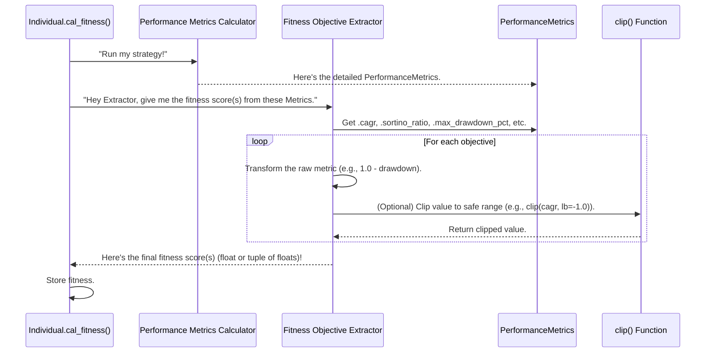

# Chapter 6: Fitness Objective Extractor

Welcome back! In [Chapter 5: Performance Metrics Calculator](05_performance_metrics_calculator_.md), we learned how `evo_worker` produces a detailed "report card" ([PerformanceMetrics](05_performance_metrics_calculator_.md) object) for each trading strategy after simulating its performance. This report contains crucial numbers like `total_return_pct`, `max_drawdown_pct`, and `sharpe_ratio`.

### The Problem: Turning a Report Card into a Simple Grade

Imagine you're a teacher with a stack of student essays. Each essay has a detailed rubric: points for grammar, points for content, points for structure, etc. That's like our `PerformanceMetrics` object – very detailed!

But when you need to quickly compare students or decide who gets an "A" versus a "B," you don't look at all the individual rubric points every time. You need a simpler, overall "grade" or a set of key grades.

The [Evolutionary Engine](03_evolutionary_engine_.md) faces a similar challenge. It receives these comprehensive `PerformanceMetrics` for every [Individual](02_individual___population_.md) (strategy). It needs to:

1.  **Quickly compare** strategies to decide which ones are "fitter" (better).
2.  **Understand** if a strategy is good based on specific goals (e.g., is it highly profitable? Or is it very low risk?).
3.  **Use these simplified scores** for operations like [Selection](04_genetic_operators_.md) (picking parents) or [Replacement](04_genetic_operators_.md) (choosing survivors for the next generation).

The detailed `PerformanceMetrics` are great for human analysis, but too complex for the automated comparison and decision-making an evolutionary algorithm requires.

### The Solution: The Fitness Objective Extractor

This is precisely the job of the **Fitness Objective Extractor**!

Think of this component as the **"judge"** that takes the detailed `PerformanceMetrics` report and translates it into a simple "score" or a concise set of "scores" that the [Evolutionary Engine](03_evolutionary_engine_.md) can easily understand and use for comparison. It's like the teacher who converts the detailed essay rubric into a final letter grade or a few key subject scores.

Here's how it works:

*   **Input**: The detailed `PerformanceMetrics` object from the [Performance Metrics Calculator](05_performance_metrics_calculator_.md).
*   **Process**: It analyzes selected metrics from the report and converts them into one or more objective values (fitness scores). It might combine several metrics, transform them, or directly use them.
*   **Output**:
    *   **Single Score (Single-Objective)**: A single number (e.g., a combined "profitability-risk score"). This is used when the algorithm aims for one overall goal.
    *   **Multiple Scores (Multi-Objective)**: A tuple of distinct numbers (e.g., one score for "profitability" and another for "low risk"). This is used when the algorithm needs to balance several different, potentially conflicting, goals simultaneously.

```mermaid
graph TD
    A[Detailed PerformanceMetrics] --> B{Fitness Objective Extractor}
    B --> C[Simple Score (e.g., 0.85)]
    B --> D[Multiple Scores (e.g., 0.8 Profit, 0.2 Risk)]
```
*Above: The Fitness Objective Extractor simplifies detailed performance into one or more scores.*

### How to Use the Fitness Objective Extractor

You don't typically call the `Fitness Objective Extractor` directly in your main script; instead, you configure the [Evolutionary Engine](03_evolutionary_engine_.md) with an instance of an `ObjectiveExtractor`. The [Individual](02_individual___population_.md) class then uses this configured extractor when it calculates its fitness (as shown in [Chapter 2: Individual & Population](02_individual___population_.md)).

Let's look at how you might set up and use two common types of extractors:

#### 1. Single Objective Extractor: Combining Goals into One Score

A `SingleObjectiveExtractor` takes various performance metrics and boils them down into a single number. This is useful when you have a clear primary goal, and you want the evolutionary algorithm to find the strategy that maximizes this one combined score.

For instance, `CSPSPWeightedAggObjectiveExtractor` combines several metrics (CAGR, Sortino Ratio, Resilience, Stability, Profit Factor) using *weights* you provide, allowing you to prioritize certain aspects.

```python
from app.algorithms.objective import CSPSPWeightedAggObjectiveExtractor
from itapia_common.schemas.entities.performance import PerformanceMetrics

# --- Step 1: Imagine we have a PerformanceMetrics report (from Chapter 5) ---
# For demonstration, we create a dummy one
dummy_metrics = PerformanceMetrics(
    num_trades=10,
    cagr=0.15, # Annual growth rate
    sortino_ratio=2.5, # Risk-adjusted return
    max_drawdown_pct=0.08, # Max loss from peak
    annual_return_stability=0.05, # How consistent returns are
    profit_factor=1.8 # Ratio of total wins to total losses
)

# --- Step 2: Create a Single Objective Extractor ---
# Let's say we want to prioritize CAGR and Sortino Ratio more
# Weights: (CAGR, Sortino, Resilience, Stability, Profit Factor)
my_weights = (0.4, 0.3, 0.1, 0.1, 0.1) # Sums to 1.0 (or any proportional values)
single_extractor = CSPSPWeightedAggObjectiveExtractor(weights=my_weights)

# --- Step 3: Extract the single fitness score ---
fitness_score = single_extractor.extract(dummy_metrics)

print(f"Single Fitness Score: {fitness_score:.4f}")
# Example Output: Single Fitness Score: 0.2310 (This value will depend on the dummy_metrics and weights)
```
*Explanation:*
1.  We pretend to have a `PerformanceMetrics` object, which would normally come from the [Performance Metrics Calculator](05_performance_metrics_calculator_.md).
2.  We create a `CSPSPWeightedAggObjectiveExtractor`, giving it a tuple of `weights`. These weights tell the extractor how much importance to give to each underlying metric (CAGR, Sortino Ratio, Resilience, Stability, Profit Factor) when calculating the final single score.
3.  Calling `extract()` on the `single_extractor` with our `dummy_metrics` gives us a single `float` value that represents the overall "goodness" of the strategy according to our weighted criteria.

#### 2. Multi-Objective Extractor: Balancing Multiple Goals

A `MultiObjectiveExtractor` provides several distinct scores, one for each goal you want to optimize for. This is crucial for more advanced evolutionary algorithms (like NSGA-II, which you'll encounter in [Multi-Objective Dominance](08_multi_objective_dominance_.md)) that can find strategies that are good across *multiple* dimensions, even if those dimensions conflict.

For example, `CSRSPObjectiveExtractor` provides 5 distinct scores for CAGR, Sortino Ratio, Resilience, Stability, and Profit Factor, allowing the algorithm to find a balance between them.

```python
from app.algorithms.objective import CSRSPObjectiveExtractor
from itapia_common.schemas.entities.performance import PerformanceMetrics

# --- Step 1: Reuse our dummy PerformanceMetrics from before ---
# (assuming the same dummy_metrics object as above)

# --- Step 2: Create a Multi-Objective Extractor ---
multi_extractor = CSRSPObjectiveExtractor()

# --- Step 3: Extract the multiple fitness scores ---
objective_scores = multi_extractor.extract(dummy_metrics)

print(f"Multiple Objective Scores: {objective_scores}")
# Example Output: Multiple Objective Scores: (0.15, 2.5, 0.92, 0.9524, 0.4)
# (Note: These values are transformed and clipped versions of the raw metrics)
```
*Explanation:*
1.  We again use our `dummy_metrics` report.
2.  We create a `CSRSPObjectiveExtractor`. This extractor is pre-defined to output 5 specific objective scores.
3.  Calling `extract()` gives us a `tuple` of `float` values. Each value in the tuple represents a different objective (e.g., the first is for CAGR, the second for Sortino Ratio, etc.). The [Evolutionary Engine](03_evolutionary_engine_.md) can then use these separate scores to find strategies that represent good compromises across all these goals. Notice that the values might be *transformed* from the raw `metrics` to fit within certain bounds or be more suitable for optimization. For instance, `max_drawdown_pct` (a loss) is transformed into `1.0 - max_drawdown_pct` (a positive "resilience" score).

### Under the Hood: The Extractor's Scoring Process

Let's visualize how the `Fitness Objective Extractor` does its job when an [Individual](02_individual___population_.md) calculates its fitness.


*Above: The `Fitness Objective Extractor` transforms and clips raw metrics into final fitness scores.*

This diagram highlights that the `Objective Extractor` acts on the `PerformanceMetrics` object, potentially transforming and *clipping* values before returning them. The `clip` function is important for preventing extreme or unrealistic metric values (like an infinitely good profit factor) from skewing the evolutionary process.

#### Diving Deeper into the Code

The `Fitness Objective Extractor` classes are located in `app/algorithms/objective.py`.

#### The Base `ObjectiveExtractor`

All objective extractors inherit from `ObjectiveExtractor`, which defines the `extract` method that every specific extractor must implement.

```python
# File: app/algorithms/objective.py (simplified)
from abc import ABC, abstractmethod
from typing import Tuple, Union
from itapia_common.schemas.entities.performance import PerformanceMetrics

AcceptedObjective = Union[float, Tuple[float, ...]]

class ObjectiveExtractor(ABC):
    @abstractmethod
    def extract(self, metrics: PerformanceMetrics) -> AcceptedObjective:
        """Extract objective values from backtest metrics."""
        pass

class SingleObjectiveExtractor(ObjectiveExtractor):
    # ... defines extract method to return a float ...
    pass

class MultiObjectiveExtractor(ObjectiveExtractor):
    # ... defines extract method to return a Tuple[float, ...] ...
    pass
```
*Explanation:* This sets up the basic contract: any `ObjectiveExtractor` must have an `extract` method that takes `PerformanceMetrics` and returns either a `float` (for single-objective) or a `tuple` of `float`s (for multi-objective).

#### The `clip` Function

This small utility function ensures that any calculated objective value stays within reasonable bounds, preventing potential errors or infinite values from disrupting the algorithm.

```python
# File: app/algorithms/objective.py (simplified)
def clip(value: float, lb: float = -float("inf"), ub: float = float("inf")):
    """Clip a value to stay within specified bounds."""
    if lb >= ub: # Handle cases where bounds are invalid
        return value
    if value < lb:
        return lb # Value is below lower bound, clip to lower bound
    if value > ub:
        return ub # Value is above upper bound, clip to upper bound
    return value # Value is within bounds, no clipping needed
```
*Explanation:* The `clip` function is used throughout the extractors to ensure that objective values (like Sortino Ratio or Profit Factor) don't become excessively large or small, which can cause mathematical instability or overly dominate the evolutionary selection process.

#### The `CSRSPObjectiveExtractor` (Multi-Objective Example)

This class calculates 5 distinct objective scores. Notice how each metric is accessed from the `metrics` object and then potentially transformed or `clip`ped.

```python
# File: app/algorithms/objective.py (simplified)
class CSRSPObjectiveExtractor(MultiObjectiveExtractor):
    # ... (DEFAULT, NUM_OBJS, OBJ_NAMES defined) ...

    def extract(
        self, metrics: PerformanceMetrics
    ) -> Tuple[float, float, float, float, float]:
        if metrics.num_trades == 0:
            return self.DEFAULT # Return worst case if no trades

        obj_cagr = clip(metrics.cagr, lb=-1.0) # Clip CAGR to -1.0 (worst)
        obj_sortino_ratio = clip(metrics.sortino_ratio, lb=0.0, ub=15.0) # Clip Sortino
        obj_resilience = 1.0 - metrics.max_drawdown_pct # Convert drawdown (negative) to resilience (positive)

        # Special handling for profit factor to normalize it
        if metrics.profit_factor >= 1:
            obj_profit_factor = clip((metrics.profit_factor - 1.0) / 2.0, ub=1.5)
        else:
            obj_profit_factor = metrics.profit_factor - 1.0

        obj_stability = 1.0 / (1.0 + metrics.annual_return_stability) # Transform stability

        objectives = (obj_cagr, obj_sortino_ratio, obj_resilience, obj_stability, obj_profit_factor)
        # ... (check for finite values and return) ...
        return objectives
```
*Explanation:*
*   If `num_trades` is zero, it returns a `DEFAULT` (worst-case) tuple.
*   It accesses `metrics.cagr`, `metrics.sortino_ratio`, `metrics.max_drawdown_pct`, etc., directly from the input `PerformanceMetrics` object.
*   Each raw metric is then passed through the `clip` function to ensure it stays within predefined, sensible ranges.
*   Some metrics, like `max_drawdown_pct`, are transformed (`1.0 - ...`) so that a higher value is always "better" (a low drawdown becomes a high resilience score).
*   The final result is a `tuple` of these transformed and clipped floats.

#### The `CSPSPWeightedAggObjectiveExtractor` (Single-Objective Example)

This extractor combines multiple objectives into one, using weights.

```python
# File: app/algorithms/objective.py (simplified)
class CSPSPWeightedAggObjectiveExtractor(SingleObjectiveExtractor):
    def __init__(self, weights: Tuple[float, float, float, float, float]):
        self.weights = weights # Store the weights provided by the user

    def extract(self, metrics: PerformanceMetrics) -> float:
        if metrics.num_trades == 0:
            return self.DEFAULT # Return worst case if no trades
        
        objectives: float = self.DEFAULT # Initialize aggregate score
        total_weights: float = sum(self.weights)

        # Apply transformations and weights for each metric
        obj_cagr = clip(metrics.cagr, lb=-1.0)
        objectives += obj_cagr * self.weights[0] # Add weighted CAGR

        obj_sortino_ratio = clip(metrics.sortino_ratio, lb=0.0, ub=15.0)
        objectives += obj_sortino_ratio * self.weights[1] # Add weighted Sortino

        obj_resilience = 1.0 - metrics.max_drawdown_pct
        objectives += obj_resilience * self.weights[2] # Add weighted Resilience

        obj_stability = 1.0 / (1.0 + metrics.annual_return_stability)
        objectives += obj_stability * self.weights[3] # Add weighted Stability

        if metrics.profit_factor >= 1:
            obj_profit_factor = clip((metrics.profit_factor - 1.0) / 2.0, ub=1.5)
        else:
            obj_profit_factor = metrics.profit_factor - 1.0
        objectives += obj_profit_factor * self.weights[4] # Add weighted Profit Factor

        return objectives / total_weights # Return the average weighted score
```
*Explanation:*
*   The `__init__` method takes the `weights` argument, which allows users to customize the importance of different objectives.
*   Inside `extract`, it performs similar transformations and `clip`ping as the multi-objective extractor, but instead of returning a tuple, it multiplies each objective by its corresponding `weight` and sums them up.
*   Finally, it divides by `total_weights` to get an average weighted score, which is a single `float`.

### Conclusion

You've now understood the "Fitness Objective Extractor," the crucial component in `evo_worker` that acts as the "judge" of trading strategies. It takes the detailed financial `PerformanceMetrics` report (from [Chapter 5: Performance Metrics Calculator](05_performance_metrics_calculator_.md)) and boils it down into one or more simple, comparable scores that the [Evolutionary Engine](03_evolutionary_engine_.md) can use to identify, select, and evolve better strategies. You've seen how it can produce a single, aggregated score or multiple distinct scores, depending on whether you're aiming for a single overall goal or balancing several objectives.

With our strategies now effectively scored, we can start to think about how the system adapts its behavior during the evolutionary process itself.

Next, we'll dive into the [Adaptive Operator Manager](07_adaptive_operator_manager_.md), which intelligently adjusts the genetic operations to improve efficiency!

---

Generated by [AI Codebase Knowledge Builder](https://github.com/The-Pocket/Tutorial-Codebase-Knowledge)