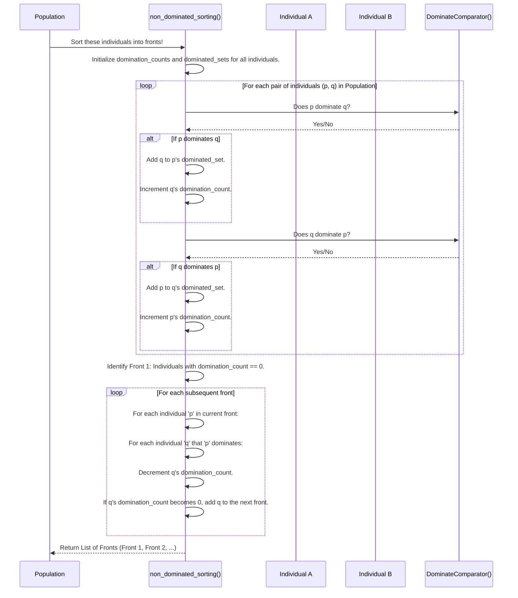
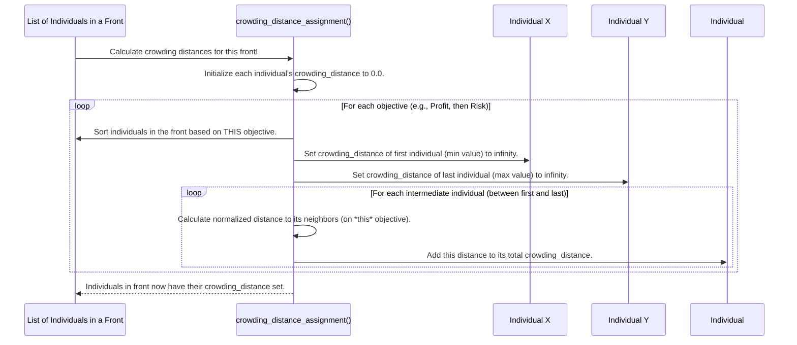

# Chapter 8: Multi-Objective Dominance

Welcome back! In [Chapter 7: Adaptive Operator Manager](07_adaptive_operator_manager_.md), we explored how `evo_worker` intelligently adjusts its genetic tools to make the evolutionary process more efficient. But whether those tools are efficient or not, they still rely on a clear understanding of what makes one trading strategy "better" than another.

### The Problem: When "Better" Isn't So Simple

Up until now, we've mostly thought about strategies having a single "fitness score" (from the [Fitness Objective Extractor](06_fitness_objective_extractor_.md)). For example, a strategy might be judged purely on "total profit." In this case, "more profit is better," and comparing strategies is straightforward.

But what if your goals are more complex, and sometimes conflict with each other?

**Use Case:** Imagine you want a trading strategy that:
1.  **Maximizes Profit (Objective 1)**: You want to make as much money as possible.
2.  **Minimizes Risk (Objective 2)**: You want to avoid huge losses (like a large `max_drawdown_pct` from [Chapter 5: Performance Metrics Calculator](05_performance_metrics_calculator_.md)).

These two goals often conflict! A very high-profit strategy might involve taking huge risks, while a very low-risk strategy might only generate small profits.

How do you compare Strategy A (High Profit, High Risk) with Strategy B (Medium Profit, Low Risk)? Neither is simply "better" than the other in all aspects. Standard "better/worse" comparisons fall short. We need a more sophisticated way to identify truly superior strategies when multiple objectives are at play.

### The Solution: Multi-Objective Dominance

This is where the concept of **Multi-Objective Dominance** comes in! It provides a framework to compare strategies when we have several conflicting goals simultaneously.

Think of it like ranking athletes based on multiple skills:
*   Athlete A: Very fast, moderately strong.
*   Athlete B: Moderately fast, very strong.
*   Athlete C: Very fast, very strong.
*   Athlete D: Slow, weak.

Here, Athlete C is clearly the best – they are better than or equal to everyone in *both* speed and strength, and strictly better in at least one. Athlete C **dominates** everyone else.

However, neither Athlete A nor Athlete B dominates each other. Athlete A is better in speed, but worse in strength. Athlete B is better in strength, but worse in speed. They represent different **trade-offs**.

In `evo_worker`, we use two key concepts to handle this:

#### 1. Pareto Dominance

A strategy (let's call it P) **dominates** another strategy (Q) if:
*   P is **not worse** than Q in *any* of the objectives.
*   P is **strictly better** than Q in *at least one* objective.

If P dominates Q, then P is clearly superior. If neither dominates the other (like Athlete A and B), they are considered **non-dominated** with respect to each other.

The goal in multi-objective optimization is to find a set of **non-dominated strategies**. These strategies form what's called the **Pareto front** (or Pareto optimal set). These are the strategies where you can't improve one objective without making another objective worse. They represent the best possible trade-offs.

```mermaid
graph TD
    subgraph Objectives: Max Profit, Min Risk
        A[Strategy A: $500 Profit, 10% Drawdown]
        B[Strategy B: $800 Profit, 20% Drawdown]
        C[Strategy C: $700 Profit, 15% Drawdown]
        D[Strategy D: $600 Profit, 12% Drawdown]
    end

    A --> Z[Less Profit, Less Risk]
    B --> X[More Profit, More Risk]
    C --> Y[Medium Profit, Medium Risk]
    D --> W[Medium Profit, Low-ish Risk]

    style A fill:#fff,stroke:#333,stroke-width:2px
    style B fill:#fff,stroke:#333,stroke-width:2px
    style C fill:#fff,stroke:#333,stroke-width:2px
    style D fill:#fff,stroke:#333,stroke-width:2px

    subgraph Comparison
        C -.- D
        A -.-> D
        B -.-> C
        B -.-> D
    end

    subgraph Dominance Example
        C -- Dominates --> A
        B -- Dominates --> A
        D -- Dominates --> A

        B -- Not Dominated by -- C
        C -- Not Dominated by -- B
        D -- Not Dominated by -- B
        D -- Not Dominated by -- C
    end

    subgraph Pareto Front (Non-Dominated Solutions)
        PF[Pareto Front]
    end
    PF --- B
    PF --- C
    PF --- D
    
    style PF fill:#afa,stroke:#333,stroke-width:2px

```
*Above: Illustration of dominance. Strategy B, C, D are non-dominated and form the Pareto Front. Strategy A is dominated by B, C, and D.*

#### 2. Non-Dominated Sorting (Ranking)

When we have a whole [Population](02_individual___population_.md) of strategies, we need a way to group them. **Non-dominated sorting** is the algorithm that achieves this. It divides the population into several "fronts" or "layers":

*   **Front 1**: Contains all individuals that are not dominated by *any other individual* in the entire population. These are the "best of the best" trade-offs.
*   **Front 2**: Once Front 1 individuals are removed (conceptually), Front 2 contains all individuals that are non-dominated *among the remaining individuals*.
*   **Front 3, 4, etc.**: The process continues until all individuals are ranked into a front.

Individuals in Front 1 are always preferred over those in Front 2, and so on.

#### 3. Crowding Distance (Diversity)

What if you have many individuals all sitting on the same Pareto front (Front 1)? They all have the same "rank." How do you choose among them, especially if you need to pick only a few for the next generation?

This is where **crowding distance** helps. For individuals within the *same* front, it measures how "crowded" an individual's neighborhood is in the objective space.

*   **High Crowding Distance**: Means the individual is far from its neighbors, representing a unique or diverse trade-off. We prefer these to maintain diversity in our population.
*   **Low Crowding Distance**: Means the individual is very similar to its neighbors.

By prioritizing individuals with higher crowding distance, we ensure that our chosen strategies cover a broad range of trade-offs, not just a small cluster of similar solutions. This prevents the evolutionary process from getting stuck in a small part of the solution space.

### How `evo_worker` Uses Multi-Objective Dominance

You, as the user, don't directly call `non_dominated_sorting` or `crowding_distance_assignment`. Instead, you configure the [Evolutionary Engine](03_evolutionary_engine_.md) to use an algorithm (like NSGA-II) that inherently uses these concepts.

Here's the chain of events:
1.  You provide a [Fitness Objective Extractor](06_fitness_objective_extractor_.md) (like `CSRSPObjectiveExtractor` from Chapter 6) that outputs a *tuple* of multiple fitness scores (e.g., `(profit, risk)`).
2.  The [Evolutionary Engine](03_evolutionary_engine_.md) uses a specialized `DominateComparator` (like `FixedDominateComparator`) to understand how to compare these multiple scores.
3.  During the [Replacement Operator](04_genetic_operators_.md) step of the evolutionary cycle (e.g., `NSGA2ReplacementOperator`), the engine applies `non_dominated_sorting` to rank all individuals into fronts.
4.  If a front is too large and needs to be trimmed, `crowding_distance_assignment` is used to calculate diversity within that front, allowing the operator to select a diverse subset for the next generation.

This ensures that the best strategies (those on the Pareto front) are always carried forward, and among equally good strategies, those offering unique trade-offs are prioritized.

### Under the Hood: The Dominance Mechanics

Let's dive into the core mechanisms that make multi-objective dominance work in `evo_worker`.

#### 1. The Dominance Comparator

The first step is to accurately compare two strategies. The `FixedDominateComparator` does this based on the definition of Pareto dominance.

```python
# File: app/algorithms/comparator.py (simplified)
from app.algorithms.pop import DominanceIndividual

class FixedDominateComparator:
    def __call__(self, ind1: DominanceIndividual, ind2: DominanceIndividual) -> bool:
        # If single objective, act as simple 'better' comparator
        if not isinstance(ind1.fitness, tuple):
            return ind1.fitness > ind2.fitness
        
        is_better_in_one = False
        for f1, f2 in zip(ind1.fitness, ind2.fitness):
            if f1 < f2: # ind1 is worse than ind2 in this objective
                return False # Cannot dominate
            if f1 > f2: # ind1 is better than ind2 in this objective
                is_better_in_one = True

        return is_better_in_one # True if better in at least one and not worse in any
```
*Explanation:* This comparator checks the `fitness` tuple of two `DominanceIndividual` objects. It loops through each objective. If `ind1` is ever worse than `ind2` in *any* objective (`f1 < f2`), it immediately returns `False` (no dominance). If it finds at least one objective where `ind1` is strictly better (`f1 > f2`) and `ind1` was never worse, then `ind1` dominates `ind2`.

#### 2. Non-Dominated Sorting

This algorithm takes a population and systematically groups individuals into fronts.


*Above: The sequence of steps for `non_dominated_sorting` to rank individuals into fronts.*

```python
# File: app/algorithms/dominance.py (simplified)
from typing import List
from .comparator import DominateComparator
from .pop import DominanceIndividual

def non_dominated_sorting(
    inds: List[DominanceIndividual], dominate_comparator: DominateComparator
) -> List[List[DominanceIndividual]]:
    domination_counts = {id(ind): 0 for ind in inds}
    dominated_sets = {id(ind): [] for ind in inds}
    fronts = [[]] # List of lists to hold each front

    # Step 1: Calculate domination counts and dominated sets for all pairs
    for i in range(len(inds)):
        for j in range(i + 1, len(inds)): # Compare each unique pair
            p, q = inds[i], inds[j]
            if dominate_comparator(p, q):
                dominated_sets[id(p)].append(id(q))
                domination_counts[id(q)] += 1
            elif dominate_comparator(q, p):
                dominated_sets[id(q)].append(id(p))
                domination_counts[id(p)] += 1

    # Step 2: Identify the first front (F1)
    for ind_id, cnt in domination_counts.items():
        if cnt == 0: # Individuals not dominated by anyone
            fronts[0].append(next(ind for ind in inds if id(ind) == ind_id)) # Add to F1
            # Note: The actual code uses an ind_map for efficiency

    # Step 3: Build subsequent fronts
    front_idx = 0
    while fronts[front_idx]:
        next_front = []
        for p_ind in fronts[front_idx]:
            for q_id in dominated_sets[id(p_ind)]:
                domination_counts[q_id] -= 1 # Decrement count for individuals p dominates

                if domination_counts[q_id] == 0: # If count becomes 0, it belongs to the next front
                    next_front.append(next(ind for ind in inds if id(ind) == q_id))
        front_idx += 1
        if next_front:
            fronts.append(next_front)
        else:
            break # No more individuals to form new fronts

    return fronts
```
*Explanation:*
*   `domination_counts` keeps track of how many other individuals dominate a given individual.
*   `dominated_sets` stores which individuals *are dominated by* a given individual.
*   The first loop compares every pair of individuals using the `dominate_comparator`.
*   Individuals with a `domination_counts` of 0 are added to `fronts[0]` (Front 1).
*   The `while` loop then iteratively finds subsequent fronts: for each individual in the current front, it reduces the `domination_counts` of the individuals it dominates. If an individual's count drops to 0, it means it's now non-dominated among the *remaining* individuals, so it's added to the `next_front`.

#### 3. Crowding Distance Assignment

This step calculates how "isolated" each individual is within its front.


*Above: The sequence of steps for `crowding_distance_assignment` to calculate diversity within a front.*

```python
# File: app/algorithms/dominance.py (simplified)
def crowding_distance_assignment(front: List[DominanceIndividual]) -> None:
    if not front or len(front) <= 2:
        for ind in front: # For small fronts, just set to infinity for boundary
            ind.crowding_distance = float("inf")
        return

    num_inds = len(front)
    num_objs = len(front[0].fitness)

    for ind in front:
        ind.crowding_distance = 0.0 # Start with 0 for each individual

    for m in range(num_objs): # Iterate through each objective (e.g., Profit, then Risk)
        front.sort(key=lambda ind: ind.fitness[m]) # Sort the front by the current objective

        min_val = front[0].fitness[m]
        max_val = front[-1].fitness[m]

        front[0].crowding_distance = float("inf") # Extreme points always get infinite distance
        front[-1].crowding_distance = float("inf") # to ensure they are kept

        if max_val == min_val: # Avoid division by zero if all values are same
            continue

        for i in range(1, num_inds - 1): # For all individuals in between
            distance = front[i + 1].fitness[m] - front[i - 1].fitness[m] # Distance to neighbors
            normalized_distance = distance / (max_val - min_val) # Normalize
            front[i].crowding_distance += normalized_distance # Add to total distance
```
*Explanation:*
*   The function initializes `crowding_distance` to 0 for all individuals in the `front`.
*   It then loops through *each objective*. For example, first for profit, then for risk.
*   For each objective, it sorts the `front` based on that objective's value.
*   The individuals at the *extremes* of the sorted list (minimum and maximum value for that objective) are assigned an infinite crowding distance. This guarantees they are always preferred, maintaining the boundaries of the Pareto front.
*   For all other individuals, it calculates the "distance" to their neighbors in the sorted list, normalizes it, and adds it to their total `crowding_distance`. This cumulative distance across all objectives gives a measure of how spread out the individual is from others in the entire objective space.

### Conclusion

You've now uncovered "Multi-Objective Dominance," a powerful concept in `evo_worker` that allows the system to intelligently optimize trading strategies for several conflicting goals simultaneously. You've learned how **Pareto dominance** identifies truly superior strategies, how **non-dominated sorting** ranks individuals into "fronts" based on this superiority, and how **crowding distance** ensures diversity among equally good trade-offs. This sophisticated comparison mechanism is vital for finding robust and flexible trading strategies that balance profitability, risk, and other key performance indicators.

Now that we understand how to compare and rank strategies in a multi-objective world, let's explore an alternative, yet complementary, approach to handling multiple objectives.

Next, we'll dive into [Multi-Objective Decomposition](09_multi_objective_decomposition_.md), which tackles the problem of multiple goals by breaking them down!

---

Generated by [AI Codebase Knowledge Builder](https://github.com/The-Pocket/Tutorial-Codebase-Knowledge)