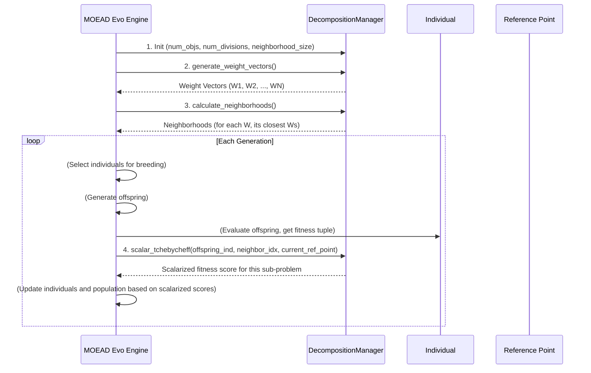

# Chapter 9: Multi-Objective Decomposition

Welcome back! In [Chapter 8: Multi-Objective Dominance](08_multi_objective_dominance_.md), we learned how to compare trading strategies when we have multiple, often conflicting, goals like maximizing profit while minimizing risk. We saw that **Pareto Dominance** helps us find a set of non-dominated strategies that represent the best possible trade-offs.

### The Problem: Tackling Complex Goals Directly

While dominance sorting is powerful, directly finding these perfect trade-offs among a large, diverse [Population](02_individual___population_.md) can sometimes be challenging, especially as the number of objectives increases. Imagine you're building a highly complex product, like a self-driving car. It needs to be:
*   Safe (Objective 1)
*   Comfortable (Objective 2)
*   Fuel-efficient (Objective 3)
*   Affordable (Objective 4)

Trying to optimize for all these at once, while comparing complex "dominance" between every possible design, can be a daunting task. Sometimes, a simpler approach is to **break down the big problem** into many smaller, more manageable sub-problems, each with a slightly different focus.

This is exactly what the **Multi-Objective Evolutionary Algorithm based on Decomposition (MOEA/D)** does, and our **Multi-Objective Decomposition** component is its heart!

### The Solution: Multi-Objective Decomposition

**Multi-Objective Decomposition** is like splitting that big, intricate self-driving car project into many smaller, focused tasks. Instead of trying to find *one* car that perfectly balances *all* objectives at once, MOEA/D assigns **many specialized teams** to focus on slightly different **priorities**:

*   **Team 1**: Focuses 100% on safety, 0% on comfort, 0% fuel-efficiency, 0% affordability.
*   **Team 2**: Focuses 90% on safety, 10% on comfort, 0% fuel-efficiency, 0% affordability.
*   **Team 3**: Focuses 50% on safety, 50% on affordability, 0% on other things.
*   ...and so on, for hundreds or thousands of teams!

Each team (representing a "sub-problem") then tries to find the best car design that matches *its specific priority*. Crucially, these teams also **collaborate with closely related teams** (their "neighbors") to share good ideas and solutions.

In `evo_worker`, the `DecompositionManager` component performs this breakdown:

1.  **Generates "Weight Vectors"**: These are the "priority settings" for each team, defining what balance of objectives that team should focus on (e.g., (0.7 Profit, 0.3 Risk) or (0.1 Profit, 0.9 Risk)).
2.  **Calculates "Neighborhoods"**: It identifies which teams have similar priority settings so they can easily share information.
3.  **Scalarizes Objectives**: It helps each individual "team member" (our [Individuals](02_individual___population_.md)) evaluate how good *their* specific strategy is according to *their team's specific priority*.

This approach guides the search towards a diverse set of solutions, each representing a different optimal trade-off across your chosen objectives.

```mermaid
graph TD
    A[Complex Multi-Objective Problem] --> B{Decomposition Manager}
    B --> C[Weight Vector 1 (e.g., Focus: High Profit)]
    B --> D[Weight Vector 2 (e.g., Focus: Balance)]
    B --> E[Weight Vector 3 (e.g., Focus: Low Risk)]
    
    C --> C1[Sub-problem 1 (Maximize Profit based on Weight 1)]
    D --> D1[Sub-problem 2 (Balance Profit/Risk based on Weight 2)]
    E --> E1[Sub-problem 3 (Minimize Risk based on Weight 3)]

    C1 --- N1["Neighborhood" (similar sub-problems)]
    D1 --- N1
    E1 --- N2["Neighborhood" (other similar sub-problems)]
    
    N1 --> F[Individuals specialize on their sub-problem, share with neighbors]
```
*Above: Multi-Objective Decomposition breaks a big problem into many smaller, specialized sub-problems.*

### How `evo_worker` Uses Multi-Objective Decomposition

Similar to multi-objective dominance, you typically don't directly call methods on the `DecompositionManager`. Instead, you configure the [Evolutionary Engine](03_evolution_engine_.md) (specifically, the `MOEADEvoEngine` which implements the MOEA/D algorithm) with the parameters for decomposition. The engine then uses the `DecompositionManager` internally to manage the weight vectors and neighborhoods.

Here's how you might set up the `DecompositionManager`'s parameters when configuring an MOEA/D engine:

```python
from app.algorithms.engine.moead import MOEADEvoEngine
# ... (other imports for Evaluator, ObjectiveExtractor, etc.)

# 1. Create the MOEA/D Engine
# It will internally create a DecompositionManager based on these params
moead_engine = MOEADEvoEngine(
    run_id="my_moead_run",
    pop_size=100,           # Total individuals in the population
    num_gen=10,             # Number of generations
    num_objs=2,             # Number of objectives (e.g., Profit, Risk)
    num_divisions=99,       # How many distinct weight vectors to create
    neighborhood_size=20    # How many "neighbors" each sub-problem has
)

# 2. Set up other essential tools
# ... (set evaluator, obj_extractor, genetic operators, etc.) ...

# 3. Run the engine
print("Starting MOEA/D evolutionary process...")
final_strategies = moead_engine.run()

print("Evolution complete using decomposition!")
```
*Explanation:* When you initialize the `MOEADEvoEngine`, you provide `num_objs`, `num_divisions`, and `neighborhood_size`. These parameters are passed to an internal `DecompositionManager`.
*   `num_objs`: Tells the manager how many dimensions your objectives have (e.g., 2 for profit and risk).
*   `num_divisions`: Controls how fine-grained the "priority settings" (weight vectors) should be. For 2 objectives and `num_divisions=99`, it will generate 100 weight vectors (from (0,1) to (1,0) and everything in between, summing to 1). More divisions mean more sub-problems and potentially a wider range of solutions.
*   `neighborhood_size`: Determines how many closest "neighbor" sub-problems each sub-problem will collaborate with.

The `DecompositionManager` then generates `num_divisions + num_objs - 1 choose num_objs - 1` weight vectors (for `num_objs=2` and `num_divisions=99`, this results in 100 weight vectors). Each of these 100 weight vectors defines a sub-problem for an [Individual](02_individual___population_.md) to specialize in.

### Under the Hood: The Decomposition Manager's Tools

Let's peek behind the scenes at how the `DecompositionManager` works its magic.


*Above: The `MOEADEvoEngine` uses the `DecompositionManager` to set up weight vectors and neighborhoods, and then to evaluate individuals against specific sub-problems.*

#### Diving Deeper into the Code

The `DecompositionManager` class is located in `app/algorithms/decomposition.py`.

#### 1. Initializing and Generating Weight Vectors

The `__init__` method sets up the manager with basic parameters, and `generate_weight_vectors` creates all the different priority settings.

```python
# File: app/algorithms/decomposition.py (simplified)
import numpy as np
import math
from typing import List, Dict, Any

class DecompositionManager:
    def __init__(self, num_objs: int, num_divisions: int, neighborhood_size: int):
        self.num_objs = num_objs
        self.num_divisions = num_divisions
        self.neighborhood_size = neighborhood_size
        self.problem_weight_vectors: np.ndarray = None # Will store our priority vectors

    def generate_weight_vectors(self) -> "DecompositionManager":
        weights = [] # List to temporarily hold generated vectors

        def _recursive_generator(idx: int, curr_sum: int, vector: List[int]):
            if idx == self.num_objs - 1:
                vector[idx] = self.num_divisions - curr_sum
                weights.append(list(vector))
                return
            for i in range(self.num_divisions - curr_sum + 1):
                vector[idx] = i
                _recursive_generator(idx + 1, curr_sum + i, vector)

        _recursive_generator(0, 0, [0] * self.num_objs) # Start recursion
        
        # Convert integer counts to percentages (summing to 1.0)
        self.problem_weight_vectors = np.array(weights) / self.num_divisions
        
        # Internal check: ensure correct number of vectors generated
        expected_num = int(math.comb(self.num_divisions + self.num_objs - 1, self.num_objs - 1))
        assert len(self.problem_weight_vectors) == expected_num

        return self
```
*Explanation:*
*   The `__init__` method simply stores the configuration values.
*   `generate_weight_vectors` uses a clever `_recursive_generator` function to create all possible combinations of integers that sum up to `num_divisions`. For example, if `num_objs=2` and `num_divisions=2`, it might generate (0,2), (1,1), (2,0).
*   These integer combinations are then divided by `num_divisions` to become `problem_weight_vectors` (e.g., (0,1), (0.5,0.5), (1,0)), which are arrays of percentages that sum to 1.0. Each vector represents a unique priority setting.

#### 2. Calculating Neighborhoods

After the weight vectors are generated, `calculate_neighborhoods` figures out which vectors are "closest" to each other in terms of their priorities.

```python
# File: app/algorithms/decomposition.py (simplified)
# ... (imports and DecompositionManager class) ...

    def calculate_neighborhoods(self) -> "DecompositionManager":
        num_vectors = self.num_vectors # Total number of weight vectors
        T = self.neighborhood_size     # How many neighbors to find

        if T >= num_vectors: # Edge case: if neighborhood size is too big
            # ... (special handling, usually won't happen) ...
            return self

        # 1. Calculate distance matrix between all weight vectors
        # This uses clever NumPy broadcasting to calculate Euclidean distance efficiently
        diff = (
            self.problem_weight_vectors[:, np.newaxis, :] # Make vectors into rows
            - self.problem_weight_vectors[np.newaxis, :, :] # Make vectors into columns
        )
        dist_matrix = np.sqrt((diff**2).sum(axis=2)) # Sum squared differences and take sqrt

        # 2. Sort distances and get indices of nearest neighbors
        sorted_indices = np.argsort(dist_matrix, axis=1) # Sort each row (distances from one vector to all others)

        # 3. Store T nearest neighbors (excluding the vector itself, which has distance 0)
        self.neighborhoods = sorted_indices[:, 1 : T + 1] # Take the first T neighbors

        return self
```
*Explanation:*
*   This method calculates the **Euclidean distance** between every pair of `problem_weight_vectors`. Think of each weight vector as a point in a multi-dimensional space; the distance tells you how similar their priorities are.
*   `np.argsort(dist_matrix, axis=1)` then sorts these distances for each weight vector, returning the *indices* of the closest vectors.
*   Finally, `sorted_indices[:, 1 : T + 1]` extracts the `T` closest neighbors for each vector, ignoring the first one (which is always the vector itself, with a distance of 0). This `self.neighborhoods` array then tells each sub-problem which other sub-problems it should collaborate with.

#### 3. Scalarizing Objectives (Tchebycheff Decomposition)

This is the core of how an [Individual](02_individual___population_.md) is "scored" for a *specific* sub-problem. The `scalar_tchebycheff` method uses the individual's fitness, a particular weight vector, and a global "reference point" (representing the worst observed performance across all objectives so far).

```python
# File: app/algorithms/decomposition.py (simplified)
import numpy as np
from app.algorithms.pop import MOEADIndividual # Specialized Individual for MOEA/D

class DecompositionManager:
    # ... (other methods) ...

    def scalar_tchebycheff(
        self, ind: MOEADIndividual, neighbor_idx: int, reference_point: np.ndarray
    ) -> float:
        """Calculate scalarized Tchebycheff decomposition value."""
        
        fitness_arr = np.array(ind.fitness) # Convert individual's fitness tuple to a NumPy array

        # 1. Calculate difference from reference point
        # The reference_point is typically the worst observed objective values,
        # so (reference - fitness) gives a positive value if fitness is worse.
        diff = reference_point - fitness_arr

        # 2. Get the specific weight vector for this sub-problem
        weight_vector = self.problem_weight_vectors[neighbor_idx]

        # 3. Multiply by weights (this "stretches" or "compresses" the difference)
        weighted_diff = weight_vector * diff

        # 4. Take the maximum value (this is the "worst" component after adjustment by weights)
        # We want to minimize this maximum, meaning we want to improve the "worst" objective
        # according to the current weight vector.
        return np.max(weighted_diff)
```
*Explanation:*
*   `ind.fitness` is expected to be a tuple of objective values (e.g., `(profit, risk)`). `fitness_arr` converts this to a NumPy array.
*   `diff = reference_point - fitness_arr`: Calculates how far the individual's fitness is from a "worst-case" `reference_point` for each objective.
*   `weighted_diff = weight_vector * diff`: This is the core "decomposition." It multiplies the `diff` for each objective by its corresponding `weight` from the `weight_vector`. If the weight vector prioritizes profit (e.g., `[0.9, 0.1]`), then the profit difference will have a much larger impact.
*   `np.max(weighted_diff)`: The Tchebycheff method then returns the *largest* of these weighted differences. The goal for a specific sub-problem is to *minimize* this value. By minimizing the maximum weighted difference, the individual tries to improve its "weakest" objective (as defined by the `weight_vector`), pushing the solution towards the desired trade-off.

### Conclusion

You've now explored "Multi-Objective Decomposition," an alternative and powerful approach to handling multiple conflicting goals in `evo_worker`. Instead of directly comparing dominance, it breaks the complex problem into many simpler, single-objective sub-problems, each defined by a unique "weight vector" that specifies objective priorities. You've seen how `evo_worker` generates these priority settings, calculates "neighborhoods" for collaboration, and then uses methods like Tchebycheff decomposition to score strategies for these specialized sub-problems. This approach, often used in algorithms like MOEA/D, efficiently guides the evolutionary process to discover a diverse set of optimal trade-offs.

With our understanding of how `evo_worker` breaks down and evaluates strategies, we have covered the main components that drive its intelligent decision-making for trading strategy generation.

---

Generated by [AI Codebase Knowledge Builder](https://github.com/The-Pocket/Tutorial-Codebase-Knowledge)