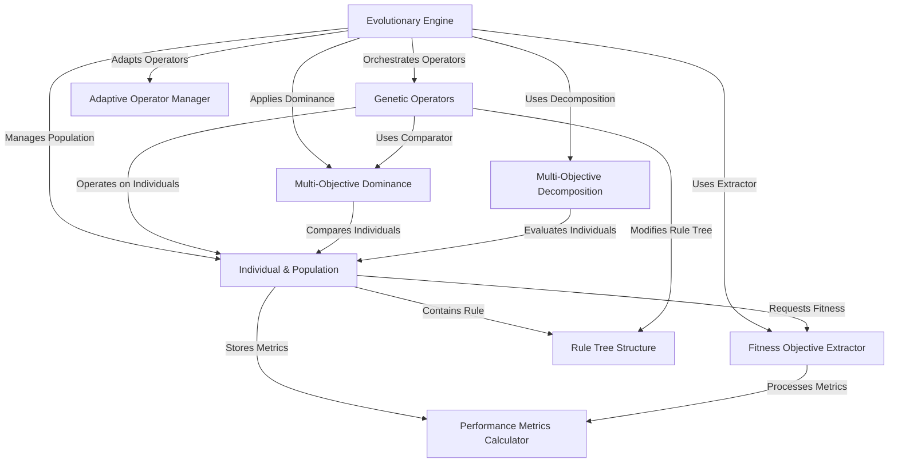

# Tutorial: evo_worker

The `evo_worker` project is a sophisticated system designed for the **automatic discovery and optimization of trading strategies**. It leverages *evolutionary algorithms* to iteratively generate, evaluate, and refine potential trading rules, aiming to find strategies that are both profitable and robust. The core functionality involves creating diverse populations of strategies, applying genetic operations to evolve them, and precisely measuring their performance to guide the optimization process towards optimal trading rules.

**Source Repository:** [None](None)

## Chapters

1. [Rule Tree Structure
](01_rule_tree_structure_.md)
2. [Individual & Population
](02_individual___population_.md)
3. [Evolutionary Engine
](03_evolutionary_engine_.md)
4. [Genetic Operators
](04_genetic_operators_.md)
5. [Performance Metrics Calculator
](05_performance_metrics_calculator_.md)
6. [Fitness Objective Extractor
](06_fitness_objective_extractor_.md)
7. [Adaptive Operator Manager
](07_adaptive_operator_manager_.md)
8. [Multi-Objective Dominance
](08_multi_objective_dominance_.md)
9. [Multi-Objective Decomposition
](09_multi_objective_decomposition_.md)

---

Generated by [AI Codebase Knowledge Builder](https://github.com/The-Pocket/Tutorial-Codebase-Knowledge)