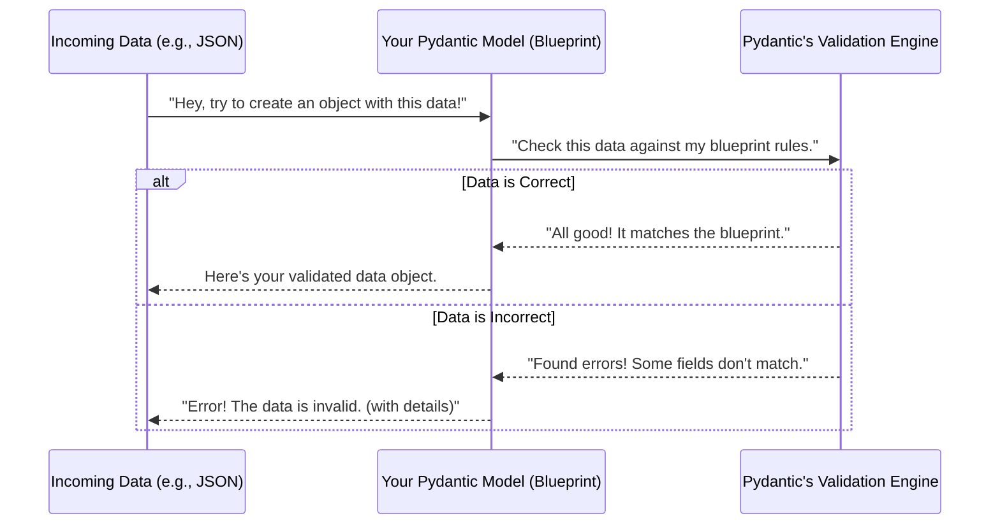

# Chapter 1: Data Schemas (Pydantic Models)

Welcome to the first chapter of our `shared` project tutorial! In this chapter, we're going to dive into a fundamental concept that helps us keep all our information organized and reliable: **Data Schemas**, specifically using something called **Pydantic Models**.

## The Problem: What If Our Data Is a Mess?

Imagine our project, `itapia`, as a bustling financial hub. We're constantly dealing with all sorts of important information:

*   **User Profiles:** Details about who our users are, their investment goals, and risk tolerance.
*   **Stock Prices:** Daily open, high, low, close prices, and trading volumes.
*   **News Articles:** Summaries, sentiment scores, and identified entities.
*   **Analysis Reports:** Complex forecasts, technical indicators, and aggregated scores.

Now, imagine we receive a user's investment profile data. What if the "risk appetite" field is spelled wrong, or the "expected annual return" is given as text instead of a number? Or what if a stock price is missing its closing value? This kind of messy or incorrect data can cause all sorts of problems: errors in calculations, crashes in our application, and ultimately, bad financial advice for our users.

How do we make sure that every piece of information, no matter how simple or complex, always has the correct structure and type?

## The Solution: Data Schemas (Our "Blueprints")

This is where **Data Schemas** come in! Think of a data schema as a **blueprint** or a **contract** for our data. It's a precise definition that says: "This piece of data *must* have these specific fields, and each field *must* be of a particular type (like text, numbers, or true/false)."

In `itapia`, we use a fantastic Python library called **Pydantic** to create these blueprints, which we call **Pydantic Models**. They ensure that all parts of our application "speak the same data language."

## Creating Your First Blueprint: The User Profile

Let's start with a simple example: defining the basic information for a user. We want every user to have an email address and optionally a full name.

```python
from pydantic import BaseModel, EmailStr
from typing import Optional

# This is our "blueprint" for basic user information
class UserBase(BaseModel):
    email: EmailStr  # This field MUST be a valid email address
    full_name: Optional[str] = None # This field is optional and if present, must be text

# The 'UserBase' model is now a contract.
# Any data claiming to be a UserBase MUST follow these rules.
```

In this code:
*   `BaseModel` is the foundation from Pydantic that gives our blueprint its powers.
*   `email: EmailStr` means the `email` field is required and Pydantic will automatically check if it looks like a real email address (e.g., `user@example.com`).
*   `full_name: Optional[str] = None` means the `full_name` field is optional (it can be `None`), but if it *is* provided, it must be a string (text).

### Putting the Blueprint to Work: Creating Data

Now, let's see how this blueprint helps us:

```python
# 1. Creating valid data
user_data_ok = UserBase(email="alice@example.com", full_name="Alice Smith")
print(user_data_ok)
# Output: email='alice@example.com' full_name='Alice Smith'

# 2. Creating data with optional field missing
user_data_no_name = UserBase(email="bob@example.com")
print(user_data_no_name)
# Output: email='bob@example.com' full_name=None

# 3. Trying to create invalid data (Pydantic catches it!)
try:
    UserBase(email="not-an-email", full_name=123) # Email is invalid, full_name is wrong type
except Exception as e:
    print("\nOops, validation error detected!")
    print(e)
# Output:
# Oops, validation error detected!
# 2 validation errors for UserBase
# email
#   value is not a valid email address (type=value_error.email)
# full_name
#   Input should be a valid string (type=string_type)
```

As you can see, Pydantic automatically validates the data against our `UserBase` blueprint. If the data doesn't match the rules, it immediately tells us what's wrong! This is incredibly helpful for preventing errors early.

## Adding More Detail: Nested Schemas and Special Types

Our `itapia` project deals with complex things like investment profiles. These profiles aren't just simple fields; they have sections like "Risk Tolerance" and "Investment Goals." Pydantic allows us to build complex blueprints by nesting smaller blueprints inside larger ones.

Here’s a simplified example of how we define parts of an investment profile, and then combine them, much like you see in `itapia_common\schemas\entities\profiles.py`:

```python
from pydantic import BaseModel, Field
from typing import Literal # Used for predefined choices

# A small blueprint for risk tolerance
class RiskTolerancePart(BaseModel):
    risk_appetite: Literal["conservative", "moderate", "aggressive"] = Field(
        ..., description="Overall risk tolerance" # '...' means this field is required
    )

# A small blueprint for investment goals
class InvestGoalPart(BaseModel):
    primary_goal: Literal["capital_growth", "income_generation"] = Field(
        ..., description="The primary goal"
    )

# The main blueprint for an investment profile, combining smaller blueprints
class ProfileBase(BaseModel):
    profile_name: str = Field(..., min_length=3, description="Name of profile")
    risk_tolerance: RiskTolerancePart # This field MUST be a RiskTolerancePart blueprint
    invest_goal: InvestGoalPart      # This field MUST be an InvestGoalPart blueprint

    class Config:
        # This tells Pydantic to be compatible with object attributes,
        # often used when loading data from databases.
        from_attributes = True
```

Now, when we create an `ProfileBase` instance, Pydantic will check the `profile_name`, AND it will check that `risk_tolerance` is a valid `RiskTolerancePart`, and `invest_goal` is a valid `InvestGoalPart`. This makes building complex data structures much easier and safer!

```python
# Creating a valid investment profile
my_profile = ProfileBase(
    profile_name="Aggressive Growth",
    risk_tolerance={"risk_appetite": "aggressive"},
    invest_goal={"primary_goal": "capital_growth"}
)
print(my_profile)
# Output: profile_name='Aggressive Growth' risk_tolerance=RiskTolerancePart(risk_appetite='aggressive') invest_goal=InvestGoalPart(primary_goal='capital_growth')

# Trying to create an invalid profile (e.g., wrong risk appetite)
try:
    ProfileBase(
        profile_name="Safe Income",
        risk_tolerance={"risk_appetite": "crazy"}, # 'crazy' is not allowed!
        invest_goal={"primary_goal": "income_generation"}
    )
except Exception as e:
    print("\nAnother validation error caught!")
    print(e)
# Output:
# Another validation error caught!
# 1 validation error for ProfileBase
# risk_tolerance.risk_appetite
#   Input should be 'conservative', 'moderate' or 'aggressive' (type=literal_error)
```

## Why These Blueprints Are So Powerful (Benefits)

1.  **Automatic Validation:** As we've seen, Pydantic checks all incoming data against your rules. This drastically reduces bugs caused by malformed data.
2.  **Clear Documentation:** Your Pydantic Models act as live, executable documentation for your data. Any developer can look at a model and immediately understand the expected structure and types.
3.  **Autocomplete & Type Hinting:** For developers using modern code editors, Pydantic models enable powerful autocomplete and type-checking features, making development faster and less error-prone.
4.  **Consistency Across the System:** From stock prices and news articles to complex analysis reports and user profiles, every piece of data in `itapia` uses these schemas. This ensures that all parts of the application "speak the same data language," helping to prevent errors and making development smoother.

## Under the Hood: How Pydantic Works (Simplified)

When you tell Pydantic to create an object from your blueprint (like `UserBase(...)`), here's a simplified view of what happens:



Essentially, Pydantic acts as a gatekeeper. It takes raw data (often from external sources like APIs or databases) and rigorously checks it against the rules you've defined in your models before letting it into your application. If the data passes, you get a beautiful, structured Python object you can confidently work with. If it fails, you get clear, actionable error messages.

## Looking at Real Code Examples in `itapia_common\schemas\entities`

In the `itapia` project, you'll find all these data blueprints organized in the `itapia_common/schemas` directory.

For instance, the `User` models we discussed are defined in `itapia_common\schemas\entities\users.py`. You'll notice patterns like:

```python
# itapia_common/schemas/entities/users.py (simplified)
from pydantic import BaseModel, EmailStr
from typing import Optional

class UserBase(BaseModel):
    email: EmailStr
    full_name: Optional[str] = None

class UserCreate(UserBase): # UserCreate "inherits" all fields and rules from UserBase
    google_id: str # Adds a new required field specific to creation

# ... other user-related models ...
```

Here, `UserCreate` is a "child" model of `UserBase`. It automatically includes `email` and `full_name` from `UserBase` and then adds its own specific `google_id` field. This inheritance makes it easy to reuse common data structures and extend them for different purposes (like creating a user vs. updating a user).

You'll also see more complex examples, such as those related to financial analysis, like `AdvisorReportSchema` in `itapia_common\schemas\entities\advisor.py` or `TechnicalReport` in `itapia_common\schemas\entities\analysis\technical\_full.py`. These models demonstrate how deep and intricate data structures can be built using the same Pydantic principles, ensuring every piece of financial insight is perfectly structured.

## Conclusion

In this chapter, we've learned that Data Schemas, powered by Pydantic Models, are like essential blueprints for all the information in our `itapia` project. They provide structure, ensure data types are correct, and prevent errors, making our system more robust and reliable. From simple user details to complex financial reports, every piece of data adheres to these defined contracts.

Now that we understand how to define the *shape* of our data, the next logical step is to learn how to store and retrieve this structured data. In the next chapter, we'll explore how `itapia` connects to its database to persist this valuable information.

[Next Chapter: Database Connection & Session Management](02_database_connection___session_management_.md)

---

Generated by [AI Codebase Knowledge Builder](https://github.com/The-Pocket/Tutorial-Codebase-Knowledge)