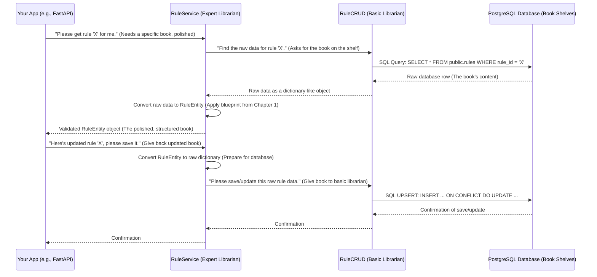

# Chapter 3: Data Access Layer (CRUD & Services)

Welcome back! In our previous chapters, we laid some crucial groundwork:
*   In [Chapter 1: Data Schemas (Pydantic Models)](01_data_schemas__pydantic_models__.md), we learned how to create "blueprints" for our data using Pydantic Models, ensuring everything has the right shape.
*   In [Chapter 2: Database Connection & Session Management](02_database_connection___session_management_.md), we explored how `itapia` efficiently connects to its databases (PostgreSQL and Redis) and provides temporary, isolated "workspaces" (sessions) for each database interaction.

Now, we have perfectly structured data and a way to connect to our storage. But how do we actually *talk* to the database to store our new user profiles, fetch historical stock prices, or update an analysis report? We need a way to perform the actual "filing" and "retrieving" of our structured information.

## The Problem: How Do We Perform Database Operations and Apply Business Logic?

Imagine you're building a feature in `itapia` that lets users save their custom investment "rules." These rules are complex – they have a name, a description, a status (like "active" or "draft"), and the actual logic tree.

When a user clicks "Save Rule," our application needs to:
1.  Take the user's input (which might be in a Pydantic Model from Chapter 1).
2.  Store this data in the PostgreSQL database.
3.  If the rule already exists, update it instead of creating a new one.
4.  Before saving, ensure the rule's data is valid and adheres to any specific business rules (e.g., a rule must have a unique ID).
5.  When the application needs to *use* a rule, it needs to fetch it from the database, ensure it's in the correct format, and perhaps apply some initial processing.

Doing all this directly in every part of our application that touches the database would be messy, error-prone, and hard to manage. We need a structured way to handle these interactions.

## The Solution: The Data Access Layer (Our Library Staff)

This is where the **Data Access Layer (DAL)** comes in! Think of the DAL as our specialized **library staff** for the `itapia` project. It's the dedicated group that knows exactly how to interact with our databases.

The DAL in `itapia` is divided into two main roles:

1.  **CRUD (Create, Read, Update, Delete) Operations: The "Basic Librarians"**
    *   These are like the librarians who know how to perform simple, direct tasks: find a specific book, put a book on a shelf, update a book's status, or remove a book.
    *   They interact *directly* with the database tables (our book shelves) using raw SQL queries or database-specific commands.
    *   Their job is purely to interact with the database; they don't apply complex rules or validate data beyond what the database itself enforces.

2.  **Services: The "Expert Librarians/Researchers"**
    *   These are like the expert librarians or researchers. They handle more complex requests.
    *   They don't directly interact with the database tables themselves. Instead, they tell the "Basic Librarians" (CRUD operations) what to do.
    *   They combine multiple basic actions, validate inputs using our data blueprints ([Pydantic Models from Chapter 1](01_data_schemas__pydantic_models__.md)), apply higher-level business rules, and prepare data in a user-friendly format before returning it to the rest of the application.

This two-tier system keeps things organized: the CRUD layer focuses on raw database mechanics, while the Services layer focuses on application logic and data integrity.

## Key Concepts Explained

Let's break down these two roles with practical examples from `itapia`.

### 1. CRUD: The Basic Librarians (itapia_common/dblib/crud/)

The `CRUD` (Create, Read, Update, Delete) layer provides simple functions that talk directly to the database. They are focused on *one type of data* and perform the four basic database operations.

In `itapia`, you'll find these files in `itapia_common/dblib/crud/`. For example, `itapia_common/dblib/crud/rules.py` handles operations for our "rules" data.

Let's look at a simplified `RuleCRUD` example for fetching a rule by its ID:

```python
# From itapia_common/dblib/crud/rules.py (simplified)
from sqlalchemy import text, RowMapping
from sqlalchemy.orm import Session
from typing import Optional

class RuleCRUD:
    def __init__(self, db_session: Session):
        self.db = db_session # Our database session from Chapter 2

    def get_rule_by_id(self, rule_id: str) -> Optional[RowMapping]:
        """
        Fetches raw rule data from the 'rules' table by its ID.
        This is a basic 'Read' operation.
        """
        stmt = text(
            """SELECT rule_id, name, description, purpose, rule_status, root, metrics
                    FROM public.rules WHERE rule_id = :rule_id;"""
        )
        result = self.db.execute(stmt, {"rule_id": rule_id}) # Execute the SQL query

        # .mappings().one() converts the database row into a dictionary-like object
        return result.mappings().one_or_none() # Returns one row or None if not found
```
**Explanation:**
*   The `RuleCRUD` class is initialized with a `db_session` (our private database workspace from [Chapter 2](02_database_connection___session_management_.md)).
*   The `get_rule_by_id` method directly constructs a SQL `SELECT` query using `text()`.
*   It then `execute()`s this query on the `db_session`.
*   Finally, it retrieves the raw database row as a `RowMapping` (which acts like a dictionary) or `None` if no rule is found.
*   Notice it returns raw data; no Pydantic Models are used here. Its sole job is to interact with the database.

Here's another example for creating or updating a rule (`UPSERT`):

```python
# From itapia_common/dblib/crud/rules.py (simplified)
import json
from typing import Any, Dict # ... other imports ...

class RuleCRUD:
    # ... (init and get_rule_by_id as above) ...

    def create_or_update_rule(self, rule_id: str, rule_data: Dict[str, Any]) -> str:
        """
        Creates a new rule or updates an existing one if rule_id conflicts.
        This is a 'Create' or 'Update' operation (UPSERT).
        """
        # Prepare data for SQL query
        name = rule_data.get("name", "Untitled Rule")
        description = rule_data.get("description", "")
        rule_status = rule_data.get("rule_status")
        purpose = rule_data.get("purpose")
        created_at = rule_data.get("created_at")

        # Convert complex dictionary data (like 'root' and 'metrics') into JSON strings
        # to store in a PostgreSQL JSONB column.
        root_str = json.dumps(rule_data.get("root"))
        metrics = json.dumps(rule_data.get("metrics"))

        stmt = text(
            """
            INSERT INTO public.rules (rule_id, name, description, purpose, rule_status, created_at, root, metrics)
            VALUES (:rule_id, :name, :description, :purpose, :rule_status, :created_at, :root, :metrics)
            ON CONFLICT (rule_id) DO UPDATE SET -- If rule_id already exists, update these fields:
                name = EXCLUDED.name,
                description = EXCLUDED.description,
                purpose = EXCLUDED.purpose,
                rule_status = EXCLUDED.rule_status,
                root = EXCLUDED.root,
                metrics = EXCLUDED.metrics,
                updated_at = NOW() -- Also update the 'updated_at' timestamp
            RETURNING rule_id;
        """
        )

        self.db.execute(
            stmt,
            { # These are the values for the placeholders in the SQL statement
                "rule_id": rule_id, "name": name, "description": description,
                "purpose": purpose, "rule_status": rule_status,
                "created_at": created_at, "root": root_str, "metrics": metrics,
            },
        )
        self.db.commit() # Save the changes to the database!
        return rule_id
```
**Explanation:**
*   The `create_or_update_rule` method takes a `rule_id` and a dictionary (`rule_data`) of values.
*   It converts certain fields (like `root` and `metrics`) into JSON strings because they will be stored in a special `JSONB` column in PostgreSQL, which is great for flexible, schema-less data.
*   It uses an `INSERT ... ON CONFLICT DO UPDATE` statement (often called an "UPSERT"), which is a powerful PostgreSQL feature to either insert a new row or update an existing one if a `rule_id` already exists.
*   `self.db.commit()` is essential here; it saves all the changes made in this session to the database.

### 2. Services: The Expert Librarians (itapia_common/dblib/services/)

The `Services` layer builds on top of the CRUD operations. It's where the application's specific business logic lives.

In `itapia`, these service files are located in `itapia_common/dblib/services/`. For instance, `itapia_common/dblib/services/rules.py` contains the `RuleService` class.

Let's see how `RuleService` uses `RuleCRUD` to provide a higher-level way to `get_rule_by_id`:

```python
# From itapia_common/dblib/services/rules.py (simplified)
from typing import Optional
from sqlalchemy.orm import Session
from itapia_common.dblib.crud.rules import RuleCRUD # Import our Basic Librarian
from itapia_common.schemas.entities.rules import RuleEntity # Our data blueprint from Chapter 1

class RuleService:
    def __init__(self, rdbms_session: Optional[Session]):
        self.crud: RuleCRUD = None
        if rdbms_session is not None:
            self.set_rdbms_session(rdbms_session)

    def set_rdbms_session(self, rdbms_session: Session) -> None:
        self.crud = RuleCRUD(rdbms_session) # Initialize the Basic Librarian

    def get_rule_by_id(self, rule_id: str) -> RuleEntity | None:
        """
        Retrieves a rule by its ID, handles conversion from raw data to a Pydantic model.
        """
        # 1. Ask the Basic Librarian (CRUD) for the raw data
        rule_data = self.crud.get_rule_by_id(rule_id)

        if rule_data:
            # 2. Convert the raw database row into our structured Pydantic model (blueprint)
            # This automatically validates the data against our RuleEntity schema!
            return RuleEntity(**rule_data) # This connects to Chapter 1
        return None
```
**Explanation:**
*   The `RuleService` is initialized with a `db_session` (just like `RuleCRUD`). It then *creates* an instance of `RuleCRUD`, effectively hiring its "Basic Librarian."
*   When `get_rule_by_id` is called on the `RuleService`, it first calls `self.crud.get_rule_by_id` to get the raw data from the database.
*   Crucially, if data is found, it uses `RuleEntity(**rule_data)` to transform the raw dictionary-like database row into a fully validated `RuleEntity` (our Pydantic Model blueprint from [Chapter 1](01_data_schemas__pydantic_models__.md)). This ensures that any data coming *out* of the database always matches our expected structure.

And here's how `RuleService` handles `save_rule`:

```python
# From itapia_common/dblib/services/rules.py (simplified)
# ... (imports and init as above) ...
class RuleService:
    # ... (init and get_rule_by_id as above) ...

    def save_rule(self, rule_entity: RuleEntity) -> str:
        """
        Takes a RuleEntity, converts it to raw data, and saves it to the database
        through the CRUD layer.
        """
        # Ensure CRUD is initialized (a health check)
        if self.crud is None:
            raise ValueError("Connection is empty! RuleService needs a database session.")

        # 1. Convert the structured Pydantic model back to a raw dictionary
        #    ready for the database (Chapter 1 again!)
        rule_dict = rule_entity.model_dump()

        # 2. Ask the Basic Librarian (CRUD) to perform the database operation
        res_uuid = self.crud.create_or_update_rule(rule_entity.rule_id, rule_dict)

        return res_uuid
```
**Explanation:**
*   The `save_rule` method receives a `RuleEntity` object (a Pydantic Model).
*   It calls `rule_entity.model_dump()` to convert this structured object back into a plain Python dictionary, which is what the `RuleCRUD` expects.
*   Then, it simply calls `self.crud.create_or_update_rule()` to actually send the data to the database.
*   The service's job here is to manage the conversion between the "business object" (Pydantic model) and the "raw data" that the CRUD layer understands.

## Using the Data Access Layer in Practice

Let's see how our application code (like an API endpoint or a processing script) would interact with the DAL to manage rules. The key is that the application only talks to the **Services** – it doesn't need to know anything about the underlying CRUD operations or raw SQL!

**Our Use Case:** Retrieve an existing rule, change its status, and save the updated rule.

```python
# Imagine this code is in a part of the application that handles user requests,
# like a FastAPI endpoint.

from sqlalchemy.orm import Session # From Chapter 2
from itapia_common.dblib.services.rules import RuleService
from itapia_common.schemas.entities.rules import RuleEntity, RuleStatus

# --- This part would typically be handled by FastAPI's Dependency Injection ---
# For demonstration, let's pretend we have a session.
# In reality, FastAPI would call get_rdbms_session() from Chapter 2 for us.
# from itapia_common.dblib.session import get_rdbms_session
# db_session: Session = next(get_rdbms_session()) # Get a session for demo

# For this simplified example, let's mock a session
class MockSession:
    def __init__(self):
        self.data = {} # Simulate our database for demonstration
        self.committed = False
    def execute(self, stmt, params):
        print(f"  Mock DB execute: {stmt.text.strip()} with {params}")
        if "INSERT" in stmt.text:
            self.data[params["rule_id"]] = {**params, "root": "{}", "metrics": "{}"}
            return type('mock_result', (object,), {'mappings': lambda: type('mock_mappings', (object,), {'one_or_none': lambda: {'rule_id': params['rule_id']}})})()
        elif "SELECT" in stmt.text:
            return type('mock_result', (object,), {'mappings': lambda: type('mock_mappings', (object,), {'one_or_none': lambda: self.data.get(params['rule_id'])})})()
        return None
    def commit(self):
        self.committed = True
        print("  Mock DB commit: Changes saved.")
    def close(self):
        print("  Mock DB session closed.")

mock_db_session = MockSession()
# --- End Mock Section ---

# Create an instance of the RuleService, providing the database session.
rule_service = RuleService(mock_db_session)

# Let's first create a dummy rule to work with
print("--- Step 1: Create a new rule ---")
new_rule_entity = RuleEntity(
    rule_id="my_first_rule",
    name="My First Awesome Rule",
    description="A rule for beginners.",
    purpose="TESTING",
    rule_status=RuleStatus.DRAFT,
    root={"type": "node", "value": "A"},
    metrics={"score": 0.5}
)
created_rule_id = rule_service.save_rule(new_rule_entity)
print(f"Rule '{created_rule_id}' has been created as a DRAFT.")

print("\n--- Step 2: Retrieve the rule ---")
rule_id_to_find = created_rule_id
found_rule = rule_service.get_rule_by_id(rule_id_to_find)

if found_rule:
    print(f"Found rule: '{found_rule.name}' with status: {found_rule.rule_status}")

    print("\n--- Step 3: Update the rule's status and save ---")
    found_rule.rule_status = RuleStatus.ACTIVE # Change the status in the Pydantic model
    updated_rule_id = rule_service.save_rule(found_rule) # Save the updated rule

    print(f"Rule '{updated_rule_id}' has been updated to status: {found_rule.rule_status}")

    print("\n--- Step 4: Verify the update ---")
    verified_rule = rule_service.get_rule_by_id(updated_rule_id)
    if verified_rule:
        print(f"Verified rule status: {verified_rule.rule_status}")
else:
    print(f"Rule with ID '{rule_id_to_find}' not found.")

mock_db_session.close() # Clean up the mock session
```
**Output (simplified, focusing on high-level actions):**
```
--- Step 1: Create a new rule ---
  Mock DB execute: INSERT INTO ... VALUES ... ON CONFLICT ... RETURNING rule_id; with {'rule_id': 'my_first_rule', ...}
  Mock DB commit: Changes saved.
Rule 'my_first_rule' has been created as a DRAFT.

--- Step 2: Retrieve the rule ---
  Mock DB execute: SELECT rule_id, name, description, purpose, rule_status, root, metrics FROM public.rules WHERE rule_id = :rule_id; with {'rule_id': 'my_first_rule'}
Found rule: 'My First Awesome Rule' with status: DRAFT

--- Step 3: Update the rule's status and save ---
  Mock DB execute: INSERT INTO ... VALUES ... ON CONFLICT ... RETURNING rule_id; with {'rule_id': 'my_first_rule', 'rule_status': <RuleStatus.ACTIVE: 'ACTIVE'>, ...}
  Mock DB commit: Changes saved.
Rule 'my_first_rule' has been updated to status: RuleStatus.ACTIVE

--- Step 4: Verify the update ---
  Mock DB execute: SELECT rule_id, name, description, purpose, rule_status, root, metrics FROM public.rules WHERE rule_id = :rule_id; with {'rule_id': 'my_first_rule'}
Verified rule status: ACTIVE
  Mock DB session closed.
```
As you can see, the application code works directly with the `RuleService` and `RuleEntity` (our Pydantic model). It doesn't care about the SQL queries, JSON conversion, or `ON CONFLICT` logic – those details are hidden within the DAL. This makes our application code much cleaner and easier to read!

## Under the Hood: The Flow of Data

Let's visualize the journey of a request that uses the Data Access Layer:



This diagram illustrates how your application code interacts with the `RuleService`, which then orchestrates the interaction with `RuleCRUD` and ultimately the `PostgreSQL` database.

## Why This Approach Is So Powerful (Benefits)

1.  **Separation of Concerns:** Each part has a clear job. `CRUD` handles raw database calls. `Services` handles business logic and data transformation. Your `Application` code handles user interaction and business workflows.
2.  **Data Consistency & Validation:** By always passing data through Pydantic Models ([Chapter 1](01_data_schemas__pydantic_models__.md)) within the Services layer, we ensure that data is validated *before* it's stored and *after* it's retrieved, preventing errors.
3.  **Readability and Maintainability:** Database operations are centralized, making them easier to find, understand, and update. Complex business rules don't get mixed up with SQL queries.
4.  **Testability:** Because different concerns are separated, it's easier to test each part independently. You can test `RuleCRUD` to ensure it performs correct SQL, and `RuleService` to ensure it applies business logic and Pydantic conversions correctly, without needing the whole system.
5.  **Flexibility:** If we decide to switch from PostgreSQL to another database, we would primarily need to update the `CRUD` layer, while the `Services` and the rest of the application would remain largely unchanged.

## Other Examples in `itapia`

You'll find this pattern consistently applied throughout `itapia`:
*   `itapia_common/dblib/crud/metadata.py` and `itapia_common/dblib/services/metadata.py` handle information about tickers, exchanges, and sectors.
*   `itapia_common/dblib/crud/prices.py` and `itapia_common/dblib/services/prices.py` manage daily and intraday stock prices (using both PostgreSQL and Redis!).
*   `itapia_common/dblib/crud/news.py` and `itapia_common/dblib/services/news.py` deal with news articles.

Each pair provides a structured way to interact with a specific type of data, abstracting away the database specifics and integrating with Pydantic for robust data handling.

## Conclusion

In this chapter, we've explored the Data Access Layer (DAL) in `itapia`, understanding its two key components: `CRUD` operations (our "Basic Librarians" performing direct database interactions) and `Services` (our "Expert Librarians" applying business logic, data validation, and Pydantic model conversions). This structured approach ensures efficient, reliable, and maintainable data management throughout our project.

Now that we know how to fetch and store individual pieces of structured data, the next logical step is to see how this data can be combined and processed to generate meaningful insights and **consolidated analysis reports**.

[Next Chapter: Consolidated Analysis Reports](04_consolidated_analysis_reports_.md)

---

Generated by [AI Codebase Knowledge Builder](https://github.com/The-Pocket/Tutorial-Codebase-Knowledge)