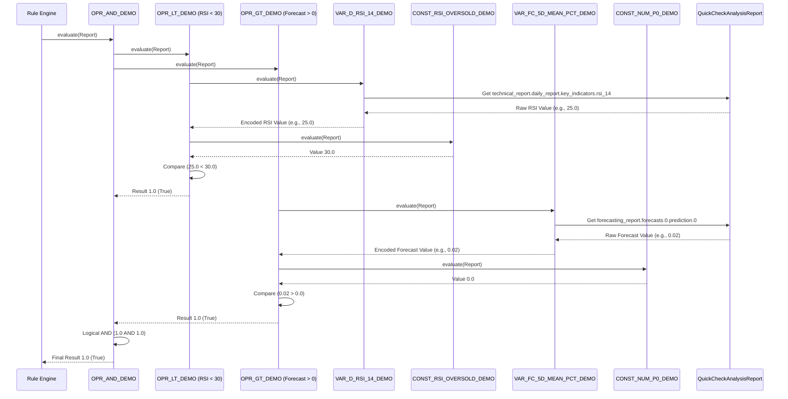

# Chapter 5: Rule Logic Tree (Nodes)

Welcome to Chapter 5! In our previous chapter, [Chapter 4: Consolidated Analysis Reports](04_consolidated_analysis_reports_.md), we learned how to assemble a comprehensive "stock report card" called the `QuickCheckAnalysisReport`. This report gathers all the crucial information about a stock, from technical indicators to news sentiment, into one neatly organized document.

## The Problem: Turning a Report into a Decision

Now that we have this fantastic, all-in-one report, what do we do with it? How do we use it to make actual investment decisions, like "Buy," "Sell," or "Hold"?

Imagine a simple investment strategy: "IF the stock's Daily RSI is below 30 (oversold) AND its 5-day forecast predicts a positive return, THEN it's a 'Buy' signal."

This is a **rule**. We could write a bunch of `if-else` statements in Python code for every rule, but:
*   What if we want to change a threshold, like RSI 30 to RSI 25? We'd have to change code.
*   What if we want to add a new condition, like "AND News sentiment is positive"? More code changes.
*   What if we have hundreds of such rules? Our code would become a tangled mess, hard to manage and even harder to understand.

We need a flexible way to build and evaluate complex business rules without constantly writing or modifying Python code.

## The Solution: Rule Logic Tree (Nodes) - Our "Decision-Making Machine"

This is where the **Rule Logic Tree** comes in! Think of it as a set of **LEGO bricks** for building rules. Each brick is a piece of logic, called a **"node."**

We can connect these nodes together to form a logical expression, much like building a tree structure. This allows us to define flexible, customizable rules without writing new code for every new strategy.

Here’s what each "LEGO brick" (node) can represent:
*   A **fixed value** (e.g., the number `30` for an RSI threshold).
*   A piece of **data extracted** from our [Consolidated Analysis Report](04_consolidated_analysis_reports__.md) (e.g., the current RSI value).
*   An **operation** (like "add two numbers," "compare if one is greater than another," or "perform a logical AND").

When these nodes are connected into a tree and given a `QuickCheckAnalysisReport`, they work together, step-by-step, to evaluate the rule and spit out a final decision or score.

## Key Concepts: The Types of Nodes (Our LEGO Bricks)

All nodes in our system are built upon a basic `_TreeNode` blueprint (`itapia_common/rules/nodes/_nodes.py`), which defines how a node can be evaluated. Let's explore the main types of nodes:

### 1. Constant Nodes: Fixed Values

These are the simplest nodes. They represent a fixed number, like a threshold.

**Example:** The number `30` (for RSI oversold) or `70` (for RSI overbought).

```python
# Simplified ConstantNode structure
class ConstantNode(_TreeNode):
    def __init__(self, node_name: str, description: str, value: float, ...):
        # ... (initialization details) ...
        self.value = value
        # ... (normalization settings if needed) ...

    def evaluate(self, report: QuickCheckAnalysisReport) -> float:
        # For a ConstantNode, evaluation simply means returning its value.
        # It might also normalize the value if configured.
        if not self.use_normalize:
            return self.value
        # If use_normalize is True, it converts the value to a standard range
        return normalize(self.value, 0, self.source_range, self.target_range)
```
In `itapia`, these constants are defined and registered in `itapia_common/rules/builtin/_constant_builtin.py`, making them available for use by their names (e.g., `CONST_RSI_OVERSOLD`).

### 2. Variable Nodes: Extracting Data from Reports

These nodes are "smart." They know how to dig into our [Consolidated Analysis Report](04_consolidated_analysis_reports__.md) and pull out a specific piece of data. They can also "normalize" this data (convert it to a standard range, like -1 to 1) so it can be easily compared with other data.

There are two main types of Variable Nodes:

*   **`NumericalVarNode`**: For extracting numerical data (e.g., RSI value, forecast percentage).

    ```python
    # Simplified NumericalVarNode structure
    class NumericalVarNode(VarNode):
        def __init__(self, node_name: str, description: str, path: str, ...):
            # ... (initialization details) ...
            self.path = path # e.g., "technical_report.daily_report.key_indicators.rsi_14"
            self.source_range = (0, 100) # e.g., RSI is normally 0-100
            self.target_range = (-1, 1) # Convert to this range for rules

        def encode(self, raw_value: float) -> float:
            # It normalizes the raw value using source_range and target_range
            return normalize(raw_value, 0, self.source_range, self.target_range)

        # The main evaluate method (from VarNode base class)
        # first extracts the raw value using 'path', then calls 'encode'.
    ```

*   **`CategoricalVarNode`**: For extracting text-based data (e.g., "uptrend," "bullish") and mapping it to a numerical value (e.g., "uptrend" -> 1.0, "downtrend" -> -1.0).

    ```python
    # Simplified CategoricalVarNode structure
    class CategoricalVarNode(VarNode):
        def __init__(self, node_name: str, description: str, path: str, mapping: dict, ...):
            # ... (initialization details) ...
            self.path = path
            self.mapping = mapping # e.g., {"uptrend": 1.0, "downtrend": -1.0}

        def encode(self, raw_value: str) -> float:
            # It maps the raw string to a float using the 'mapping' dictionary
            return self.mapping.get(raw_value, self.default_value)

        # The main evaluate method (from VarNode base class)
        # first extracts the raw value using 'path', then calls 'encode'.
    ```
In `itapia`, these variables are defined and registered in `itapia_common/rules/builtin/_variable_builtin.py`, making data points like `VAR_D_RSI_14` (Daily RSI) and `VAR_FC_5D_MEAN_PCT` (5-Day Forecast Mean Percentage) accessible.

### 3. Operator Nodes: Performing Actions

These nodes take the results from their "child" nodes, perform an operation, and then return a new result. They are like the "verbs" or "connectors" in our rule sentences.

*   **`FunctionalOperatorNode`**: These apply a specific function to their children's results. This covers mathematical operations (add, subtract), comparisons (greater than, equal to), and logical operations (AND, OR, NOT).

    ```python
    # Simplified FunctionalOperatorNode structure (e.g., for OPR_ADD2)
    class FunctionalOperatorNode(OperatorNode):
        def __init__(self, node_name: str, description: str, num_child: int, opr_func: Any, ...):
            # ... (initialization details) ...
            self.num_child = num_child # e.g., 2 for addition
            self.opr_func = opr_func   # e.g., lambda x, y: x + y

        def _evaluate_valid(self, report: QuickCheckAnalysisReport) -> float:
            # 1. Evaluate all child nodes recursively
            child_results = [child.evaluate(report) for child in self.children]
            # 2. Apply the operation function
            return self.opr_func(*child_results)
    ```

*   **`BranchOperatorNode`**: This is our "IF/THEN/ELSE" operator. It evaluates a condition and then, based on the result, evaluates and returns the value of one of its two other children.

    ```python
    # Simplified BranchOperatorNode structure (for OPR_IF_THEN_ELSE)
    class BranchOperatorNode(OperatorNode):
        def __init__(self, node_name: str, description: str, ...):
            # ... (initialization details) ...
            self.num_child = 3 # Always 3 children: [condition, then_branch, else_branch]

        def _evaluate_valid(self, report: QuickCheckAnalysisReport) -> float:
            # 1. Evaluate the condition child (children[0])
            condition = self.children[0].evaluate(report)

            # 2. If condition is "True" (represented as > 0.0), evaluate 'then' branch (children[1])
            if condition > 0:
                return self.children[1].evaluate(report)
            # 3. Otherwise, evaluate 'else' branch (children[2])
            else:
                return self.children[2].evaluate(report)
    ```
In `itapia`, these operators are defined and registered in `itapia_common/rules/builtin/_operator_builtin.py`. Examples include `OPR_ADD2` (add two numbers), `OPR_GT` (greater than), `OPR_AND` (logical AND), and `OPR_IF_THEN_ELSE`.

### Node Registry: The "LEGO Catalog"

All these different types of nodes (Constants, Variables, Operators) are stored in a central **Node Registry** (`itapia_common/rules/nodes/registry.py`). This registry acts as a catalog, allowing our system to look up any node by its unique name (e.g., `VAR_D_RSI_14`, `OPR_AND`) and know how to create it and what its properties are (like what type of data it expects and what type it returns).

The `names.py` file (`itapia_common/rules/names.py`) provides standardized, easy-to-use names for all these nodes.

## How to Use: Building a Simple Rule Tree

Let's build our example rule: "Is the daily RSI less than the oversold threshold (30) AND is the 5-day forecast positive?"

To do this, we'll need to create:
1.  A **Constant Node** for the RSI oversold threshold (30).
2.  A **Variable Node** to fetch the current Daily RSI from the report.
3.  A **Comparison Operator Node** (`OPR_LT`) to check if RSI < 30.
4.  A **Variable Node** to fetch the 5-day forecast.
5.  A **Constant Node** for `0` (to compare with forecast).
6.  A **Comparison Operator Node** (`OPR_GT`) to check if forecast > 0.
7.  A **Logical Operator Node** (`OPR_AND`) to combine the two conditions.

First, we need a way to create nodes from our registry. The `create_node` function is our factory:

```python
# From itapia_common/rules/nodes/registry.py (simplified)
from itapia_common.rules.nodes.registry import create_node
from itapia_common.schemas.entities.rules import SemanticType, NodeType

# Example of creating a node (in reality, these are registered in _builtin files)
# For demo, let's manually create a spec and register it:
from itapia_common.rules.nodes._nodes import ConstantNode, NumericalVarNode, FunctionalOperatorNode
from itapia_common.rules.nodes.registry import NodeSpec, register_node_by_spec
import math

# Register a few nodes manually for this specific example (normally done in builtin files)
register_node_by_spec(
    "CONST_RSI_OVERSOLD_DEMO",
    NodeSpec(
        node_class=ConstantNode, description="RSI Oversold Threshold (30)",
        return_type=SemanticType.MOMENTUM, params={"value": 30.0, "use_normalize": False},
        node_type=NodeType.CONSTANT,
    ),
)
register_node_by_spec(
    "VAR_D_RSI_14_DEMO",
    NodeSpec(
        node_class=NumericalVarNode, description="Daily RSI (14-period)",
        return_type=SemanticType.MOMENTUM, node_type=NodeType.VARIABLE,
        params={
            "path": "technical_report.daily_report.key_indicators.rsi_14",
            "source_range": (0, 100), "target_range": (-1, 1),
        },
    ),
)
register_node_by_spec(
    "VAR_FC_5D_MEAN_PCT_DEMO",
    NodeSpec(
        node_class=NumericalVarNode, description="Forecasted mean price change in 5 days (%)",
        return_type=SemanticType.PERCENTAGE, node_type=NodeType.VARIABLE,
        params={
            "path": "forecasting_report.forecasts.0.prediction.0",
            "source_range": (-2.5, 2.5), "target_range": (-1, 1),
        },
    ),
)
register_node_by_spec(
    "CONST_NUM_P0_DEMO", # Represents 0.0
    NodeSpec(
        node_class=ConstantNode, description="Numerical constant 0.0",
        return_type=SemanticType.NUMERICAL, params={"value": 0.0, "use_normalize": False},
        node_type=NodeType.CONSTANT,
    ),
)
register_node_by_spec(
    "OPR_LT_DEMO",
    NodeSpec(
        node_class=FunctionalOperatorNode, description="Less Than (<)",
        return_type=SemanticType.BOOLEAN, args_type=[SemanticType.ANY, SemanticType.ANY],
        node_type=NodeType.OPERATOR, params={"num_child": 2, "opr_func": lambda x, y: 1.0 if x < y else 0.0},
    ),
)
register_node_by_spec(
    "OPR_GT_DEMO",
    NodeSpec(
        node_class=FunctionalOperatorNode, description="Greater Than (>)",
        return_type=SemanticType.BOOLEAN, args_type=[SemanticType.ANY, SemanticType.ANY],
        node_type=NodeType.OPERATOR, params={"num_child": 2, "opr_func": lambda x, y: 1.0 if x > y else 0.0},
    ),
)
register_node_by_spec(
    "OPR_AND_DEMO",
    NodeSpec(
        node_class=FunctionalOperatorNode, description="Logical AND",
        return_type=SemanticType.BOOLEAN, args_type=[SemanticType.BOOLEAN, SemanticType.BOOLEAN],
        node_type=NodeType.OPERATOR, params={"num_child": 2, "opr_func": lambda x, y: 1.0 if x > 0 and y > 0 else 0.0},
    ),
)

# Define a mock QuickCheckAnalysisReport for testing
from pydantic import BaseModel, Field
from typing import List, Dict, Any

class MockDailyReport(BaseModel):
    key_indicators: Dict[str, Any] = Field(default_factory=dict)

class MockTechnicalReport(BaseModel):
    daily_report: MockDailyReport = Field(default_factory=MockDailyReport)

class MockForecast(BaseModel):
    prediction: List[float] = Field(default_factory=list)

class MockForecastingReport(BaseModel):
    forecasts: List[MockForecast] = Field(default_factory=list)

class MockQuickCheckAnalysisReport(BaseModel):
    technical_report: MockTechnicalReport = Field(default_factory=MockTechnicalReport)
    forecasting_report: MockForecastingReport = Field(default_factory=MockForecastingReport)

# --- Start building the rule ---

print("--- Building the Rule Logic Tree ---")

# Part 1: Is RSI < 30?
rsi_var = create_node("VAR_D_RSI_14_DEMO")
rsi_oversold_const = create_node("CONST_RSI_OVERSOLD_DEMO")
rsi_less_than_30_op = create_node("OPR_LT_DEMO")
rsi_less_than_30_op.add_child_node(rsi_var)
rsi_less_than_30_op.add_child_node(rsi_oversold_const)
print(f"Created node: {rsi_less_than_30_op.node_name} (RSI < 30)")

# Part 2: Is 5-day forecast > 0?
forecast_var = create_node("VAR_FC_5D_MEAN_PCT_DEMO")
zero_const = create_node("CONST_NUM_P0_DEMO")
forecast_greater_than_0_op = create_node("OPR_GT_DEMO")
forecast_greater_than_0_op.add_child_node(forecast_var)
forecast_greater_than_0_op.add_child_node(zero_const)
print(f"Created node: {forecast_greater_than_0_op.node_name} (Forecast > 0)")

# Part 3: Combine with AND
final_rule_root = create_node("OPR_AND_DEMO")
final_rule_root.add_child_node(rsi_less_than_30_op)
final_rule_root.add_child_node(forecast_greater_than_0_op)
print(f"Created node: {final_rule_root.node_name} (RSI < 30 AND Forecast > 0)")
print("Rule Logic Tree built!")

# --- Evaluate the rule with some mock data ---
print("\n--- Evaluating the Rule Logic Tree ---")

# Scenario 1: RSI is 25 (oversold), Forecast is 0.02 (positive) -> SHOULD BE TRUE (1.0)
mock_report_1 = MockQuickCheckAnalysisReport(
    technical_report={"daily_report": {"key_indicators": {"rsi_14": 25.0}}},
    forecasting_report={"forecasts": [{"prediction": [0.02]}]}
)
result_1 = final_rule_root.evaluate(mock_report_1)
print(f"Scenario 1 (RSI=25, Forecast=0.02): Result = {result_1}") # Expected: 1.0

# Scenario 2: RSI is 40 (not oversold), Forecast is 0.02 (positive) -> SHOULD BE FALSE (0.0)
mock_report_2 = MockQuickCheckAnalysisReport(
    technical_report={"daily_report": {"key_indicators": {"rsi_14": 40.0}}},
    forecasting_report={"forecasts": [{"prediction": [0.02]}]}
)
result_2 = final_rule_root.evaluate(mock_report_2)
print(f"Scenario 2 (RSI=40, Forecast=0.02): Result = {result_2}") # Expected: 0.0

# Scenario 3: RSI is 25 (oversold), Forecast is -0.01 (negative) -> SHOULD BE FALSE (0.0)
mock_report_3 = MockQuickCheckAnalysisReport(
    technical_report={"daily_report": {"key_indicators": {"rsi_14": 25.0}}},
    forecasting_report={"forecasts": [{"prediction": [-0.01]}]}
)
result_3 = final_rule_root.evaluate(mock_report_3)
print(f"Scenario 3 (RSI=25, Forecast=-0.01): Result = {result_3}") # Expected: 0.0
```

**Output:**
```
--- Building the Rule Logic Tree ---
Created node: OPR_LT_DEMO (RSI < 30)
Created node: OPR_GT_DEMO (Forecast > 0)
Created node: OPR_AND_DEMO (RSI < 30 AND Forecast > 0)
Rule Logic Tree built!

--- Evaluating the Rule Logic Tree ---
Scenario 1 (RSI=25, Forecast=0.02): Result = 1.0
Scenario 2 (RSI=40, Forecast=0.02): Result = 0.0
Scenario 3 (RSI=25, Forecast=-0.01): Result = 0.0
```

The output shows that our rule logic tree correctly evaluates the given conditions! When `evaluate()` is called on the `final_rule_root`, it triggers a chain reaction, where each operator asks its children to evaluate themselves, until the constants and variables provide their base values.

## Under the Hood: How the Tree Evaluates

Let's visualize the evaluation process of our simple rule:



As you can see, when `evaluate` is called on the main operator node (the "root" of the tree), it recursively calls `evaluate` on its children. This continues until it reaches Constant Nodes and Variable Nodes, which provide the base values from the `QuickCheckAnalysisReport`. The results then bubble back up the tree, with each operator performing its action until the final result is returned.

### Semantic Types: Ensuring Compatible Connections

You might have noticed `SemanticType` and `return_type` in the node definitions. This is a powerful feature that ensures we don't connect incompatible "LEGO bricks." For example, we wouldn't want to compare a `MOMENTUM` value with a `RISK_LEVEL` directly if they need different scaling. The `return_type` of a node tells us what kind of data it produces, and `args_type` tells an operator what kind of data it expects from its children. This helps prevent errors and ensures our rules are logically sound, leveraging our [Data Schemas (Pydantic Models)](01_data_schemas__pydantic_models__.md) for data *type* safety within the rule logic itself.

## Why Rule Logic Trees Are So Powerful (Benefits)

1.  **Extreme Flexibility:** You can build almost any logical expression by combining different nodes, without changing any core code.
2.  **No Code Changes for New Rules:** Once the system of nodes is set up, new rules or modifications to existing rules can be done by simply rearranging or adding nodes, not by writing Python.
3.  **Readability:** Although it looks complex in code, once defined, a tree structure can be visually represented, making complex rules easier to understand for humans.
4.  **Domain-Specific Language:** The nodes (like `VAR_D_RSI_14`, `OPR_GT`) create a language specific to our financial domain, making rules more intuitive for financial experts.
5.  **Testability:** Each node is a small, self-contained unit of logic, making it easier to test independently.

## Conclusion

In this chapter, we've unlocked the power of the **Rule Logic Tree**, the core "decision-making machine" of `itapia`. We've seen how `Constant Nodes`, `Variable Nodes` (both numerical and categorical), and `Operator Nodes` (functional and branch) act as "LEGO bricks" to construct flexible and complex business rules. By using a central Node Registry and semantic typing, `itapia` can evaluate these rules against our [Consolidated Analysis Reports](04_consolidated_analysis_reports__.md) to produce concrete outcomes.

Now that we understand how to build and evaluate the logical core of a rule, the next step is to explore how these logic trees are wrapped into a complete **Rule Definition** – a `Rule` class that encompasses not just the logic, but also its name, description, purpose, and other metadata.

[Next Chapter: Rule Definition (The `Rule` class)](06_rule_definition__the__rule__class__.md)

---

Generated by [AI Codebase Knowledge Builder](https://github.com/The-Pocket/Tutorial-Codebase-Knowledge)