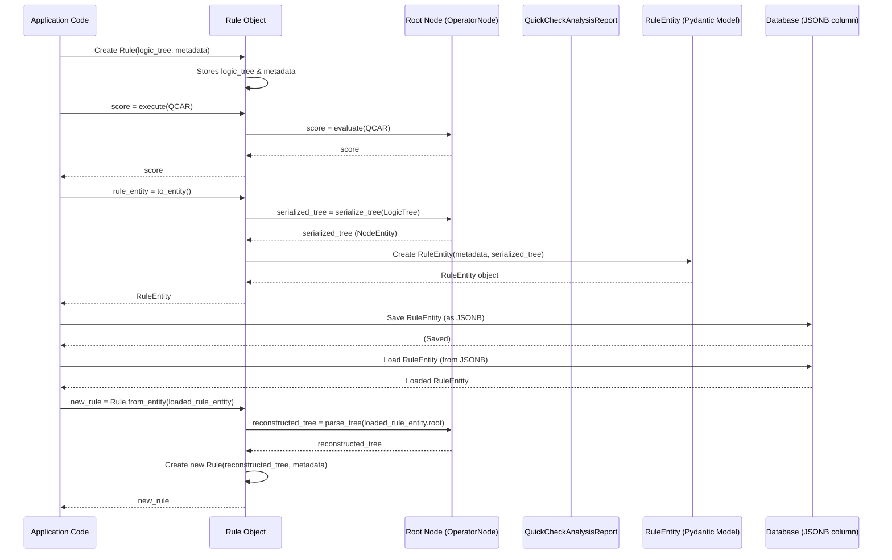

# Chapter 6: Rule Definition (The `Rule` class)

Welcome back! In our previous chapter, [Chapter 5: Rule Logic Tree (Nodes)](05_rule_logic_tree__nodes__.md), we learned how to build powerful "decision-making machines" using **nodes** as LEGO bricks, connecting them into a **logic tree** to evaluate complex conditions. We saw how this tree could, for example, tell us if "RSI is oversold AND the forecast is positive."

## The Problem: What Makes a Complete Recipe?

Now that we have these amazing logic trees, what's missing? Imagine you've created a fantastic set of cooking instructions (your logic tree) for a special dish. That's great, but it's not a complete recipe card yet, is it? A true recipe card also needs:

*   **A name:** "Grandma's Secret Sauce"
*   **A description:** "A rich, savory sauce perfect for pasta or meats."
*   **Its purpose:** "Main Course Sauce" (not a dessert!)
*   **Its status:** "Ready to Cook," "Needs more salt," or "Deprecated"
*   **And, of course, the instructions!**

Similarly, in our `shared` project, a `_TreeNode` is just the *logic*. A complete **Rule** in `itapia` needs much more than just a logic tree. It needs metadata (information *about* the rule) to make it useful, manageable, and understandable. For instance, if a logic tree spits out the number `1.0`, does that mean "Buy," "High Risk," or "Great Opportunity"? The tree alone doesn't tell us; the **Rule Definition** does.

How do we bundle our intelligent logic trees with all the necessary descriptive information so that they become fully-fledged, actionable rules within `itapia`?

## The Solution: The `Rule` Class (Our "Recipe Card")

This is where the **`Rule` class** comes in! Think of the `Rule` class as the **central container** or the **complete "recipe card"** for a business rule. It takes a powerful logic tree (from [Chapter 5](05_rule_logic_tree__nodes__.md)) and wraps it with all the essential metadata needed to understand, manage, and use that rule effectively.

Each `Rule` object holds:
*   Its unique ID, name, description, and status.
*   Its *purpose* (e.g., "Decision Signal" for buying/selling, "Risk Level", "Opportunity Rating").
*   The actual "logic tree" (the `root` node) that defines its calculations.
*   A special method called `execute()` that knows how to run its logic tree against a [Consolidated Analysis Report](04_consolidated_analysis_reports__.md) and give us a numerical score.

The `Rule` class brings everything together, making our complex logic trees usable and meaningful.

## Key Concepts: What's on Our Rule "Recipe Card"?

Let's look at the main ingredients of a `Rule` object.

### 1. The Logic Tree (`root`)

At its heart, every `Rule` contains a `root` property. This `root` is the starting `OperatorNode` of the decision-making logic tree we learned about in [Chapter 5](05_rule_logic_tree__nodes__.md). The `Rule` class doesn't define *how* the logic tree works; it just *holds* it.

```python
# From itapia_common/rules/rule.py (simplified)
from .nodes import OperatorNode # Our 'root' must be an OperatorNode

class Rule:
    def __init__(
        self,
        root: OperatorNode, # This is the core logic tree!
        rule_id: str | None = None,
        name: str = "Untitled Rule",
        # ... other metadata ...
    ):
        if not isinstance(root, OperatorNode):
            raise TypeError("The root of a rule must be an instance of OperatorNode.")
        self.root = root
        # ... rest of initialization ...
```
**Explanation:**
*   The `root` of a rule *must* be an `OperatorNode`. This is because a rule is always about performing an operation (like "AND", "IF/THEN/ELSE") to produce a final outcome, not just a single constant or variable.

### 2. Essential Metadata

These are the "labels" and "details" on our recipe card that describe the rule:

*   **`rule_id`**: A unique identifier for the rule (e.g., `RULE_D_01_TREND_FOLLOW`). If not provided, a random UUID is generated.
*   **`name`**: A human-readable title (e.g., "Trend Following Score").
*   **`description`**: A longer explanation of what the rule does.
*   **`rule_status`**: Indicates if the rule is `READY`, `EVOLVING`, or `DEPRECATED`. Deprecated rules might return a neutral score (e.g., 0.0) or indicate they shouldn't be used.
*   **`created_at` / `updated_at`**: Timestamps for tracking when the rule was created or last modified.
*   **`metrics`**: (Optional) Stores performance metrics from backtesting the rule.

### 3. The `purpose` Property

This is a very important piece of metadata! The `purpose` property tells us *what kind of result* the rule is intended to produce. Is it a "Decision Signal" (telling us to buy/sell), a "Risk Level" (how risky is this stock?), or an "Opportunity Rating" (how good is this opportunity?).

The `Rule` automatically figures out its `purpose` from the `return_type` of its `root` node. This uses the `SemanticType` concept we introduced in [Chapter 5](05_rule_logic_tree__nodes__.md).

```python
# From itapia_common/rules/rule.py (simplified)
from itapia_common.schemas.entities.rules import SemanticType

class Rule:
    # ... (init method) ...

    @property
    def purpose(self) -> SemanticType:
        """Get the purpose of the rule based on the root node's return type."""
        return self.root.return_type # Direct link to the root node's output type
```
**Explanation:**
*   If your `root` node is an operator designed to produce a `DECISION_SIGNAL`, then the `Rule`'s `purpose` will automatically be `DECISION_SIGNAL`. This is how the system understands what a rule *means*.

### 4. Executing the Rule (`execute()`)

The `execute()` method is the main way to use a `Rule`. It takes a [Consolidated Analysis Report](04_consolidated_analysis_reports__.md) (our `QuickCheckAnalysisReport`) and passes it to its `root` logic tree for evaluation. It's a simple "facade" – meaning it's a convenient front-door that hides the complex internal process of the logic tree.

```python
# From itapia_common/rules/rule.py (simplified)
from itapia_common.schemas.entities.analysis import QuickCheckAnalysisReport

class Rule:
    # ... (init and purpose property) ...

    def execute(self, report: QuickCheckAnalysisReport) -> float:
        """Execute the rule based on an analysis report and return the result."""
        if self.rule_status == RuleStatus.DEPRECATED:
            return 0.0 # Deprecated rules might return a neutral score
        return self.root.evaluate(report) # This calls the logic tree!
```
**Explanation:**
*   If the rule is marked as `DEPRECATED`, it returns `0.0` (a neutral score) without even evaluating the logic. This is a safety mechanism.
*   Otherwise, it simply calls `self.root.evaluate(report)`, which kicks off the recursive evaluation of the entire logic tree as we saw in [Chapter 5](05_rule_logic_tree__nodes__.md). The result is a single `float` score.

### 5. Storing and Retrieving Rules (`to_entity()` / `from_entity()`)

Just like with any important data, we need to save our rules to the database and load them back later. The `Rule` class provides `to_entity()` to convert itself into a [Pydantic Model](01_data_schemas__pydantic_models__.md) ([`RuleEntity`](itapia_common\schemas\entities\rules.py)) that can be easily stored (e.g., as JSON) in our PostgreSQL database (as discussed in [Chapter 3: Data Access Layer (CRUD & Services)](03_data_access_layer__crud___services__.md)). The `from_entity()` class method does the reverse, reconstructing a `Rule` object from the stored data.

These methods rely on the `parser` module (from Chapter 5's context) to serialize and parse the nested logic tree structure.

```python
# From itapia_common/rules/rule.py (simplified)
from typing import Self
from itapia_common.schemas.entities.rules import RuleEntity
from .parser import parse_tree, serialize_tree # From Chapter 5 context

class Rule:
    # ... (all methods above) ...

    def to_entity(self) -> RuleEntity:
        """Converts Rule object into a RuleEntity Pydantic model for storage."""
        # This converts the logic tree (self.root) into a nested dict
        serialized_root = serialize_tree(self.root)
        return RuleEntity(
            rule_id=self.rule_id,
            name=self.name,
            purpose=self.purpose,
            root=serialized_root, # The serialized logic tree
            # ... other fields ...
        )

    @classmethod
    def from_entity(cls, data: RuleEntity) -> Self:
        """Reconstructs a Rule object from a RuleEntity Pydantic model."""
        # This reconstructs the logic tree from the stored dictionary
        reconstructed_root = parse_tree(data.root)
        return cls(
            rule_id=data.rule_id,
            name=data.name,
            root=reconstructed_root, # The reconstructed logic tree
            # ... other fields ...
        )
```
**Explanation:**
*   `to_entity()` calls `serialize_tree()` to turn the `self.root` object into a nested dictionary structure that can be easily saved.
*   `from_entity()` takes the stored data, calls `parse_tree()` to recreate the `_TreeNode` objects, and then uses these to initialize a new `Rule` object.

## How to Use: Creating and Executing a Complete Rule

Let's take our example logic tree from [Chapter 5](05_rule_logic_tree__nodes__.md) ("Is RSI < 30 AND Forecast > 0?") and wrap it into a full `Rule` object.

First, we need to set up some mock nodes and a mock report, just like in Chapter 5.

```python
# --- Setup for demonstration (re-using mock setup from Chapter 5) ---
from itapia_common.rules.nodes.registry import create_node, register_node_by_spec
from itapia_common.rules.nodes._nodes import ConstantNode, NumericalVarNode, FunctionalOperatorNode, OperatorNode
from itapia_common.schemas.entities.rules import SemanticType, NodeType, RuleStatus, NodeEntity
from itapia_common.schemas.entities.analysis import QuickCheckAnalysisReport
from pydantic import BaseModel, Field
from typing import List, Dict, Any
from datetime import datetime, timezone
import uuid

# Define mock report structure (simplified QuickCheckAnalysisReport)
class MockDailyReport(BaseModel):
    key_indicators: Dict[str, Any] = Field(default_factory=dict)
class MockTechnicalReport(BaseModel):
    daily_report: MockDailyReport = Field(default_factory=MockDailyReport)
class MockForecast(BaseModel):
    prediction: List[float] = Field(default_factory=list)
class MockForecastingReport(BaseModel):
    forecasts: List[MockForecast] = Field(default_factory=list)
class MockQuickCheckAnalysisReport(QuickCheckAnalysisReport): # Inherit from real QCAR for compatibility
    technical_report: MockTechnicalReport = Field(default_factory=MockTechnicalReport)
    forecasting_report: MockForecastingReport = Field(default_factory=MockForecastingReport)

# Register necessary mock nodes for this example (normally done in builtin files)
# To avoid name conflicts with Chapter 5, we use new names
register_node_by_spec(
    "DEMO_CONST_RSI_OVERSOLD",
    NodeEntity(
        node_name="CONST_NUM",
        children=[NodeEntity(node_name="NUMERICAL", children=[NodeEntity(node_name="30.0")])]
    )
)
register_node_by_spec(
    "DEMO_VAR_D_RSI_14",
    NodeEntity(
        node_name="NUMERICAL_VAR",
        children=[
            NodeEntity(node_name="PATH", children=[NodeEntity(node_name="technical_report.daily_report.key_indicators.rsi_14")]),
            NodeEntity(node_name="SOURCE_RANGE", children=[NodeEntity(node_name="0_100")]),
            NodeEntity(node_name="TARGET_RANGE", children=[NodeEntity(node_name="-1_1")])
        ]
    )
)
register_node_by_spec(
    "DEMO_VAR_FC_5D_MEAN_PCT",
    NodeEntity(
        node_name="NUMERICAL_VAR",
        children=[
            NodeEntity(node_name="PATH", children=[NodeEntity(node_name="forecasting_report.forecasts.0.prediction.0")]),
            NodeEntity(node_name="SOURCE_RANGE", children=[NodeEntity(node_name="-2.5_2.5")]),
            NodeEntity(node_name="TARGET_RANGE", children=[NodeEntity(node_name="-1_1")])
        ]
    )
)
register_node_by_spec(
    "DEMO_CONST_NUM_P0", # Represents 0.0
    NodeEntity(
        node_name="CONST_NUM",
        children=[NodeEntity(node_name="NUMERICAL", children=[NodeEntity(node_name="0.0")])]
    )
)
register_node_by_spec(
    "DEMO_OPR_LT",
    NodeEntity(node_name="LT")
)
register_node_by_spec(
    "DEMO_OPR_GT",
    NodeEntity(node_name="GT")
)
register_node_by_spec(
    "DEMO_OPR_AND",
    NodeEntity(node_name="AND")
)
register_node_by_spec(
    "DEMO_OPR_TO_DECISION_SIGNAL", # This is the root node for decision rules
    NodeEntity(node_name="TO_DECISION_SIGNAL")
)

# Now define a minimal set of actual node classes with `evaluate` methods for demo
# In real code, these would be in itapia_common/rules/nodes/_nodes.py and related builtin files

class _MockTreeNode(BaseModel): # Minimal base for evaluation
    node_name: str
    return_type: SemanticType = SemanticType.NUMERICAL
    children: List['_MockTreeNode'] = Field(default_factory=list)

    def evaluate(self, report: QuickCheckAnalysisReport) -> float:
        raise NotImplementedError

    def add_child_node(self, child: '_MockTreeNode'):
        self.children.append(child)

# Minimal mock versions of classes used in the example
class MockConstantNode(_MockTreeNode):
    value: float
    use_normalize: bool = False
    source_range: tuple = (0,0)
    target_range: tuple = (0,0)

    def evaluate(self, report: QuickCheckAnalysisReport) -> float:
        return self.value

class MockNumericalVarNode(_MockTreeNode):
    path: str
    source_range: tuple = (0, 100)
    target_range: tuple = (-1, 1)

    def evaluate(self, report: QuickCheckAnalysisReport) -> float:
        # Simulate extracting from report
        # This part is simplified, real path traversal is more robust
        try:
            val = report.model_dump()
            for key in self.path.split('.'):
                if key.isdigit():
                    val = val[int(key)]
                else:
                    val = val[key]
            # No normalization for simplicity in this demo, just return raw value
            return float(val)
        except (AttributeError, KeyError, IndexError):
            return 0.0 # Default if path not found

class MockFunctionalOperatorNode(_MockTreeNode):
    opr_func: Any
    num_child: int
    return_type: SemanticType = SemanticType.BOOLEAN # Default for comparison/logic

    def evaluate(self, report: QuickCheckAnalysisReport) -> float:
        child_results = [child.evaluate(report) for child in self.children]
        return self.opr_func(*child_results)

class MockOperatorNode(MockFunctionalOperatorNode): # Base for specific operators
    pass

class MockDecisionSignalOperator(MockOperatorNode):
    return_type: SemanticType = SemanticType.DECISION_SIGNAL
    def evaluate(self, report: QuickCheckAnalysisReport) -> float:
        # For a conclusion operator, it just evaluates its single child
        return self.children[0].evaluate(report)

# Override create_node to use our mock classes for this example
original_create_node = create_node
def mock_create_node(node_name: str, **kwargs) -> _MockTreeNode:
    if node_name == "DEMO_CONST_NUM_P0":
        return MockConstantNode(node_name=node_name, value=0.0)
    if node_name == "DEMO_CONST_RSI_OVERSOLD":
        return MockConstantNode(node_name=node_name, value=30.0)
    if node_name == "DEMO_VAR_D_RSI_14":
        return MockNumericalVarNode(node_name=node_name, path="technical_report.daily_report.key_indicators.rsi_14")
    if node_name == "DEMO_VAR_FC_5D_MEAN_PCT":
        return MockNumericalVarNode(node_name=node_name, path="forecasting_report.forecasts.0.prediction.0")
    if node_name == "DEMO_OPR_LT":
        return MockFunctionalOperatorNode(node_name=node_name, num_child=2, opr_func=lambda x, y: 1.0 if x < y else 0.0)
    if node_name == "DEMO_OPR_GT":
        return MockFunctionalOperatorNode(node_name=node_name, num_child=2, opr_func=lambda x, y: 1.0 if x > y else 0.0)
    if node_name == "DEMO_OPR_AND":
        return MockFunctionalOperatorNode(node_name=node_name, num_child=2, opr_func=lambda x, y: 1.0 if x > 0 and y > 0 else 0.0)
    if node_name == "DEMO_OPR_TO_DECISION_SIGNAL":
        node = MockDecisionSignalOperator(node_name=node_name, num_child=1, opr_func=lambda x: x) # func is passthrough
        if "children" in kwargs:
            for child in kwargs["children"]:
                node.add_child_node(child)
        return node
    raise ValueError(f"Unknown node: {node_name}")
# Temporarily replace the global create_node with our mock
import itapia_common.rules.nodes.registry
itapia_common.rules.nodes.registry.create_node = mock_create_node

# --- Rule class definition (minimal for demo, the real one is more robust) ---
class Rule:
    def __init__(self, root: OperatorNode, rule_id: str | None = None, name: str = "Untitled Rule",
                 description: str = "", rule_status: RuleStatus = RuleStatus.READY,
                 created_at: datetime | None = None, updated_at: datetime | None = None, metrics: Any | None = None):
        if not isinstance(root, _MockTreeNode): # Use our mock base for type check
            raise TypeError("The root of a rule must be an instance of OperatorNode.")
        self.rule_id = rule_id or str(uuid.uuid4())
        self.name = name
        self.description = description
        self.root = root
        self.rule_status = rule_status
        self.created_at = created_at or datetime.now(timezone.utc)
        self.updated_at = updated_at or datetime.now(timezone.utc)
        self.metrics = metrics

    @property
    def purpose(self) -> SemanticType:
        return self.root.return_type

    def execute(self, report: QuickCheckAnalysisReport) -> float:
        if self.rule_status == RuleStatus.DEPRECATED:
            return 0.0
        return self.root.evaluate(report)

    def to_entity(self) -> NodeEntity: # Simplified to return root for brevity
        return serialize_tree(self.root)

    @classmethod
    def from_entity(cls, data: NodeEntity) -> 'Rule': # Simplified to take root directly
        root_node = parse_tree(data)
        # For this demo, we can't fully reconstruct all Rule metadata from a NodeEntity
        # So, we'll return a minimal rule.
        return cls(root=root_node, name="Reconstructed Rule", rule_id=str(uuid.uuid4()))

# Mock serialize_tree and parse_tree (they would be in itapia_common/rules/parser.py)
# For this demo, we make them simple passthrough functions for the NodeEntity representation
def serialize_tree(node: _MockTreeNode) -> NodeEntity:
    children_entities = [serialize_tree(child) for child in node.children] if node.children else None
    return NodeEntity(node_name=node.node_name, children=children_entities)

def parse_tree(data: NodeEntity) -> _MockTreeNode:
    node_instance = mock_create_node(data.node_name)
    if data.children:
        for child_data in data.children:
            node_instance.add_child_node(parse_tree(child_data))
    return node_instance
# --- End of Setup ---


print("--- Building the Logic Tree ---")
# 1. Is RSI < 30?
rsi_var = create_node("DEMO_VAR_D_RSI_14")
rsi_oversold_const = create_node("DEMO_CONST_RSI_OVERSOLD")
rsi_less_than_30_op = create_node("DEMO_OPR_LT")
rsi_less_than_30_op.add_child_node(rsi_var)
rsi_less_than_30_op.add_child_node(rsi_oversold_const)

# 2. Is 5-day forecast > 0?
forecast_var = create_node("DEMO_VAR_FC_5D_MEAN_PCT")
zero_const = create_node("DEMO_CONST_NUM_P0")
forecast_greater_than_0_op = create_node("DEMO_OPR_GT")
forecast_greater_than_0_op.add_child_node(forecast_var)
forecast_greater_than_0_op.add_child_node(zero_const)

# 3. Combine with AND, and make it a DECISION_SIGNAL
logic_root = create_node("DEMO_OPR_AND")
logic_root.add_child_node(rsi_less_than_30_op)
logic_root.add_child_node(forecast_greater_than_0_op)

# Wrap the logic_root in a final "Conclusion Operator" (OPR_TO_DECISION_SIGNAL)
# This operator's job is to ensure the rule outputs a DECISION_SIGNAL SemanticType.
final_root_for_rule = create_node("DEMO_OPR_TO_DECISION_SIGNAL", children=[logic_root])
print("Logic Tree completed, wrapped for Decision Signal.")


print("\n--- Creating the Rule Object ---")
# Now, create a complete Rule object, adding metadata
my_strategy_rule = Rule(
    rule_id="my-first-buy-signal",
    name="RSI Oversold & Positive Forecast Buy Signal",
    description="Generates a buy signal (1.0) if Daily RSI is below 30 AND 5-day forecast is positive (>0).",
    root=final_root_for_rule, # Our fully built logic tree
    rule_status=RuleStatus.READY,
    created_at=datetime.now(timezone.utc)
)
print(f"Rule '{my_strategy_rule.name}' (ID: {my_strategy_rule.rule_id}) created.")
print(f"Rule Purpose: {my_strategy_rule.purpose.name}") # Will be DECISION_SIGNAL


print("\n--- Executing the Rule ---")
# Prepare a mock consolidated analysis report
mock_report = MockQuickCheckAnalysisReport(
    ticker="AAPL",
    generated_at_utc=datetime.now(timezone.utc).isoformat(),
    generated_timestamp=int(datetime.now(timezone.utc).timestamp()),
    technical_report={"daily_report": {"key_indicators": {"rsi_14": 25.0}}}, # RSI 25 (oversold)
    forecasting_report={"forecasts": [{"prediction": [0.03]}]} # 3% positive forecast
)

# Execute the rule against the report!
score = my_strategy_rule.execute(mock_report)
print(f"Rule executed! Resulting score: {score}") # Expected: 1.0 (True)


print("\n--- Simulating Storage and Retrieval ---")
# Convert the rule to its Pydantic entity for storage
rule_entity = my_strategy_rule.to_entity()
print(f"Rule converted to entity (simplified root): {rule_entity.model_dump_json(indent=2)}")

# Reconstruct the rule from the entity (as if loaded from DB)
reconstructed_rule = Rule.from_entity(rule_entity)
print(f"Rule '{reconstructed_rule.name}' (ID: {reconstructed_rule.rule_id}) reconstructed from entity.")
print(f"Reconstructed Rule Purpose: {reconstructed_rule.purpose.name}")

# Test the reconstructed rule
reconstructed_score = reconstructed_rule.execute(mock_report)
print(f"Reconstructed Rule executed! Resulting score: {reconstructed_score}") # Expected: 1.0 (True)

# Restore original create_node
itapia_common.rules.nodes.registry.create_node = original_create_node
```

**Output (simplified, actual dates/UUIDs will vary):**
```
--- Building the Logic Tree ---
Logic Tree completed, wrapped for Decision Signal.

--- Creating the Rule Object ---
Rule 'RSI Oversold & Positive Forecast Buy Signal' (ID: my-first-buy-signal) created.
Rule Purpose: DECISION_SIGNAL

--- Executing the Rule ---
Rule executed! Resulting score: 1.0

--- Simulating Storage and Retrieval ---
Rule converted to entity (simplified root): {
  "node_name": "DEMO_OPR_TO_DECISION_SIGNAL",
  "children": [
    {
      "node_name": "DEMO_OPR_AND",
      "children": [
        {
          "node_name": "DEMO_OPR_LT",
          "children": [
            {
              "node_name": "DEMO_VAR_D_RSI_14",
              "children": []
            },
            {
              "node_name": "DEMO_CONST_RSI_OVERSOLD",
              "children": []
            }
          ]
        },
        {
          "node_name": "DEMO_OPR_GT",
          "children": [
            {
              "node_name": "DEMO_VAR_FC_5D_MEAN_PCT",
              "children": []
            },
            {
              "node_name": "DEMO_CONST_NUM_P0",
              "children": []
            }
          ]
        }
      ]
    }
  ]
}
Rule 'Reconstructed Rule' (ID: <some-uuid>) reconstructed from entity.
Reconstructed Rule Purpose: DECISION_SIGNAL
Reconstructed Rule executed! Resulting score: 1.0
```
As you can see, the `Rule` object successfully encapsulated our logic tree and its metadata. We could execute it, store it (via `to_entity`), and load it back (via `from_entity`), and it still worked perfectly!

## Under the Hood: The Rule Lifecycle

Here’s a simplified view of how a `Rule` fits into the broader system:


This diagram illustrates the full journey of a `Rule`: from creation, through execution, to storage (as a `RuleEntity` using `serialize_tree`), and finally reconstruction (using `parse_tree`).

## Why the `Rule` Class Is So Powerful (Benefits)

1.  **Encapsulation:** It neatly bundles the complex logic tree with all its important metadata, creating a single, self-contained unit.
2.  **Clear Identity & Purpose:** Each rule has a name, description, and a defined `purpose` (like `DECISION_SIGNAL`), making it easy to understand what it does and how to use its output.
3.  **Unified Execution Interface:** Regardless of how complex the underlying logic tree is, you always execute a rule by calling `rule.execute(report)`. This consistent interface simplifies integration with other parts of the system.
4.  **Persistence:** The `to_entity()` and `from_entity()` methods allow rules to be easily saved to and loaded from a database, making them durable and reusable across application restarts.
5.  **Status Management:** The `rule_status` allows for lifecycle management, preventing deprecated rules from being accidentally executed.

## Conclusion

In this chapter, we've brought everything together by exploring the **`Rule` class**, the central "recipe card" for all business rules in `itapia`. We've seen how it encapsulates a powerful [Rule Logic Tree (Nodes)](05_rule_logic_tree__nodes__.md) with essential metadata like `rule_id`, `name`, `description`, `rule_status`, and its all-important `purpose`. We also learned how to `execute()` a rule against a [Consolidated Analysis Report](04_consolidated_analysis_reports__.md) and how to save/load rules using its `to_entity()` and `from_entity()` methods.

Now that we know how to define and execute rules to get a numerical score, the next logical step is to understand what these scores *mean* and how `itapia` maps them to concrete actions or insights for users.

[Next Chapter: Rule Score Interpretation & Action Mapping](07_rule_score_interpretation___action_mapping_.md)

---

Generated by [AI Codebase Knowledge Builder](https://github.com/The-Pocket/Tutorial-Codebase-Knowledge)