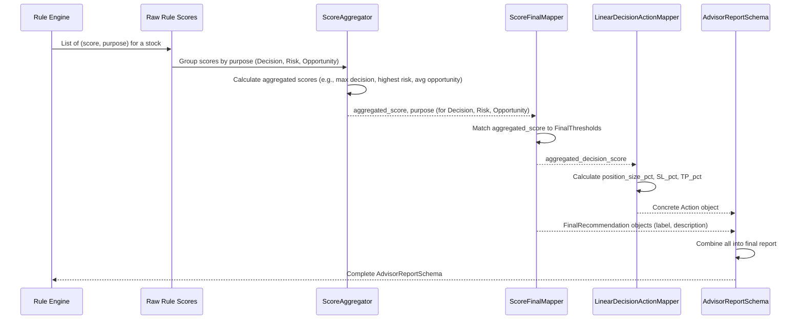

# Chapter 7: Rule Score Interpretation & Action Mapping

Welcome to Chapter 7! In our previous chapter, [Chapter 6: Rule Definition (The `Rule` class)](06_rule_definition__the__rule__class__.md), we learned how to define complete `Rule` objects that encapsulate a logic tree and metadata. We saw how these rules, when `execute()`d against a [Consolidated Analysis Report](04_consolidated_analysis_reports__.md), give us a numerical score (e.g., `0.7` or `-0.5`).

## The Problem: Making Sense of Raw Numbers

So, a rule tells us "score is `0.7`" or "score is `-0.5`." That's a great start, but what does `0.7` actually *mean* for an investor? Does it mean "Buy now," "Strong Buy," or just "Consider buying"? And what about `-0.5`? Does that imply "Sell," "Reduce Position," or "Strong Sell"?

Also, what if we have **multiple** rules that all suggest "buy" but with slightly different scores? How do we combine those into one confident decision? And once we have a clear decision, how do we translate it into concrete instructions like "Buy 20% of your position with a 5% stop loss"?

We need a way to:
1.  **Combine** multiple scores into one overall score for different purposes (like a final "buy/sell" decision, a "risk level," or an "opportunity rating").
2.  **Translate** these final scores into easy-to-understand labels (like "Strong Buy" or "High Risk").
3.  **Map** the "buy/sell" decisions into specific trading instructions (like "Buy X% position, Stop Loss Y%").

Without this step, our intelligent rules are just spitting out numbers, and those numbers aren't directly actionable.

## The Solution: Rule Score Interpretation & Action Mapping (Our "Financial Translator")

This is exactly what **Rule Score Interpretation & Action Mapping** does! Think of this entire process as our project's **"Financial Translator"** or **"Decision Interpreter."** It's the critical link that converts raw numerical analysis into human-readable insights and actionable advice.

This abstraction takes the scores from our rules and performs three key tasks:

1.  **Aggregates Scores:** If multiple rules (e.g., three different "buy" rules) all return scores for the same purpose, it combines them into a single, unified score (e.g., by averaging them).
2.  **Interprets Scores into Labels:** It compares the aggregated score against a predefined "rubric" (thresholds) to give it a human-friendly label (e.g., `0.8` for a decision rule becomes "Strong Buy").
3.  **Maps to Actions:** For decision signals, it goes a step further, translating the final score into a concrete trading instruction (e.g., "Buy 20% position, Stop Loss 5%").

The final output is a comprehensive `AdvisorReportSchema` (our "Executive Summary") that gives a complete picture of what to do and why.

## Key Concepts: How Our Financial Translator Works

Let's break down the main components that make this translation possible.

### A. Aggregating Multiple Scores (The "Scorekeeper")

Imagine we have several rules evaluating the same stock for a "buy/sell" decision. One rule might suggest `0.7` (moderate buy), another `0.9` (strong buy), and a third `0.5` (weak buy). We don't want three separate buy signals; we need one overall score.

The `ScoreAggregator` (`itapia_common/rules/score.py`) is like our **"Scorekeeper."** Its job is to take a list of numerical scores and combine them into a single, meaningful score using different mathematical methods.

Here's how you might use it:

```python
# From itapia_common/rules/score.py
from itapia_common.rules.score import ScoreAggregator

scorekeeper = ScoreAggregator()

# Example: Scores from multiple "buy/sell decision" rules
decision_scores = [0.7, 0.9, 0.5, -0.2] # Some positive, some negative
risk_scores = [0.1, 0.3, 0.2] # For risk assessment
opportunity_scores = [0.8, 0.75] # For opportunity rating

# 1. Averaging decision scores (simple mean)
avg_decision = scorekeeper.average(decision_scores)
print(f"Average Decision Score: {avg_decision:.2f}")
# Output: Average Decision Score: 0.47

# 2. Getting the highest risk score (max for worst-case risk)
highest_risk = scorekeeper.get_highest_score(risk_scores)
print(f"Highest Risk Score: {highest_risk:.2f}")
# Output: Highest Risk Score: 0.30

# 3. Getting the strongest signal (largest absolute value)
strongest_signal = scorekeeper.get_max_score(decision_scores)
print(f"Strongest Decision Signal: {strongest_signal:.2f}")
# Output: Strongest Decision Signal: 0.90
```
**Explanation:**
*   `ScoreAggregator` provides methods like `average`, `get_highest_score`, and `get_max_score`.
*   We use the appropriate method based on what we're aggregating. For decisions, an average or max signal might be useful. For risk, we often care about the *highest* perceived risk.

### B. Mapping Scores to Human-Readable Labels (The "Grader's Rubric")

Once we have a single, aggregated score (e.g., `0.85` for a decision, or `0.6` for risk), we need to translate that number into a label like "Strong Buy" or "Moderate Risk."

This is done using **Final Thresholds** (`itapia_common/rules/final_thresholds.py`) and the `ScoreFinalMapper` (`itapia_common/rules/score.py`).

1.  **Final Thresholds:** These are predefined numerical boundaries, like a grading rubric. For example, a score between `0.8` and `0.95` might mean "Strong Buy." We have different sets of thresholds for different `purpose`s (`DECISION_SIGNAL`, `RISK_LEVEL`, `OPPORTUNITY_RATING`).

    ```python
    # From itapia_common/rules/final_thresholds.py (simplified)
    from typing import List, NamedTuple
    from itapia_common.schemas.entities.rules import SemanticType

    class FinalThreshold(NamedTuple):
        name: str
        value: float
        description: str
        purpose: SemanticType

    # Example: A small part of the DECISION_THRESHOLDS
    DECISION_THRESHOLDS: List[FinalThreshold] = sorted(
        [
            # ... other thresholds ...
            FinalThreshold("SELL_MODERATE", -0.5, "Moderate indication to sell", SemanticType.DECISION_SIGNAL),
            FinalThreshold("HOLD_NEUTRAL", 0.0, "Hold, no clear direction", SemanticType.DECISION_SIGNAL),
            FinalThreshold("BUY_MODERATE", 0.5, "Moderate indication to buy", SemanticType.DECISION_SIGNAL),
            FinalThreshold("BUY_STRONG", 0.8, "Strong indication to buy", SemanticType.DECISION_SIGNAL),
            # ... other thresholds ...
        ],
        key=lambda x: x.value, # Sorted by value
    )
    ```
    **Explanation:**
    *   `FinalThreshold` is a simple structure that holds a `name` (like `BUY_STRONG`), its numerical `value` (the threshold), a `description`, and its `purpose`.
    *   `DECISION_THRESHOLDS`, `RISK_THRESHOLDS`, and `OPPORTUNITY_THRESHOLDS` are lists of these, sorted by their `value`.

2.  **`ScoreFinalMapper`:** This is our **"Grader."** It takes an aggregated score and a `purpose` (e.g., `DECISION_SIGNAL`), then looks up the correct `FinalThreshold` list to find the best matching label and description.

    ```python
    # From itapia_common/rules/score.py (simplified)
    from itapia_common.rules.score import ScoreFinalMapper
    from itapia_common.schemas.entities.rules import SemanticType

    grader = ScoreFinalMapper()

    # Using an aggregated decision score from above
    decision_score = 0.85
    label_name, description = grader.map(decision_score, SemanticType.DECISION_SIGNAL)
    print(f"Decision: {label_name} - {description}")
    # Output: Decision: THRESHOLD_DECISION_BUY_STRONG - Threshold match is THRESHOLD_DECISION_BUY_STRONG, which mean Strong indication to buy.

    # Example for a risk score
    risk_score = 0.6
    label_name, description = grader.map(risk_score, SemanticType.RISK_LEVEL)
    print(f"Risk: {label_name} - {description}")
    # Output: Risk: THRESHOLD_RISK_MODERATE - Threshold match is THRESHOLD_RISK_MODERATE, which mean Moderate, balanced risk/reward.
    ```
    **Explanation:**
    *   The `map` method takes the `score` and the `purpose`.
    *   It iterates through the sorted thresholds for that purpose to find the highest threshold that the `score` still meets or exceeds.

### C. Mapping Scores to Concrete Trading Actions (The "Coach's Playbook")

For decision signals (like "Buy" or "Sell"), a label isn't always enough. We need concrete instructions. "Buy Strong" might mean "Buy 20% of your available capital, with a 5% stop loss and aiming for a 15% profit." The confidence in the signal (how high or low the score is) should influence these parameters.

The `LinearDecisionActionMapper` (`itapia_common/rules/action.py`) is like our **"Coach."** It takes a decision score and converts it into a detailed `Action` object (`itapia_common/schemas/entities/action.py`).

```python
# From itapia_common/schemas/entities/action.py (simplified)
from pydantic import BaseModel
from typing import Literal

ACTION_TYPE = Literal["BUY", "SELL", "HOLD"]

class Action(BaseModel):
    action_type: ACTION_TYPE
    position_size_pct: float = 1.0 # % of capital
    duration_days: int = 365 # Hold time
    sl_pct: float = 1.0 # Stop Loss %
    tp_pct: float = 1.0 # Take Profit %
```
**Explanation:**
*   The `Action` Pydantic model defines the structure of our trading instruction.

Now, let's see the `LinearDecisionActionMapper` in action:

```python
# From itapia_common/rules/action.py (simplified)
from itapia_common.rules.action import LinearDecisionActionMapper

# Initialize the mapper with default ranges (or customized ones)
coach = LinearDecisionActionMapper()

# Scenario 1: A strong buy signal
strong_buy_score = 0.85
buy_action = coach.map_action(strong_buy_score)
print(f"Strong Buy Action: {buy_action.action_type}, Pos Size: {buy_action.position_size_pct:.2f}, SL: {buy_action.sl_pct:.2f}")
# Output: Strong Buy Action: BUY, Pos Size: 0.80, SL: 0.09 (values might vary based on config)

# Scenario 2: A moderate sell signal
moderate_sell_score = -0.6
sell_action = coach.map_action(moderate_sell_score)
print(f"Moderate Sell Action: {sell_action.action_type}, Pos Size: {sell_action.position_size_pct:.2f}, SL: {sell_action.sl_pct:.2f}")
# Output: Moderate Sell Action: SELL, Pos Size: 0.50, SL: 0.07 (values might vary based on config)

# Scenario 3: A neutral signal
hold_score = 0.05 # Falls within hold thresholds
hold_action = coach.map_action(hold_score)
print(f"Neutral Action: {hold_action.action_type}")
# Output: Neutral Action: HOLD
```
**Explanation:**
*   The `map_action` method checks if the `score_final` is above a `min_buy_threshold`, below a `max_sell_threshold`, or falls into a "HOLD" range.
*   The `confidence` (absolute value of the score) is used to linearly scale the `position_size_pct`, `duration_days`, `sl_pct` (Stop Loss Percentage), and `tp_pct` (Take Profit Percentage) within their defined ranges. This means a stronger signal leads to a larger position size and perhaps tighter risk/reward settings.

### D. The Full Picture: The Advisor Report (Our "Executive Summary")

All these interpretations and actions are finally compiled into a single, comprehensive `AdvisorReportSchema` (`itapia_common/schemas/entities/advisor.py`). This is the ultimate output of our system for a given stock, providing a clear "executive summary" for the user.

```python
# From itapia_common/schemas/entities/advisor.py (simplified)
from pydantic import BaseModel
from typing import List
from datetime import datetime, timezone
from itapia_common.schemas.entities.action import Action # Our action Pydantic model

class FinalRecommendation(BaseModel):
    final_score: float
    purpose: str
    label: str # e.g., "STRONG_BUY"
    final_recommend: str # e.g., "Threshold match is STRONG_BUY, which mean Strong indication to buy"
    # triggered_rules: List[TriggeredRuleInfo] # (for XAI)

class AggregatedScoreInfo(BaseModel):
    raw_decision_score: float
    raw_risk_score: float
    raw_opportunity_score: float

class AdvisorReportSchema(BaseModel):
    final_decision: FinalRecommendation
    final_risk: FinalRecommendation
    final_opportunity: FinalRecommendation
    final_action: Action # The concrete trading action!
    aggregated_scores: AggregatedScoreInfo
    ticker: str
    generated_at_utc: str
    generated_timestamp: int
```
**Explanation:**
*   `AdvisorReportSchema` brings together the `FinalRecommendation` for Decision, Risk, and Opportunity, the `Action`, and the underlying `AggregatedScoreInfo` (for transparency).
*   This schema acts as the final [Pydantic Model](01_data_schemas__pydantic_models__.md) for our `Advisor` module, ready to be sent to a user interface or another system.

## How to Use: Our Decision-Making Journey in Practice

Let's put all these pieces together with a simple use case: **Generate a comprehensive recommendation and action plan for a stock based on several rule scores.**

```python
from datetime import datetime, timezone
from itapia_common.rules.score import ScoreAggregator, ScoreFinalMapper
from itapia_common.rules.action import LinearDecisionActionMapper
from itapia_common.schemas.entities.action import Action
from itapia_common.schemas.entities.rules import SemanticType
from itapia_common.schemas.entities.advisor import (
    AdvisorReportSchema,
    AggregatedScoreInfo,
    FinalRecommendation,
)

# --- Step 1: Assume we have raw scores from executing multiple rules ---
# (In a real system, these would come from the Rule class's execute() from Chapter 6)

print("--- Step 1: Raw Scores from Rules ---")
# Let's say we evaluated a stock 'XYZ' with several rules:
rule_scores = {
    SemanticType.DECISION_SIGNAL: [0.7, 0.9, 0.5, -0.2], # Some rules say buy, one says mild sell
    SemanticType.RISK_LEVEL: [0.1, 0.3, 0.2], # Various risk assessments
    SemanticType.OPPORTUNITY_RATING: [0.8, 0.75], # Good opportunities
}
print("Received raw scores for XYZ.")

# --- Step 2: Aggregate Scores (using the Scorekeeper) ---
print("\n--- Step 2: Aggregating Scores ---")
score_aggregator = ScoreAggregator()

# For Decision Signal: Use max_score to get the strongest signal (e.g., strongest buy or sell)
aggregated_decision_score = score_aggregator.get_max_score(
    rule_scores[SemanticType.DECISION_SIGNAL]
)
# For Risk Level: Use get_highest_score to capture the worst-case risk
aggregated_risk_score = score_aggregator.get_highest_score(
    rule_scores[SemanticType.RISK_LEVEL]
)
# For Opportunity Rating: Use average for a balanced view
aggregated_opportunity_score = score_aggregator.average(
    rule_scores[SemanticType.OPPORTUNITY_RATING]
)

print(f"Aggregated Decision Score: {aggregated_decision_score:.2f}") # Expected: 0.90
print(f"Aggregated Risk Score: {aggregated_risk_score:.2f}") # Expected: 0.30
print(f"Aggregated Opportunity Score: {aggregated_opportunity_score:.2f}") # Expected: 0.78

aggregated_info = AggregatedScoreInfo(
    raw_decision_score=aggregated_decision_score,
    raw_risk_score=aggregated_risk_score,
    raw_opportunity_score=aggregated_opportunity_score,
)


# --- Step 3: Map Aggregated Scores to Human-Readable Labels (using the Grader's Rubric) ---
print("\n--- Step 3: Mapping to Labels ---")
score_final_mapper = ScoreFinalMapper()

# Map Decision Score
decision_label_name, decision_recommend = score_final_mapper.map(
    aggregated_decision_score, SemanticType.DECISION_SIGNAL
)
final_decision = FinalRecommendation(
    final_score=aggregated_decision_score,
    purpose=SemanticType.DECISION_SIGNAL.name,
    label=decision_label_name,
    final_recommend=decision_recommend,
    triggered_rules=[], # Simplified, in real use would list contributing rules
)
print(f"Final Decision: {final_decision.final_recommend}")

# Map Risk Score
risk_label_name, risk_recommend = score_final_mapper.map(
    aggregated_risk_score, SemanticType.RISK_LEVEL
)
final_risk = FinalRecommendation(
    final_score=aggregated_risk_score,
    purpose=SemanticType.RISK_LEVEL.name,
    label=risk_label_name,
    final_recommend=risk_recommend,
    triggered_rules=[],
)
print(f"Final Risk: {final_risk.final_recommend}")

# Map Opportunity Score
opp_label_name, opp_recommend = score_final_mapper.map(
    aggregated_opportunity_score, SemanticType.OPPORTUNITY_RATING
)
final_opportunity = FinalRecommendation(
    final_score=aggregated_opportunity_score,
    purpose=SemanticType.OPPORTUNITY_RATING.name,
    label=opp_label_name,
    final_recommend=opp_recommend,
    triggered_rules=[],
)
print(f"Final Opportunity: {final_opportunity.final_recommend}")


# --- Step 4: Map Decision Score to Concrete Trading Action (using the Coach's Playbook) ---
print("\n--- Step 4: Mapping to Action ---")
action_mapper = LinearDecisionActionMapper()
final_action = action_mapper.map_action(aggregated_decision_score)
print(
    f"Concrete Action: {final_action.action_type} {final_action.position_size_pct*100:.0f}% position, "
    f"SL: {final_action.sl_pct*100:.0f}%, TP: {final_action.tp_pct*100:.0f}%"
)


# --- Step 5: Assemble the Final Advisor Report (Executive Summary) ---
print("\n--- Step 5: Assembling Final Advisor Report ---")
now_utc = datetime.now(timezone.utc)
advisor_report = AdvisorReportSchema(
    ticker="XYZ",
    generated_at_utc=now_utc.isoformat(timespec="seconds"),
    generated_timestamp=int(now_utc.timestamp()),
    final_decision=final_decision,
    final_risk=final_risk,
    final_opportunity=final_opportunity,
    final_action=final_action,
    aggregated_scores=aggregated_info,
)

print(f"\nAdvisor Report for {advisor_report.ticker}:\n")
print(f"Decision: {advisor_report.final_decision.label} - {advisor_report.final_decision.final_recommend}")
print(f"Risk: {advisor_report.final_risk.label} - {advisor_report.final_risk.final_recommend}")
print(f"Opportunity: {advisor_report.final_opportunity.label} - {advisor_report.final_opportunity.final_recommend}")
print(f"Action: {advisor_report.final_action.action_type} with {advisor_report.final_action.position_size_pct*100:.0f}% position.")
```
**Output (simplified, actual dates/values will vary slightly due to ranges):**
```
--- Step 1: Raw Scores from Rules ---
Received raw scores for XYZ.

--- Step 2: Aggregating Scores ---
Aggregated Decision Score: 0.90
Aggregated Risk Score: 0.30
Aggregated Opportunity Score: 0.78

--- Step 3: Mapping to Labels ---
Final Decision: Threshold match is THRESHOLD_DECISION_BUY_IMMEDIATE, which mean Buy immediately with high confidence
Final Risk: Threshold match is THRESHOLD_RISK_LOW, which mean Low, conservative approach
Final Opportunity: Threshold match is THRESHOLD_OPP_RATING_STRONG, which mean A strong opportunity, worth investigating

--- Step 4: Mapping to Action ---
Concrete Action: BUY 90% position, SL: 10%, TP: 30%

--- Step 5: Assembling Final Advisor Report ---

Advisor Report for XYZ:

Decision: THRESHOLD_DECISION_BUY_IMMEDIATE - Threshold match is THRESHOLD_DECISION_BUY_IMMEDIATE, which mean Buy immediately with high confidence
Risk: THRESHOLD_RISK_LOW - Threshold match is THRESHOLD_RISK_LOW, which mean Low, conservative approach
Opportunity: THRESHOLD_OPP_RATING_STRONG - Threshold match is THRESHOLD_OPP_RATING_STRONG, which mean A strong opportunity, worth investigating
Action: BUY with 90% position.
```
This example shows how we start with raw numbers from multiple rules and end up with a clear, actionable summary!

## Under the Hood: The Interpretation Flow

Here's a simplified view of the entire interpretation and mapping process:


This diagram illustrates how the raw scores are fed into the `ScoreAggregator`, then the aggregated scores go to the `ScoreFinalMapper` and the `LinearDecisionActionMapper`, before all results are compiled into the `AdvisorReportSchema`.

## Why This Approach Is So Powerful (Benefits)

1.  **Actionable Insights:** Raw numbers are converted into clear, human-understandable labels and concrete trading instructions, making `itapia`'s advice immediately useful.
2.  **Consistency:** All interpretations follow predefined thresholds and logic, ensuring that a "Strong Buy" always means the same thing across the system.
3.  **Flexibility:** Thresholds and action mapping logic can be easily adjusted in configuration (e.g., `final_thresholds.py` or `action.py`) without changing core business logic, allowing for different risk profiles or strategies.
4.  **Consolidated View:** The `AdvisorReportSchema` provides an all-in-one summary, eliminating the need to piece together information from multiple sources.
5.  **Transparency:** By showing both aggregated raw scores and final recommendations, the system offers insight into how decisions are made.

## Conclusion

In this chapter, we've explored the crucial final step of `itapia`'s analytical pipeline: **Rule Score Interpretation & Action Mapping.** We learned how raw numerical scores from our [Rule Definition (The `Rule` class)](06_rule_definition__the__rule__class__.md) are transformed into meaningful labels and concrete trading instructions. By leveraging the `ScoreAggregator` to combine multiple scores, the `ScoreFinalMapper` to translate scores into human-readable recommendations (using `FinalThresholds`), and the `LinearDecisionActionMapper` to generate specific `Action` plans, we bridge the gap between complex analysis and practical advice, culminating in a comprehensive `AdvisorReportSchema`.

This concludes our tutorial! You've now seen how `shared` builds robust financial analysis capabilities, from defining data structures and managing databases to building flexible rules and interpreting their results into actionable insights.

---

Generated by [AI Codebase Knowledge Builder](https://github.com/The-Pocket/Tutorial-Codebase-Knowledge)