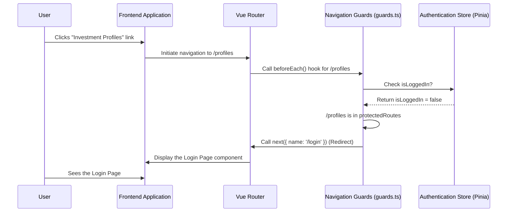

# Chapter 1: Routing & Navigation

Welcome to the very first chapter of our `frontend` tutorial! Think of our web application as a sprawling city. Just like a city has different neighborhoods (like a shopping district, a residential area, or a park), our application has different "pages" or "views" – like a "Login" page, an "Investment Profiles" page, or an "AI Advisor" page.

### What Problem Does Routing Solve?

How do you get from one neighborhood to another in a city? You follow roads, use a map, or your GPS. In a web application, **Routing** is our GPS! It's the system that guides users to the correct "page" or "view" when they click a link, type an address in the browser bar, or submit a form.

Imagine you're using our application. You're on the home page, and you see a link that says "My Investment Profiles." When you click it, you expect to be taken to a new screen that shows all your investment profiles. This seemingly simple act is handled by routing! It figures out:
1.  Which specific visual component (the "page") should be displayed.
2.  What unique address (like `/profiles`) should appear in your browser's address bar.
3.  And sometimes, whether you're even *allowed* to visit that page.

Without routing, our application would just be one static screen, which isn't very useful!

### Key Concepts of Routing & Navigation

Let's break down the main ideas:

1.  **Routes and Pages:** Each unique address in our application (like `/login`, `/profiles`, `/advisor`) corresponds to a **route**. Each route typically displays a specific **page** component. Think of routes as street addresses and pages as the houses at those addresses.

2.  **Automatic Routing with `unplugin-vue-router`:** Traditionally, you had to manually list every single route in a big configuration file. But our project uses a clever tool called `unplugin-vue-router`. This tool is like a magical urban planner that *automatically* creates roads (routes) to new buildings (pages) as soon as you build them! You simply create a `.vue` file in the `src/pages` folder, and `unplugin-vue-router` automatically makes it accessible via a URL. This makes adding new pages super easy!

3.  **Navigation Guards:** Sometimes, certain areas of our "city" (application) are restricted. For example, you wouldn't want someone to access your "Investment Profiles" without logging in first. **Navigation Guards** are like security checkpoints. They are special functions that run *before* a user can access a route. They can check if a user is logged in, has certain permissions, or meets other criteria before allowing them to proceed or redirecting them elsewhere (like to the login page).

### How We Use Automatic Routing to Create Pages

Let's see how easy it is to add a new page using `unplugin-vue-router`.

#### Creating a Page

You don't need to write any special routing configuration. Just create a `.vue` file inside the `src/pages` directory.

For example, if you want a page for viewing all investment profiles, you'd create:

```
src/pages/profiles.vue
```

And inside that file, you'd have your Vue component code:

```vue
<!-- src/pages/profiles.vue -->
<template>
  <div>
    <h1>Your Investment Profiles</h1>
    <p>This is where your profiles will be listed.</p>
  </div>
</template>

<script setup lang="ts">
// Your page-specific logic will go here
</script>
```

That's it! `unplugin-vue-router` automatically turns this file into a route accessible at `/profiles`.

You can also create dynamic routes, which are like roads with variable parts. For example, to view a *specific* investment profile, you might have a route like `/profiles/123` where `123` is the profile's ID. You'd set this up like so:

```
src/pages/profiles/[profile_id].vue
```

The `[profile_id]` part tells `unplugin-vue-router` that this part of the URL is a variable, which you can then use inside your page component.

The `src/pages/README.md` file in our project confirms this:

```markdown
# Pages

Vue components created in this folder will automatically be converted to navigatable routes.

Full documentation for this feature can be found in the Official [unplugin-vue-router](https://github.com/posva/unplugin-vue-router) repository.
```

#### Generated Route Types

As a developer, it's helpful to know what routes are available. `unplugin-vue-router` doesn't just create routes; it also generates a special file called `src\typed-router.d.ts`. This file helps our code editor understand all the routes and gives us "type safety" – meaning it helps catch errors if we try to navigate to a route that doesn't exist.

Here's a simplified look at what that file contains:

```typescript
// src\typed-router.d.ts (excerpt - DO NOT MODIFY MANUALLY)
declare module 'vue-router/auto-routes' {
  export interface RouteNamedMap {
    '/': RouteRecordInfo<'/', '/', /* ... */>,
    '/advisor/': RouteRecordInfo<'/advisor/', '/advisor', /* ... */>,
    '/login': RouteRecordInfo<'/login', '/login', /* ... */>,
    '/profiles/': RouteRecordInfo<'/profiles/', '/profiles', /* ... */>,
    '/profiles/[profile_id]': RouteRecordInfo<'/profiles/[profile_id]', '/profiles/:profile_id', { profile_id: ParamValue<true> }, /* ... */>,
    // ... more routes based on your files ...
  }
}
```

This snippet shows that paths like `/`, `/login`, `/profiles/`, and `/profiles/[profile_id]` are recognized as valid routes. Notice how `[profile_id]` from our file name becomes `:profile_id` in the actual route path, indicating it's a dynamic parameter.

The `env.d.ts` file in our project includes a reference to these generated types, ensuring they are available throughout our project for better development experience:

```typescript
// env.d.ts (excerpt)
/// <reference types="unplugin-vue-router/client" />
```
This line essentially tells our development environment, "Hey, also consider the types generated by `unplugin-vue-router`!"

### How Navigation Guards Protect Our Routes

Now, let's look at the "security checkpoints" – navigation guards. They are crucial for protecting sensitive parts of our application.

Imagine a user tries to access `/profiles` without being logged in. We want to redirect them to the `/login` page. This is exactly what a navigation guard can do.

In our project, the core logic for navigation guards lives in `src/router/guards.ts`:

```typescript
// src\router\guards.ts (simplified excerpt)
import type { Router } from 'vue-router';
import { useAuthStore } from '@/stores/authStore'; // For checking login status

// List of routes that require authentication
const protectedRoutes = ['/profiles', '/advisor/[ticker]'];

export function setupNavigationGuards(router: Router) {
    router.beforeEach((to, from, next) => {
        const authStore = useAuthStore();
        const isLoggedIn = authStore.isLoggedIn; // Is the user logged in?

        // Check if the route the user is *trying to go to* requires authentication
        const requiresAuth = protectedRoutes.some(path => to.path.startsWith(path));

        // Rule 1: Trying to access a protected route without being logged in
        if (requiresAuth && !isLoggedIn) {
            next({ name: '/login' }); // Redirect to login page
        }
        // Rule 2: Trying to access the login page while *already* logged in
        else if (to.path == '/login' && isLoggedIn) {
            next({ name: '/' }); // Redirect to home page
        }
        // Rule 3: All good! Let the navigation proceed
        else {
            next();
        }
    });
}
```

Let's break down what's happening here:

*   `protectedRoutes`: This array lists the "street addresses" that require a security check. Notice `/profiles` is there.
*   `router.beforeEach((to, from, next) => { ... })`: This is the actual navigation guard. `beforeEach` means "run this function *before* every single route change."
    *   `to`: This object contains information about the route the user *wants to go to*.
    *   `from`: This object contains information about the route the user *is currently on*.
    *   `next`: This is a function that tells the router what to do next.
        *   `next()`: "OK, proceed to the destination route."
        *   `next({ name: '/login' })`: "STOP, don't go to the destination, instead redirect to the login page."
*   Inside the guard, we check `isLoggedIn` (from an authentication store, which we'll cover in [Chapter 4: User Authentication](04_user_authentication_.md)).
*   If a route `requiresAuth` and the user `!isLoggedIn`, they are redirected to `/login`.
*   Conversely, if a user is already logged in and tries to go to `/login` again, they're sent to the home page (`/`) to avoid confusion.

### How it All Comes Together: The Router Initialization

The "brain" that brings `unplugin-vue-router`'s automatic routes and our navigation guards together is located in `src/router/index.ts`:

```typescript
// src\router\index.ts (simplified excerpt)
import { createRouter, createWebHistory } from 'vue-router/auto';
import { setupLayouts } from 'virtual:generated-layouts'; // For applying common page structures
import { routes } from 'vue-router/auto-routes'; // Our auto-generated routes

import { setupNavigationGuards } from './guards'; // Our security checkpoints

// Create the router instance
const router = createRouter({
  history: createWebHistory(import.meta.env.BASE_URL),
  // Apply layouts to our automatically generated routes
  routes: setupLayouts(routes),
});

// Set up our navigation guards
setupNavigationGuards(router);

export default router;
```

Here's what this code does:

*   `createRouter`: This is the main function that creates our application's router.
*   `createWebHistory`: This tells the router to use standard browser history (so the back/forward buttons work as expected).
*   `routes: setupLayouts(routes)`: This is where `unplugin-vue-router`'s magic `routes` (from `vue-router/auto-routes`) are used. The `setupLayouts` part wraps our pages with common UI elements (like a header and footer), which we'll briefly touch upon in [Chapter 2: UI Framework (Vuetify)](02_ui_framework__vuetify__.md). The `src/layouts/README.md` also provides more details about this.
*   `setupNavigationGuards(router)`: This line *activates* our security checkpoints, attaching them to our router instance.

### Step-by-Step Scenario: Accessing a Protected Page

Let's walk through our use case: a user tries to access "Investment Profiles" without being logged in.



In this sequence:
1.  The **User** clicks a link for `/profiles`.
2.  Our **Frontend Application** tells the **Vue Router** to navigate.
3.  Before going to `/profiles`, the **Router** triggers the `beforeEach` guard in `guards.ts`.
4.  The **Navigation Guards** check the `AuthStore` to see if the user is logged in.
5.  The `AuthStore` reports that the user is `false` (not logged in).
6.  Since `/profiles` is a `protectedRoute` and the user isn't logged in, the guard calls `next({ name: '/login' })`.
7.  The **Router** then stops the navigation to `/profiles` and instead navigates to `/login`.
8.  The **Application** displays the Login page to the **User**.

This entire process happens extremely quickly, making our application secure and user-friendly.

### Conclusion

In this chapter, we've explored **Routing & Navigation**, which acts as the GPS of our application, guiding users to the right pages. We learned how `unplugin-vue-router` simplifies page creation by automatically generating routes from files in `src/pages`. We also understood the crucial role of **Navigation Guards** as security checkpoints, ensuring users have the right permissions to access certain areas, as implemented in `src/router/guards.ts`.

With a solid understanding of how users move between different parts of our application, we're ready to make those parts look good!

Our next step is to explore how our application gets its visual style and structure.

[Next Chapter: UI Framework (Vuetify)](02_ui_framework__vuetify__.md)

---

Generated by [AI Codebase Knowledge Builder](https://github.com/The-Pocket/Tutorial-Codebase-Knowledge)