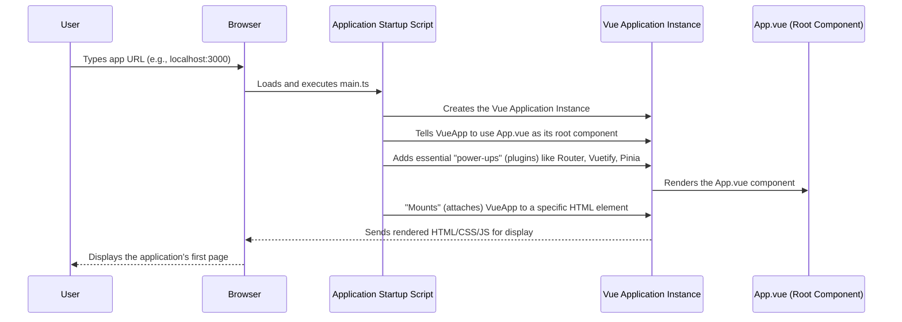

# Chapter 3: Vue Application Core

Welcome back! In [Chapter 1: Routing & Navigation](01_routing___navigation_.md), we explored how users move between different parts of our application, like roads in a city. Then, in [Chapter 2: UI Framework (Vuetify)](02_ui_framework__vuetify__.md), we learned how Vuetify helps us make those parts look beautiful and consistent, like selecting pre-designed building blocks for our city's houses.

But who decided which road to build first? And how do those beautiful building blocks actually get put together to form a living, breathing application? This is where the **Vue Application Core** comes in!

### What Problem Does the Vue Application Core Solve?

Imagine a complex machine, like a self-driving car. It has a GPS (our router), fancy exterior panels (our UI framework), and many other parts. But none of it works without a central engine and a control system that starts it up, coordinates all the components, and makes decisions.

The **Vue Application Core** is precisely this: the central engine and control room for our entire frontend application. It's the "brain" that brings *everything* together – the routing, the UI components, data handling (which we'll see later), and more – to create a single, complete, and interactive experience for the user.

Without this core, all our fancy routes and beautiful components would just be separate pieces, unable to communicate or function as a unified application. It ensures that from the moment you open your browser to our app, everything starts up correctly and works together smoothly.

#### Central Use Case: Launching and Displaying the First Page

How does our application first appear in the browser? When you type `localhost:3000` (or `frontend.yourdomain.com`) into your browser, what actually kicks off the display of the login page, or the home page? The Vue Application Core is responsible for this initial launch sequence. It's like flipping the "ON" switch for the entire application, making sure the initial components are loaded and displayed.

### Key Concepts of the Vue Application Core

Let's break down how this core engine works:

1.  **The Vue Application Instance (The "Brain"):** At the very heart of any Vue app is the **Vue Application Instance**. Think of this as the main "brain" or the central control unit of our application. It's created once, and it's responsible for managing all the components, connecting them, and making sure everything runs smoothly. When we talk about "our Vue application," we're essentially talking about this instance.

2.  **The Root Component (`App.vue` - The "Main Shell"):** While the Vue Application Instance is the brain, it needs a body to control. This is where the **Root Component**, usually named `App.vue`, comes in. Think of `App.vue` as the main shell or the outer casing of our entire application. It's the very first visual component that the Vue instance loads, and all other pages and components live *inside* it. It often contains shared elements like the main header, footer, or where our routes will be displayed.

3.  **Plugins (The "Power-ups"):** Our Vue application isn't just a brain and a shell; it needs extra capabilities. **Plugins** are like "power-ups" or extensions that add global functionality to our Vue application. We've already seen two crucial plugins:
    *   [Vue Router](01_routing___navigation_.md): The plugin that enables navigation.
    *   [Vuetify](02_ui_framework__vuetify__.md): The plugin that provides all our beautiful UI components.
    Later, we'll also see [Pinia](06_state_management__pinia_stores__.md) for managing data across the app, which is another plugin. The core makes sure these plugins are loaded and ready to use.

4.  **Mounting (Connecting to the Webpage):** Once the Vue application instance is created and the `App.vue` component is ready, we need to show it to the user. **Mounting** is the final step where our Vue application literally "attaches" itself to a specific spot in the HTML of our webpage. It takes control of that spot and starts displaying its content there.

### How it All Comes Together: The Application Launch Sequence

The magic of starting our application happens in a file called `src/main.ts`. This is the very first TypeScript file that runs when our frontend application loads in the browser. It's like the main startup script for our entire project.

Let's visualize the journey from your browser opening our app to seeing the first page:



Now, let's look at the `src/main.ts` file, which orchestrates this entire process:

#### The Application's Entry Point: `src/main.ts`

This file is the control room. It's responsible for creating our main Vue application instance and making sure all the necessary pieces are plugged in and ready to go.

```typescript
// src/main.ts (simplified excerpt)

import App from './App.vue'; // Our main shell component
import { createApp } from 'vue'; // Function to create the Vue app

// --- Plugins (our "power-ups") ---
import { createPinia } from 'pinia'; // For data management (Chapter 6)
import router from './router';      // Our GPS for navigation (Chapter 1)
import vuetify from './plugins/vuetify'; // Our UI toolkit (Chapter 2)

// 1. Create the main Vue application instance
const app = createApp(App); // <-- 'App' is our root component

// 2. Register core plugins (attach our "power-ups")
app.use(createPinia()); // Make Pinia available
app.use(router);      // Make Vue Router available
app.use(vuetify);     // Make Vuetify available

// 3. Mount the application to the webpage
app.mount('#app'); // <-- Attach to an HTML element with id="app"
```

Let's break down the key lines in this crucial file:

*   `import { createApp } from 'vue';`: This line imports the `createApp` function from the Vue library. This is the starting point for creating any Vue 3 application.
*   `import App from './App.vue';`: This imports our `App.vue` file. This component will be the "root" or main container for our entire application's user interface.
*   `const app = createApp(App);`: This is the big one! It creates our central **Vue Application Instance**. We pass `App` (our root component) to it, telling Vue that `App.vue` is the component that should kick off our UI.
*   `app.use(...)`: These lines are where we attach our **plugins**. Each `app.use()` call adds a new capability or library to our entire Vue application.
    *   `app.use(createPinia());`: Makes our data management system ([Chapter 6: State Management (Pinia Stores)](06_state_management__pinia_stores__.md)) available everywhere.
    *   `app.use(router);`: Makes our navigation system ([Chapter 1: Routing & Navigation](01_routing___navigation_.md)) available.
    *   `app.use(vuetify);`: Makes our UI components and styling ([Chapter 2: UI Framework (Vuetify)](02_ui_framework__vuetify__.md)) available.
*   `app.mount('#app');`: This is the final step. It tells our Vue application instance to take control of an HTML element on the page that has the `id="app"`. This is usually a simple `<div>` in `public/index.html` (or similar for Vite projects), like this: `<div id="app"></div>`. Once mounted, Vue will render all its components, starting with `App.vue`, inside that `#app` element.

#### The Root Component: `src/App.vue`

Since `App.vue` is the root component that gets rendered first, what does it typically contain? Often, it acts as a wrapper that sets up the overall layout and tells the [Vue Router](01_routing___navigation_.md) where to display the actual pages.

```vue
<!-- src/App.vue (simplified example) -->
<template>
  <!-- Vuetify application wrapper -->
  <v-app>
    <!-- Main content area where pages will be displayed -->
    <v-main>
      <!-- This is where Vue Router will render our pages -->
      <router-view />
    </v-main>
  </v-app>
</template>

<script setup lang="ts">
// No specific logic usually needed here for a simple App.vue
// It mainly sets up the structure.
</script>
```

Here's a quick explanation:
*   `<v-app>`: This is a special [Vuetify](02_ui_framework__vuetify__.md) component that wraps our entire application. It's necessary for Vuetify to work correctly and apply its styles and functionality globally.
*   `<v-main>`: Another [Vuetify](02_ui_framework__vuetify__.md) component that designates the primary content area of our application.
*   `<router-view />`: This is a special component provided by [Vue Router](01_routing___navigation_.md). It acts as a placeholder. Whenever you navigate to a different route (a different "page"), the component for that page will be rendered *inside* this `<router-view />`. So, if you go to `/login`, the `LoginPage.vue` component will appear here. If you go to `/profiles`, the `ProfilesPage.vue` component will appear here.

### Conclusion

In this chapter, we've explored the **Vue Application Core**, the central engine that brings our entire frontend application to life. We learned that `src/main.ts` is the startup script, responsible for creating the main **Vue Application Instance**, plugging in essential **plugins** like the router and UI framework, and finally **mounting** the application to the webpage. We also saw how `App.vue` acts as the root component, providing the main shell where all our other pages are displayed.

With the core engine understood, we now have a solid foundation for how our application starts and runs. Our next step is to tackle one of the most critical aspects of many web applications: knowing who our users are.

[Next Chapter: User Authentication](04_user_authentication_.md)

---

Generated by [AI Codebase Knowledge Builder](https://github.com/The-Pocket/Tutorial-Codebase-Knowledge)