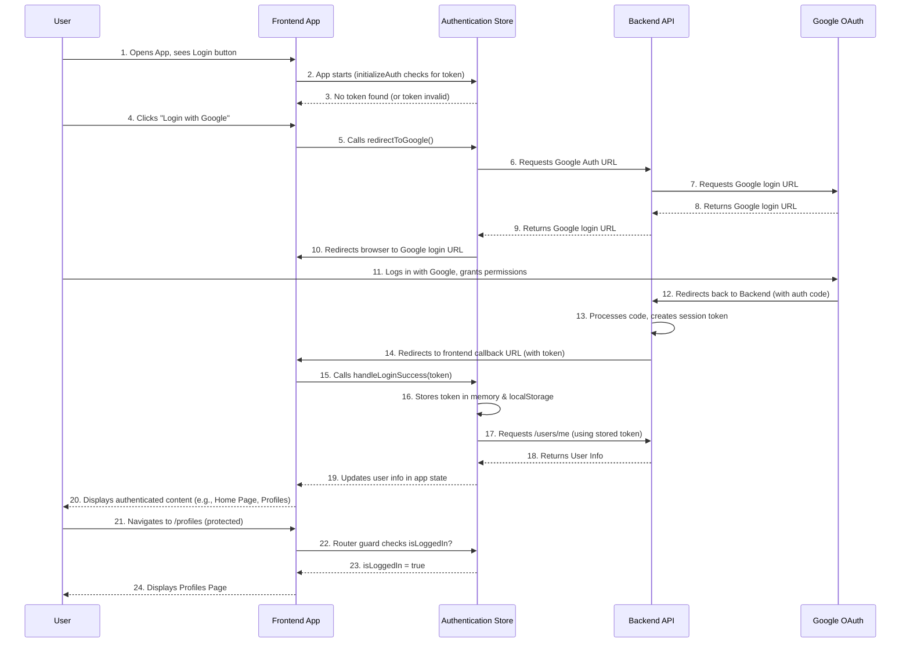

# Chapter 4: User Authentication

Welcome back! In [Chapter 3: Vue Application Core](03_vue_application_core_.md), we explored the central engine that brings our entire frontend application to life, ensuring all its parts start up and work together smoothly. Now that our application has a brain and a body, it's time to give it an identity!

### What Problem Does User Authentication Solve?

Imagine our application is a super exclusive club. It has public areas everyone can see, but also VIP lounges and private offices where only members are allowed. How does the club know who is a member and who isn't? How does it keep track of who's currently inside and what privileges they have?

This is exactly the problem **User Authentication** solves in our web application. It's the process of **verifying who you are**, ensuring that you are indeed the person you claim to be. Once verified, it grants you secure access to your personal data and protected features, like your "Investment Profiles" (which we learned are protected in [Chapter 1: Routing & Navigation](01_routing___navigation_.md)).

Think of it as the friendly but firm bouncer at our exclusive club. They check your ID to make sure only authorized people get in. Once you're in, they might give you a special pass (a session token) that lets you move around without showing your ID at every door. If your pass expires or is no longer valid, they'll politely (or not-so-politely) escort you out and ask you to get a new pass.

Without authentication, anyone could walk into any part of our "club," access sensitive information, or use features meant only for you. That's not very secure or personal!

#### Central Use Case: Logging In and Staying Logged In

How do you, as a user, log into our application and then access your protected `Investment Profiles` page? Our application uses Google for login, which is super convenient. Once you log in, we want you to stay logged in, even if you close and reopen your browser, so you don't have to enter your details every time. This involves getting a special "session token" and managing it securely.

### Key Concepts of User Authentication

Let's break down the main ideas that make our authentication system work:

1.  **Google as Your ID Provider:** Instead of building our own complex username and password system, we delegate the "Who are you?" question to Google. When you log in, you're actually logging into your Google account. Google then tells our application, "Yes, this person is who they say they are!"
    *   **Analogy:** Google is like the official ID card office. Our bouncer trusts their ID cards.

2.  **Session Token (Your Temporary Pass):** After Google verifies you, our backend server gives your browser a special, secret code called a **session token**. This token is like your temporary pass to the club. Your browser saves this token, and whenever it asks our server for a protected page or data, it shows this token.
    *   **Analogy:** This is the wristband or temporary pass the bouncer gives you after checking your ID. You show this pass to access different areas.

3.  **User Details (Your Profile Info):** Once you're logged in with a valid token, our application can use that token to ask the backend for your personal information, like your name and email. This lets us personalize your experience (e.g., "Welcome, [Your Name]!").
    *   **Analogy:** The bouncer also checks your ID to see your name and maybe your picture, so they can greet you personally.

4.  **Login and Logout Actions:** These are the primary ways you interact with the authentication system.
    *   **Login:** Initiates the process of getting verified by Google and receiving a session token.
    *   **Logout:** Revokes your session token, essentially tearing up your temporary pass and making you "leave the club."

5.  **Session Management (Keeping Your Pass Valid):** Our application continuously monitors your session token. If it expires (like a pass that's only good for one night) or becomes invalid (like a fake pass), the system automatically logs you out. This is a crucial security measure.
    *   **Analogy:** The bouncer constantly patrols, checking passes and ensuring everyone's pass is still valid. If not, out you go!

6.  **Authentication Store (The Bouncer's Ledger):** In our frontend, we use a special place called an **Authentication Store** (built with Pinia, which we'll explore in [Chapter 6: State Management (Pinia Stores)](06_state_management__pinia_stores__.md)). This store is where we keep all the authentication-related information: whether you're logged in, your session token, your user details, and the functions to perform login/logout actions.
    *   **Analogy:** The bouncer keeps a detailed ledger with everyone's current entry status, their valid passes, and their basic info.

### Solving the Use Case: Logging In

Let's trace how a user logs into our application using Google.

When a user visits our `/login` page, they'll see a button like "Login with Google."

```vue
<!-- src/pages/login.vue (simplified example) -->
<template>
  <v-container>
    <v-card class="mx-auto pa-4" max-width="400">
      <v-card-title class="text-h5">Login to Your Account</v-card-title>
      <v-card-text>
        <p>Please log in to access your personalized investment tools.</p>
        <v-btn
          color="primary"
          block
          large
          @click="loginWithGoogle"
          :loading="authStore.isLoading"
          class="mt-4"
        >
          <v-icon left>mdi-google</v-icon>
          Login with Google
        </v-btn>
      </v-card-text>
    </v-card>
  </v-container>
</template>

<script setup lang="ts">
import { useAuthStore } from '@/stores/authStore'; // Our bouncer's ledger

const authStore = useAuthStore(); // Get access to the auth store

const loginWithGoogle = () => {
  authStore.redirectToGoogle(); // Tell the store to start the Google login process
};
</script>
```
When the user clicks the "Login with Google" button:
1.  The `loginWithGoogle` function is called.
2.  This function calls `authStore.redirectToGoogle()`.
3.  The `redirectToGoogle` action (inside `src/stores/authStore.ts`) sends a request to our **backend server** to get a special URL from Google.
4.  Our frontend then `window.location.href = response.data.authorization_url;` which means the browser *redirects* the user to Google's login page.
5.  On Google's page, the user logs in and grants permission.
6.  Google then redirects the user back to a specific "callback" URL on our **backend server**, which processes Google's response.
7.  Our **backend server** then redirects the user *back to our frontend* (e.g., to a `/auth/callback` page or the home page), but this time it includes the precious **session token** in the URL.
8.  A special component (let's imagine a `src/pages/auth/callback.vue` page, though it could be handled by the router directly) grabs this token from the URL and calls `authStore.handleLoginSuccess(token)`.
9.  The `handleLoginSuccess` action saves the token and immediately tries to fetch the user's details from our backend to populate the app with their information.

Now, let's see how our application brings all this together.

### How it All Comes Together: The Authentication Flow

Let's visualize the typical journey of a user logging in and accessing protected resources.



#### Deep Dive into the Code

Let's look at the actual files that orchestrate this process.

1.  **Application Startup (`src/main.ts`)**
    When our application first starts (as we saw in [Chapter 3: Vue Application Core](03_vue_application_core_.md)), it needs to check if the user is already logged in.

    ```typescript
    // src/main.ts (simplified excerpt)
    // ... imports ...
    import { createPinia } from 'pinia';
    import router from './router';
    import vuetify from './plugins/vuetify';
    import { useAuthStore } from './stores/authStore'; // Our authentication store

    const app = createApp(App);

    // Register core plugins
    app.use(createPinia()); // Pinia must be available first!
    app.use(router);
    app.use(vuetify);

    // 2. Initialize and call action after Pinia has been used
    const authStore = useAuthStore(); // Get our bouncer's ledger
    authStore.initializeAuth();      // Ask the bouncer to check for existing passes

    app.mount('#app');
    ```
    The key lines here are `const authStore = useAuthStore();` and `authStore.initializeAuth();`. This tells our application, "Hey, as soon as you start up, check if we have any existing authentication tokens stored, and if so, fetch the user's details!" This makes sure you stay logged in between browser sessions.

2.  **The Authentication Store (`src/stores/authStore.ts`)**
    This Pinia store is the heart of our authentication logic. It holds the user's status and provides all the actions for logging in, logging out, and fetching user data.

    ```typescript
    // src/stores/authStore.ts (simplified excerpt)
    import { defineStore } from 'pinia';
    import axios from '@/plugins/axios'; // For talking to the backend (Chapter 5)
    import router from '@/router';      // For navigation (Chapter 1)
    import type { components } from '@/types/api'; // For type safety

    type UserInfo = components['schemas']['UserResponse']; // What a user's data looks like

    interface AuthState {
      user: UserInfo | null;
      token: string | null;
      isLoading: boolean;
    }

    export const useAuthStore = defineStore('auth', {
      state: (): AuthState => ({
        user: null,
        token: localStorage.getItem('authToken'), // Check for token saved in browser
        isLoading: false,
      }),

      getters: {
        isLoggedIn: (state) => !!state.token, // True if token exists, false otherwise
        userName: (state) => state.user?.full_name || 'Guest',
      },

      actions: {
        async redirectToGoogle() {
          this.isLoading = true;
          try {
            // Ask backend for the Google login URL
            const response = await axios.get('/auth/google/login');
            window.location.href = response.data.authorization_url; // Redirect!
          } catch (error) { /* ... handle error ... */ }
        },

        async handleLoginSuccess(token: string) {
          this.token = token;
          localStorage.setItem('authToken', token); // Save token to browser's local storage
          await this.fetchCurrentUser(); // Get user details after saving token
        },
        
        async fetchCurrentUser() {
          if (!this.token) return;
          try {
            // Send token with request to get user info
            const response = await axios.get('/users/me'); 
            this.user = response.data; // Store user details
          } catch (error) {
            console.error("Failed to fetch user info. Logging out.", error);
            this.logout(); // If token is bad, log out
          }
        },

        logout() {
          this.token = null;
          this.user = null;
          localStorage.removeItem('authToken'); // Clear token from browser
          router.push('/login'); // Send user to login page
        },

        async initializeAuth() {
          if (this.token) { // If we found a token when the app started
            await this.fetchCurrentUser(); // Try to fetch user info
          }
        }
      },
    });
    ```
    *   **`state`**: This is where our bouncer keeps current info: `user` (details like name, email), `token` (the temporary pass), and `isLoading` (to show a spinner during login). `localStorage.getItem('authToken')` is important because it tries to find a previously saved token when the app loads.
    *   **`getters`**: `isLoggedIn` quickly tells us if the user has a valid token, and `userName` provides their name for display.
    *   **`actions`**: These are the functions that *do* things:
        *   `redirectToGoogle()`: Contacts our backend for Google's login page URL and then redirects the browser. It uses `axios` to talk to the backend, which we'll cover in [Chapter 5: API Communication (Axios & OpenAPI Types)](05_api_communication__axios___openapi_types__.md). The specific API path `/auth/google/login` is defined in `src/types/api.ts`.
        *   `handleLoginSuccess()`: Is called when Google successfully redirects back to our frontend with a token. It saves this token and immediately calls `fetchCurrentUser()`.
        *   `fetchCurrentUser()`: Uses the saved token to ask our backend (`/users/me`) for the user's full details. If this fails (e.g., token expired), it calls `logout()`. The structure of `UserInfo` comes from `src/types/api.ts`.
        *   `logout()`: Clears all authentication data and sends the user back to the login page.
        *   `initializeAuth()`: This is called once on app startup (from `src/main.ts`) to check for an existing token and silently log the user in if one is found and valid.

3.  **Route Protection (`src/router/guards.ts`)**
    Finally, remember our navigation guards from [Chapter 1: Routing & Navigation](01_routing___navigation_.md)? They play a critical role here, using the `isLoggedIn` getter from our `authStore`.

    ```typescript
    // src/router/guards.ts (simplified excerpt)
    import type { Router } from 'vue-router';
    import { useAuthStore } from '@/stores/authStore';

    const protectedRoutes = ['/profiles', '/advisor/[ticker]']; // These need a valid pass

    export function setupNavigationGuards(router: Router) {
        router.beforeEach((to, from, next) => {
            const authStore = useAuthStore();
            const isLoggedIn = authStore.isLoggedIn; // Is the user logged in?

            const requiresAuth = protectedRoutes.some(path => to.path.startsWith(path));

            if (requiresAuth && !isLoggedIn) {
                next({ name: '/login' }); // No pass? To the login page!
            } else if (to.path == '/login' && isLoggedIn) {
                next({ name: '/' }); // Already in? No need for login page, go home.
            } else {
                next(); // All clear, proceed!
            }
        });
    }
    ```
    This guard actively checks `authStore.isLoggedIn` before allowing access to any `protectedRoutes`. If the user isn't logged in, they are redirected to `/login`, ensuring our "club" remains secure.

### Conclusion

In this chapter, we've explored **User Authentication**, which is all about verifying who you are to give you secure, personalized access. We learned how our system uses Google for login, stores a **session token** as your temporary pass, and fetches your **user details**. The central piece of this is our **Authentication Store** (`src/stores/authStore.ts`), which manages your login state, handles the Google authentication flow, and deals with session expiry. We also revisited how **Navigation Guards** (`src/router/guards.ts`) use this authentication status to protect sensitive pages, making our application both secure and user-friendly.

Now that we understand how to identify our users, our next step is to learn how our frontend talks to the backend server to get and send all the data that powers our application's features.

[Next Chapter: API Communication (Axios & OpenAPI Types)](05_api_communication__axios___openapi_types__.md)

---

Generated by [AI Codebase Knowledge Builder](https://github.com/The-Pocket/Tutorial-Codebase-Knowledge)