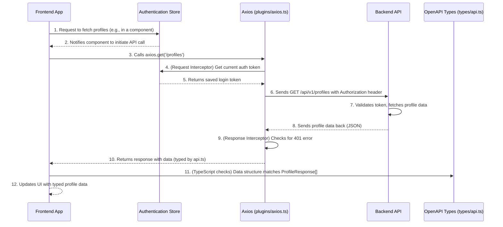

# Chapter 5: API Communication (Axios & OpenAPI Types)

Welcome back! In [Chapter 4: User Authentication](04_user_authentication_.md), we learned how our application verifies who you are so you can securely access your personalized features. Now that our application knows *who* the user is, the next crucial step is for the frontend to actually *talk* to the backend server to get and send all the important data. This is where **API Communication** comes in.

### What Problem Does API Communication Solve?

Imagine our frontend application is a customer at a fancy restaurant (the backend server). The customer wants to order a meal (request data or perform an action) or receive specific dishes (get data). How does the customer communicate with the kitchen?

This is the problem **API Communication** solves. Our frontend needs a way to "order" information (like your investment profiles) from the backend "kitchen" and "receive" those orders (the actual profile data). It also needs to be able to "send back" information, like saving changes to your profile.

Without API communication, our beautiful frontend would just be a static display, unable to interact with your personal data or the powerful backend services (like the AI advisor). It would be like a restaurant with a stunning dining room but no way to send orders to the kitchen!

#### Central Use Case: Fetching Investment Profiles

Let's say you've just logged in (thanks to [Chapter 4: User Authentication](04_user_authentication_.md)) and landed on your Investment Profiles page. You expect to see a list of all your investment profiles. How does our frontend get this list from the backend server? This requires a well-structured API request, and the frontend needs to understand exactly what kind of profile data the backend will send back.

### Key Concepts of API Communication

Let's break down the main ideas:

1.  **Backend Server (The "Kitchen"):** This is where all your data (investment profiles, market reports, etc.) lives, and where complex operations (like running an AI analysis) happen. It's separate from our frontend and communicates over the internet.

2.  **API (Application Programming Interface - The "Menu"):** The API is like the restaurant's menu. It lists all the "dishes" (data or actions) the backend "kitchen" can provide. For each dish, it specifies:
    *   What you need to ask for (the URL, like `/api/v1/profiles`).
    *   What ingredients (data) you need to provide (if any).
    *   What kind of dish (data) you'll receive back.

3.  **Axios (The "Waiter"):** This is a popular JavaScript library that acts as our super-efficient waiter. When our frontend wants to talk to the backend, Axios is the tool we use to send the request. It handles all the complex details of making HTTP requests (GET, POST, PUT, DELETE), sending data, and receiving responses. Critically, our Axios waiter is trained to **automatically add your login token** to every request for protected resources, so you don't have to worry about showing your "pass" every time!

4.  **OpenAPI Types (`src/types/api.ts` - The "Recipe Book"):** Imagine our waiter (Axios) brings back a dish. How do we know if it's soup, salad, or a main course? This is where OpenAPI Types come in. Our project uses a special file, `src/types/api.ts`, which is automatically generated from our backend's API documentation. This file acts like a detailed recipe book, telling our frontend (and our code editor) *exactly* what kind of data structure to expect for every API call. This prevents common errors where the frontend might misunderstand the data format, leading to a much smoother development experience.

### Solving the Use Case: Fetching Investment Profiles with Axios and Types

Let's see how we would use Axios and OpenAPI Types to fetch a user's investment profiles.

In a Vue component or a Pinia store (which we'll cover in [Chapter 6: State Management (Pinia Stores)](06_state_management__pinia_stores__.md)), you might write code like this:

```typescript
// Example: src/stores/profileStore.ts (simplified)
import { defineStore } from 'pinia';
import axios from '@/plugins/axios'; // Our configured Axios "waiter"
import type { components } from '@/types/api'; // Our OpenAPI "recipe book"

// Define the type for an individual profile using our OpenAPI types
type ProfileResponse = components['schemas']['ProfileResponse'];

export const useProfileStore = defineStore('profile', {
  state: () => ({
    profiles: [] as ProfileResponse[], // We expect an array of ProfileResponse
    isLoading: false,
  }),
  actions: {
    async fetchUserProfiles() {
      this.isLoading = true;
      try {
        // Use Axios to make a GET request to the /profiles API endpoint
        const response = await axios.get('/profiles');
        
        // Thanks to OpenAPI types, `response.data` is automatically known
        // to be an array of ProfileResponse! This prevents errors.
        this.profiles = response.data;
        console.log('Fetched profiles:', this.profiles);
      } catch (error) {
        console.error('Failed to fetch profiles:', error);
        // Handle errors, maybe show a message to the user
      } finally {
        this.isLoading = false;
      }
    },
  },
});
```

Let's break this down:

*   `import axios from '@/plugins/axios';`: We import our specially configured Axios instance. This is our "waiter" ready for service.
*   `import type { components } from '@/types/api';`: This imports the core type definitions generated from our backend's OpenAPI specification. This is our "recipe book."
*   `type ProfileResponse = components['schemas']['ProfileResponse'];`: Here, we're extracting a specific "recipe" for an investment profile from our `api.ts` file. This tells TypeScript exactly what a `ProfileResponse` object should look like (what properties it has, their types, etc.).
*   `profiles: [] as ProfileResponse[]`: We declare that our `profiles` array will hold objects that conform to the `ProfileResponse` type.
*   `const response = await axios.get('/profiles');`: This line sends the actual request to the backend. Axios takes care of constructing the HTTP GET request to `/api/v1/profiles` (because of our base URL configuration) and automatically adds your login token (as configured in `src/plugins/axios.ts`).
*   `this.profiles = response.data;`: When the response comes back, `response.data` will contain the list of profiles. Because we used `ProfileResponse[]`, TypeScript *knows* what to expect here. If the backend changes its response format, TypeScript will immediately flag an error in our code, helping us catch bugs early!

This simple example shows how Axios handles the communication, and OpenAPI types ensure our frontend correctly understands the data it receives.

### How it All Comes Together: The API Communication Flow

Let's visualize the journey of a request, including authentication:



In this sequence:
1.  The **Frontend App** wants to get profiles.
2.  It uses **Axios** to send the request.
3.  Before sending, **Axios's Request Interceptor** (a special "hook") automatically asks the **Authentication Store** for the user's login token.
4.  The token is added to the request, and **Axios** sends it to the **Backend API**.
5.  The **Backend API** processes the request and sends back the profile data.
6.  When the response arrives, **Axios** (via its Response Interceptor) checks if it's a 401 Unauthorized error (meaning the token is bad). If so, it logs the user out.
7.  Finally, **Axios** delivers the data to the **Frontend App**. Thanks to the **OpenAPI Types** (checked by TypeScript during development), the frontend knows exactly what kind of data `response.data` contains, allowing for safe and predictable usage.

#### Deep Dive into the Code

Let's look at the actual files that make this possible.

1.  **Axios Configuration (`src/plugins/axios.ts`)**
    This file sets up our "waiter" (Axios) with default instructions and special training (interceptors).

    ```typescript
    // src/plugins/axios.ts (simplified excerpt)
    import axios from 'axios';
    import { useAuthStore } from '@/stores/authStore'; // Our bouncer's ledger

    // Set the base URL for all API requests
    // Example: VITE_BACKEND_URL=http://localhost:8000, VITE_BACKEND_API_BASE_ROUTE=/api/v1
    // Result: axios.defaults.baseURL = http://localhost:8000/api/v1
    axios.defaults.baseURL = import.meta.env.VITE_BACKEND_URL + import.meta.env.VITE_BACKEND_API_BASE_ROUTE;
    axios.defaults.headers.common['Content-Type'] = 'application/json'; // Always send JSON

    // --- Request Interceptor: Add the login token ---
    axios.interceptors.request.use(
      (config) => {
        const authStore = useAuthStore(); // Get our auth store
        const token = authStore.token;    // Grab the token (our temporary pass)

        if (token) {
          // If a token exists, add it to the 'Authorization' header
          config.headers.Authorization = `Bearer ${token}`;
        }
        return config; // Return the modified request config
      },
      (error) => {
        return Promise.reject(error); // Pass any request errors along
      }
    );

    // --- Response Interceptor: Handle 401 Unauthorized errors ---
    axios.interceptors.response.use(
      response => response, // For successful responses, just pass them through
      (error) => {
        // If the backend returns a 401 (Unauthorized) error
        if (error.response && error.response.status === 401) {
          const authStore = useAuthStore();
          authStore.logout(); // Automatically log the user out (as seen in Chapter 4)
        }
        return Promise.reject(error); // Re-throw the error for component/store to handle
      }
    );

    export default axios; // Export this configured Axios instance for use everywhere
    ```
    *   `axios.defaults.baseURL`: This sets the default starting part of our API URLs. So, `axios.get('/profiles')` automatically becomes `http://localhost:8000/api/v1/profiles`.
    *   `axios.interceptors.request.use(...)`: This is the "pre-flight check" for every outgoing request. It gets the user's `token` from the `authStore` and attaches it as an `Authorization` header. This is crucial for accessing protected routes.
    *   `axios.interceptors.response.use(...)`: This is the "post-flight check" for every incoming response. If the backend sends back a `401 Unauthorized` status, it means our token is no longer valid, so we automatically call `authStore.logout()` to clear the user's session and redirect them to the login page.

2.  **OpenAPI Types (`src/types/api.ts`)**
    This file is automatically generated whenever our backend's API specification changes. It's a massive file that describes *every single* API endpoint, its expected inputs, and its exact response structure.

    ```typescript
    // src/types/api.ts (excerpt - DO NOT MODIFY MANUALLY)
    export interface components {
        schemas: {
            /**
             * ProfileResponse
             * @description Response schema for investment profile data.
             */
            ProfileResponse: {
                /**
                 * Profile Name
                 * @description Name of profile
                 */
                profile_name: string;
                /** Description */
                description: string;
                risk_tolerance: components["schemas"]["RiskTolerancePart"];
                invest_goal: components["schemas"]["InvestGoalPart"];
                // ... many more fields for a profile ...
                /** Profile Id */
                profile_id: string;
                /** User Id */
                user_id: string;
                /** Created At Ts */
                created_at_ts: number;
            };
            /**
             * UserResponse
             * @description Response schema for user data.
             */
            UserResponse: {
                /** Format: email */
                email: string;
                /** Full Name */
                full_name?: string | null;
                /** Avatar Url */
                avatar_url?: string | null;
                /** User Id */
                user_id: string;
                // ... more user fields ...
            };
            // ... many more schemas for other API responses and requests ...
        };
        operations: {
            get_user_profiles_api_v1_profiles_get: {
                parameters: { /* ... */ };
                requestBody?: never;
                responses: {
                    /** @description Successful Response */
                    200: {
                        headers: { [name: string]: unknown; };
                        content: {
                            "application/json": components["schemas"]["ProfileResponse"][];
                        };
                    };
                    // ... other response types ...
                };
            };
            // ... many more operations for other API endpoints ...
        };
    }
    ```
    *   **`export interface components`**: This is the main structure.
    *   **`schemas`**: This section defines the "shapes" (types) of data objects used across our API. For example, `ProfileResponse` clearly specifies that a profile will have `profile_name` (a string), `description` (a string), `profile_id` (a string), etc. If the backend changes `profile_name` to be a number, TypeScript will yell at us if we try to treat it as a string!
    *   **`operations`**: This section details each specific API endpoint (like `get_user_profiles_api_v1_profiles_get`). It tells us what parameters the endpoint takes and what kind of `components['schemas']` it returns. Notice how `get_user_profiles` returns an array of `ProfileResponse` objects.

    This `api.ts` file acts as a single source of truth for all data flowing between our frontend and backend. It's generated by running `npm run sync:api-types`.

3.  **API Constants (`src/constants/api.ts`)**
    This file demonstrates how we can use the generated OpenAPI types to create frontend-specific constants, ensuring they are always in sync with the backend.

    ```typescript
    // src/constants/api.ts (simplified excerpt)
    import type { components } from '@/types/api';

    // Extract type definitions from API schemas for TypeScript support
    type SemanticType = components['schemas']['SemanticType'];

    /**
     * An array containing all valid SemanticType values.
     * If the backend adds a new enum value and you run `npm run sync:api-types`,
     * TypeScript will throw an error here if you forget to update this array,
     * ensuring synchronization.
     */
    export const SEMANTIC_TYPE_OPTIONS: SemanticType[] = [
      'ANY', 'DECISION_SIGNAL', 'RISK_LEVEL', 'OPPORTUNITY_RATING', // ... etc.
    ];
    ```
    Here, `SemanticType` is directly pulled from `components['schemas']['SemanticType']`. This means if our backend updates the allowed `SemanticType` values, TypeScript will immediately highlight an error in `SEMANTIC_TYPE_OPTIONS` if we don't update it to match, providing powerful type safety and preventing runtime bugs.

### Conclusion

In this chapter, we've explored **API Communication**, understanding how our frontend "talks" to the backend server. We learned that **Axios** is our reliable "waiter" for making requests, automatically adding your login token. Crucially, **OpenAPI Types** (generated in `src/types/api.ts`) act as our detailed "recipe book," providing strong type definitions for all API data. This ensures our frontend understands exactly what to expect from the backend, preventing errors and providing a robust development experience.

Now that our application can securely identify users and communicate with the backend to fetch and send data, the next logical step is to learn how to manage all this data efficiently throughout our application.

[Next Chapter: State Management (Pinia Stores)](06_state_management__pinia_stores__.md)

---

Generated by [AI Codebase Knowledge Builder](https://github.com/The-Pocket/Tutorial-Codebase-Knowledge)