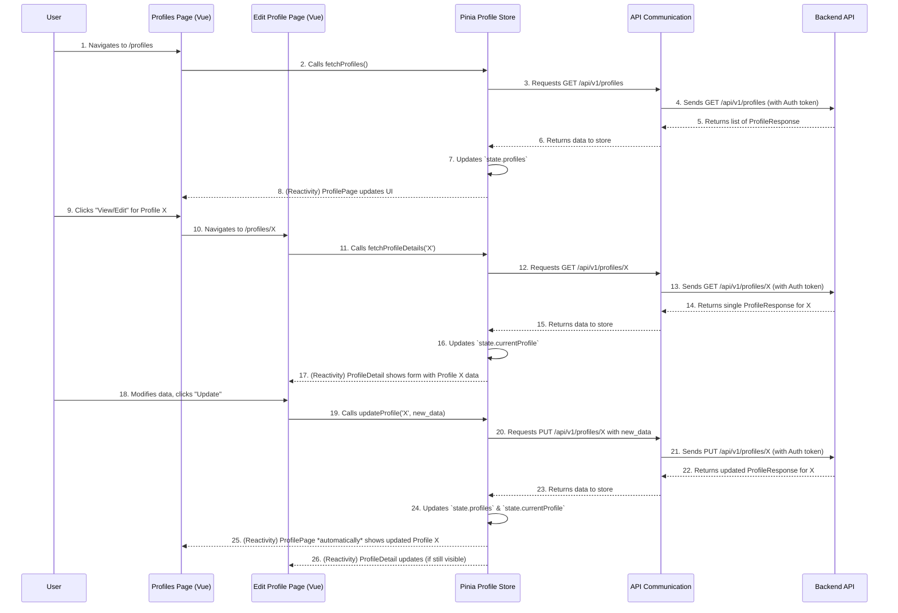

# Chapter 7: Investment Profiles

Welcome back! In [Chapter 6: State Management (Pinia Stores)](06_state_management__pinia_stores__.md), we learned how to efficiently manage and share data across our application using Pinia stores. We now have a robust system for handling information, but what kind of information is most important to our users, especially when it comes to personalized financial advice?

### What Problem Do Investment Profiles Solve?

Imagine you're seeking financial advice. You wouldn't get the same recommendation as your friend, right? Your age, how comfortable you are with risk, what you're saving for (a house, retirement, a new gadget), and your current income all play a huge role.

In our application, **Investment Profiles** are the way we capture *your unique financial personality*. They are personalized settings that define your investment goals, your comfort level with risk, and your other preferences. Think of them as custom "lenses" through which our powerful AI advisor views the market and generates advice just for you.

Without these profiles, the AI would be giving generic advice, which isn't very useful. Investment Profiles solve the problem of *personalization*, making sure the advice you get is truly tailored to your situation.

#### Central Use Case: Getting Tailored AI Advice

Let's say you have money you want to invest. You might have one pot of money for your retirement (long-term, conservative) and another for trying out some riskier, short-term ideas. You want our AI advisor to give different advice for each scenario. This is exactly what Investment Profiles enable: you create a "Retirement Profile" and a "Speculation Profile," and the AI can use the appropriate one to give you relevant recommendations.

### Key Concepts of Investment Profiles

Let's break down these personalized settings:

1.  **Your Investment Persona:** Each Investment Profile represents a specific "persona" or "playbook" for your money. It's a collection of attributes that describe *how you want to invest*.

2.  **Core Components:** A profile includes important details like:
    *   **Risk Tolerance:** How comfortable are you with potential ups and downs? (e.g., "conservative," "aggressive").
    *   **Investment Goal:** What are you investing for? (e.g., "capital growth," "income generation," "speculation").
    *   **Investment Horizon:** How long do you plan to invest this money? (e.g., "short-term," "long-term").
    *   **Knowledge & Experience:** How much do you know about investing?
    *   **Capital & Income:** Your initial capital and income dependency.
    *   **Personal Preferences:** Like preferred or excluded sectors, or ethical investing choices.

3.  **Multiple Profiles:** You're not limited to just one! You can create several profiles. For example:
    *   "My Retirement Fund" (long-term, moderate risk)
    *   "Side Hustle Savings" (mid-term, aggressive risk)
    *   "Experimental Portfolio" (short-term, very aggressive risk)
    This allows you to get diversified advice for different financial objectives.

4.  **AI Advisor's Lenses:** When you ask the [AI Investment Advisor](08_ai_investment_advisor_.md) for recommendations, you'll select *which* Investment Profile it should use. The AI then filters and tailors its advice based on that profile's settings.

### How to Use Investment Profiles (Solving the Use Case)

Our application allows you to create, view, update, and delete these profiles. All this happens through dedicated pages in our frontend, powered by the `profilesStore` we discussed in [Chapter 6: State Management (Pinia Stores)](06_state_management__pinia_stores__.md).

#### 1. Listing All Your Profiles

You'll find your profiles on a page like `/profiles`. This page uses our `profilesStore` to fetch and display them.

```vue
<!-- src/pages/profiles.vue (simplified) -->
<template>
  <v-container>
    <h1>Your Investment Profiles</h1>
    <v-btn color="primary" class="my-4" to="/profiles/create">Create New Profile</v-btn>

    <div v-if="profileStore.isLoadingList">Loading profiles...</div>
    <div v-else-if="profileStore.error">{{ profileStore.error }}</div>
    <div v-else>
      <v-card v-for="profile in profileStore.profiles" :key="profile.profile_id" class="mt-4">
        <v-card-title>{{ profile.profile_name }}</v-card-title>
        <v-card-text>
          <p>Goal: {{ profile.invest_goal.primary_goal }}</p>
          <p>Risk: {{ profile.risk_tolerance.risk_appetite }}</p>
        </v-card-text>
        <v-card-actions>
          <v-btn text :to="`/profiles/${profile.profile_id}`">View/Edit</v-btn>
          <v-btn text color="error" @click="confirmDelete(profile.profile_id)">Delete</v-btn>
        </v-card-actions>
      </v-card>
    </div>
  </v-container>
</template>

<script setup lang="ts">
import { useProfileStore } from '@/stores/profilesStore';
import { onMounted } from 'vue';

const profileStore = useProfileStore();

onMounted(() => {
  profileStore.fetchProfiles(); // Fetch all profiles when page loads
});

const confirmDelete = async (profileId: string) => {
  if (confirm('Are you sure you want to delete this profile?')) {
    await profileStore.deleteProfile(profileId);
  }
};
</script>
```
This component uses `profileStore.profiles` to loop through and display each profile's basic information. When the component first loads, it calls `profileStore.fetchProfiles()` to get the latest list from the backend. Notice the `View/Edit` button that navigates to a detailed page for a specific profile (e.g., `/profiles/abcd-1234`).

#### 2. Creating a New Profile

When you click "Create New Profile," you'll go to a form page.

```vue
<!-- src/pages/profiles/create.vue (simplified) -->
<template>
  <v-container>
    <h1>Create New Investment Profile</h1>
    <v-form @submit.prevent="saveProfile">
      <v-text-field label="Profile Name" v-model="profileForm.profile_name"></v-text-field>
      <v-textarea label="Description" v-model="profileForm.description"></v-textarea>
      <!-- ... other form fields for risk tolerance, goals, etc. ... -->
      <v-btn color="primary" type="submit" :loading="isSaving">Save Profile</v-btn>
    </v-form>
  </v-container>
</template>

<script setup lang="ts">
import { ref } from 'vue';
import { useProfileStore } from '@/stores/profilesStore';
import { useRouter } from 'vue-router/auto';
import type { components } from '@/types/api';

const profileStore = useProfileStore();
const router = useRouter();
const isSaving = ref(false);

// Define initial form data based on API's ProfileCreateRequest type
type ProfileCreateRequest = components['schemas']['ProfileCreateRequest'];
const profileForm = ref<ProfileCreateRequest>({
  profile_name: '',
  description: '',
  risk_tolerance: { risk_appetite: 'moderate', loss_reaction: 'hold_and_wait' },
  invest_goal: { primary_goal: 'capital_growth', investment_horizon: 'mid_term', expected_annual_return_pct: 10 },
  knowledge_exp: { investment_knowledge: 'intermediate', years_of_experience: 5 },
  capital_income: { initial_capital: 10000, income_dependency: 'low' },
  personal_prefer: { preferred_sectors: [], excluded_sectors: [], ethical_investing: false },
  use_in_advisor: true,
  is_default: false,
});

const saveProfile = async () => {
  isSaving.value = true;
  const success = await profileStore.createProfile(profileForm.value);
  if (success) {
    router.push('/profiles'); // Go back to the list on success
  }
  isSaving.value = false;
};
</script>
```
Here, we collect data using `v-text-field` and other Vuetify components. When the user clicks "Save Profile," `profileStore.createProfile` is called with the collected data. This sends the request to the backend, and if successful, the `profilesStore` automatically updates its list, and we navigate back to `/profiles`.

#### 3. Updating an Existing Profile

To update a profile, you'd typically go to a dynamic route like `/profiles/[profile_id]`.

```vue
<!-- src/pages/profiles/[profile_id].vue (simplified) -->
<template>
  <v-container>
    <h1>Edit Profile: {{ profileStore.currentProfile?.profile_name }}</h1>
    <div v-if="profileStore.isLoadingDetails">Loading profile details...</div>
    <div v-else-if="profileStore.error">{{ profileStore.error }}</div>
    <v-form v-else @submit.prevent="updateExistingProfile">
      <v-text-field label="Profile Name" v-model="profileStore.currentProfile.profile_name"></v-text-field>
      <v-textarea label="Description" v-model="profileStore.currentProfile.description"></v-textarea>
      <!-- ... other form fields for risk tolerance, goals, etc. ... -->
      <v-btn color="primary" type="submit" :loading="isUpdating">Update Profile</v-btn>
    </v-form>
  </v-container>
</template>

<script setup lang="ts">
import { onMounted, ref } from 'vue';
import { useRoute, useRouter } from 'vue-router/auto';
import { useProfileStore } from '@/stores/profilesStore';

const route = useRoute('/profiles/[profile_id]'); // Access current route parameters
const router = useRouter();
const profileStore = useProfileStore();
const isUpdating = ref(false);

onMounted(async () => {
  // Fetch details for this specific profile ID when component loads
  await profileStore.fetchProfileDetails(route.params.profile_id);
});

const updateExistingProfile = async () => {
  if (!profileStore.currentProfile) return;
  isUpdating.value = true;
  // Send only the updatable fields as ProfileUpdateRequest
  const updateData = {
    profile_name: profileStore.currentProfile.profile_name,
    description: profileStore.currentProfile.description,
    // ... other updatable fields ...
  };
  const success = await profileStore.updateProfile(route.params.profile_id, updateData);
  if (success) {
    router.push('/profiles'); // Go back to the list on success
  }
  isUpdating.value = false;
};
</script>
```
This page uses `useRoute` (from [Chapter 1: Routing & Navigation](01_routing___navigation_.md)) to get the `profile_id` from the URL. `profileStore.fetchProfileDetails` is called on mount to load the specific profile. When saving, `profileStore.updateProfile` is called, sending the updated data to the backend. The `profilesStore` then updates its internal state, ensuring consistency.

### Internal Implementation: How it Works Behind the Scenes

The power of Investment Profiles comes from how our frontend components, Pinia stores, and API communication work together.

#### The Profile Workflow



#### Deep Dive into the Code

1.  **The `profilesStore` (`src/stores/profilesStore.ts`)**
    This Pinia store is the central hub for all profile-related data and actions. As we saw in [Chapter 6: State Management (Pinia Stores)](06_state_management__pinia_stores__.md), it uses [Axios](05_api_communication__axios___openapi_types__.md) to communicate with the backend.

    ```typescript
    // src/stores/profilesStore.ts (simplified excerpt)
    import { defineStore } from 'pinia';
    import axios from '@/plugins/axios';
    import type { components } from '@/types/api';

    type Profile = components['schemas']['ProfileResponse'];
    type ProfileCreate = components['schemas']['ProfileCreateRequest'];
    type ProfileUpdate = components['schemas']['ProfileUpdateRequest'];

    export const useProfileStore = defineStore('profile', {
      state: () => ({
        profiles: [] as Profile[],
        currentProfile: null as Profile | null,
        // ... loading and error states ...
      }),
      actions: {
        async fetchProfiles() { /* ... API call and state update ... */ },
        async fetchProfileDetails(profileId: string) {
          // Fetches one profile and sets it to `currentProfile`
          const response = await axios.get(`/profiles/${profileId}`);
          this.currentProfile = response.data;
        },
        async createProfile(profileData: ProfileCreate): Promise<boolean> {
          // Calls POST API, adds new profile to `this.profiles` array
          const response = await axios.post('/profiles', profileData);
          this.profiles.unshift(response.data); // Add to the start of the list
          return true;
        },
        async updateProfile(profileId: string, profileData: ProfileUpdate): Promise<boolean> {
          // Calls PUT API, updates `this.profiles` and `this.currentProfile`
          const response = await axios.put(`/profiles/${profileId}`, profileData);
          // Update the specific profile in the local list
          const index = this.profiles.findIndex(p => p.profile_id === profileId);
          if (index !== -1) {
            this.profiles[index] = response.data;
          }
          // If this was the profile being edited, update `currentProfile` too
          if (this.currentProfile?.profile_id === profileId) {
            this.currentProfile = response.data;
          }
          return true;
        },
        async deleteProfile(profileId: string): Promise<boolean> {
          // Calls DELETE API, removes profile from `this.profiles`
          await axios.delete(`/profiles/${profileId}`);
          this.profiles = this.profiles.filter(p => p.profile_id !== profileId);
          if (this.currentProfile?.profile_id === profileId) {
            this.currentProfile = null;
          }
          return true;
        },
      },
    });
    ```
    Notice how `fetchProfileDetails`, `createProfile`, `updateProfile`, and `deleteProfile` all interact with the backend using `axios` (our "waiter" from [Chapter 5: API Communication (Axios & OpenAPI Types)](05_api_communication__axios___openapi_types__.md)). After each successful API call, they update the `profiles` array or `currentProfile` object in the store's `state`. This reactive update automatically refreshes any Vue component that is displaying this data.

2.  **API Type Definitions (`src/types/api.ts`)**
    The structure of our Investment Profiles (like `ProfileResponse`, `ProfileCreateRequest`, `ProfileUpdateRequest`) is strictly defined in `src/types/api.ts`. This file, automatically generated from our backend's OpenAPI specification, ensures that our frontend always sends and receives data in the correct format.

    ```typescript
    // src/types/api.ts (excerpt - DO NOT MODIFY MANUALLY)
    export interface components {
        schemas: {
            ProfileResponse: {
                profile_name: string;
                description: string;
                risk_tolerance: components["schemas"]["RiskTolerancePart"];
                invest_goal: components["schemas"]["InvestGoalPart"];
                knowledge_exp: components["schemas"]["KnowledgeExpPart"];
                // ... many other parts ...
                profile_id: string; // ID of the profile
                user_id: string;    // ID of the user it belongs to
            };
            ProfileCreateRequest: {
                profile_name: string;
                description: string;
                risk_tolerance: components["schemas"]["RiskTolerancePart"];
                // ... etc. for creating a new profile ...
            };
            ProfileUpdateRequest: {
                profile_name?: string | null; // All fields are optional for update
                description?: string | null;
                // ... etc. for updating a profile ...
            };
            // ... definitions for RiskTolerancePart, InvestGoalPart, etc. ...
        };
    }
    ```
    This type safety (from [Chapter 5: API Communication (Axios & OpenAPI Types)](05_api_communication__axios___openapi_types__.md)) is invaluable. If we try to create a profile without a `profile_name`, or if the backend suddenly changes `risk_tolerance` to a simple number, TypeScript will alert us immediately during development, preventing bugs.

3.  **Routing (`src/typed-router.d.ts`)**
    As we learned in [Chapter 1: Routing & Navigation](01_routing___navigation_.md), our routing system automatically creates paths.

    ```typescript
    // src\typed-router.d.ts (excerpt - DO NOT MODIFY THIS FILE)
    declare module 'vue-router/auto-routes' {
      export interface RouteNamedMap {
        '/profiles/': RouteRecordInfo<'/profiles/', '/profiles', /* ... */>,
        '/profiles/[profile_id]': RouteRecordInfo<'/profiles/[profile_id]', '/profiles/:profile_id', { profile_id: ParamValue<true> }, /* ... */>,
        // ...
      }
    }
    ```
    This ensures that `/profiles` maps to our list page (`src/pages/profiles.vue`), and dynamic routes like `/profiles/123` map to a detail page (`src/pages/profiles/[profile_id].vue`), where `123` can be accessed as `route.params.profile_id`.

### Conclusion

In this chapter, we've explored **Investment Profiles**, which are crucial for personalizing the financial advice provided by our application. We learned that these profiles capture your unique investment goals, risk tolerance, and preferences, acting as personalized "lenses" for the AI advisor. We saw how our `profilesStore` efficiently manages the creation, viewing, updating, and deletion of these profiles, working seamlessly with our [API Communication (Axios & OpenAPI Types)](05_api_communication__axios___openapi_types__.md) for backend interaction and [State Management (Pinia Stores)](06_state_management__pinia_stores__.md) for keeping our UI up-to-date.

With a deep understanding of how to manage user-specific investment settings, we are now perfectly positioned to understand how these profiles feed into the heart of our application: the AI Investment Advisor itself!

[Next Chapter: AI Investment Advisor](08_ai_investment_advisor_.md)

---

Generated by [AI Codebase Knowledge Builder](https://github.com/The-Pocket/Tutorial-Codebase-Knowledge)