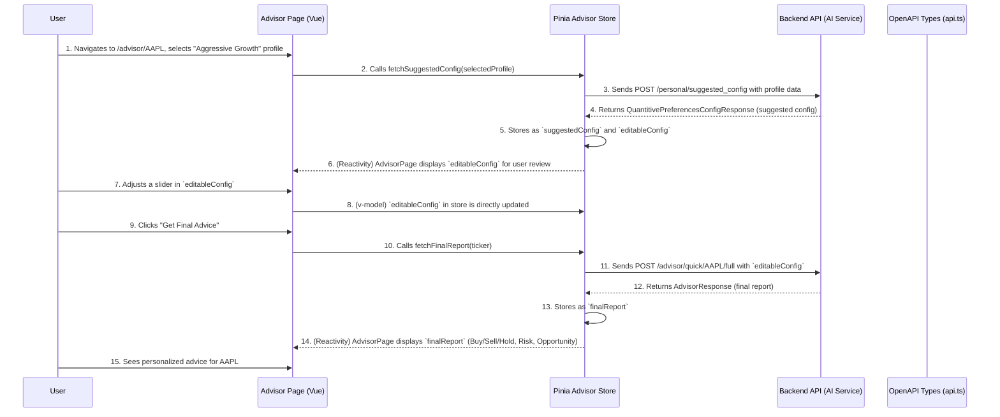

# Chapter 8: AI Investment Advisor

Welcome back! In [Chapter 7: Investment Profiles](07_investment_profiles_.md), we learned how to create and manage personalized settings that define your unique investment preferences. These profiles are like custom "lenses" that help our application understand *how* you want to invest. But how do these preferences translate into actual advice?

### What Problem Does the AI Investment Advisor Solve?

Imagine you have a specific stock in mind, say Apple (`AAPL`), and you want to know if it's a good investment *for you*, right now. You wouldn't just look at a generic "buy" signal; you'd want advice that considers your risk tolerance, investment goals, and other personal preferences.

The **AI Investment Advisor** is the core intelligence in our application that acts as your personal financial consultant. Its job is to bridge the gap between your unique [Investment Profile](07_investment_profiles_.md) and complex market data, providing you with **tailored, actionable investment recommendations** for any specific stock ticker you choose.

Without this advisor, your investment profiles would just be static settings. The advisor brings them to life, turning your preferences into concrete, quantitative suggestions and detailed reports.

#### Central Use Case: Getting Tailored Advice for a Specific Stock

You want to decide whether to buy, sell, or hold Apple stock (ticker `AAPL`). You select your "Aggressive Growth" [Investment Profile](07_investment_profiles_.md) and feed it to the advisor. The advisor then gives you a personalized report, suggesting how much to invest, when to take profit, and when to cut losses, all based on your profile and `AAPL`'s current market situation.

### Key Concepts of the AI Investment Advisor

Let's break down how this "personal consultant" works:

1.  **Personalized Input:** The advisor takes two main inputs:
    *   Your selected [Investment Profile](07_investment_profiles_.md): This tells the AI about your risk appetite, goals, etc.
    *   A specific stock ticker (e.g., `AAPL`): This tells the AI *which* asset to analyze.

2.  **Suggested Quantitative Configuration (The AI's Blueprint):** Based on your profile and the stock, the AI first generates a detailed "blueprint" for how it thinks you should approach this investment. This blueprint is called the **Quantitative Configuration**. It includes things like:
    *   `weights`: How important are different performance metrics (like total return, win rate) to you?
    *   `constraints`: Are there any hard limits, like "I can't lose more than 10%?"
    *   `modifiers`: How aggressively should the AI suggest position sizes or risk parameters?
    This initial configuration is *suggested* by the AI, but it's not final!

3.  **User Adjustments (Your Expertise):** You, the user, are in control! You can review the AI's suggested Quantitative Configuration and tweak it. Maybe you want to be a bit more conservative than the AI initially suggested, or perhaps more aggressive. This allows you to combine the AI's advanced analysis with your own insights.

4.  **Detailed Report (Actionable Advice):** After you finalize the configuration (either by accepting the AI's suggestion or making your own adjustments), the advisor processes everything and generates a comprehensive report. This report includes:
    *   **Buy/Sell/Hold Decisions:** The core recommendation.
    *   **Risk Assessments:** How risky is this recommendation given your settings?
    *   **Opportunity Ratings:** How much potential upside does it see?
    *   **Specific Action Plan:** Often includes suggested position size, stop-loss, and take-profit percentages.

5.  **Advisor Store (The Consultant's Desk):** All the data and logic for this multi-step process (fetching suggestions, handling edits, generating reports) is managed in a dedicated [Pinia Store](06_state_management__pinia_stores__.md) called `advisorStore` (`src/stores/advisorStore.ts`). This ensures a smooth workflow across your application.

### How to Use the AI Investment Advisor (Solving the Use Case)

Let's walk through the steps a user takes to get advice for a stock, like `AAPL`. This process typically takes place on a dedicated "AI Advisor" page, often at a dynamic route like `/advisor/AAPL`.

#### Step 1: Select Profile and Get Suggested Configuration

The user would navigate to the advisor page for a specific ticker (e.g., `/advisor/AAPL`). The first thing the application needs to do is take the user's chosen [Investment Profile](07_investment_profiles_.md) and the ticker, and ask the AI for an initial quantitative configuration.

```vue
<!-- src/pages/advisor/[ticker].vue (simplified snippet) -->
<template>
  <v-container>
    <h1>AI Investment Advisor for {{ route.params.ticker }}</h1>

    <div v-if="!advisorStore.activeProfile">
      <p>Please select an Investment Profile to get started:</p>
      <v-select
        :items="profileStore.profiles"
        item-title="profile_name"
        item-value="profile_id"
        label="Select Profile"
        @update:modelValue="selectProfile"
      ></v-select>
    </div>

    <v-card v-if="advisorStore.isLoadingSuggestion" class="mt-4">
      <v-progress-circular indeterminate color="primary"></v-progress-circular>
      <p class="ml-2">Generating initial advice blueprint...</p>
    </v-card>

    <v-alert v-if="advisorStore.error" type="error" class="mt-4">{{ advisorStore.error }}</v-alert>

    <div v-if="advisorStore.editableConfig && advisorStore.activeProfile">
      <h2>Suggested Configuration for {{ advisorStore.activeProfile.profile_name }}</h2>
      <!-- ... UI to display and allow editing of advisorStore.editableConfig ... -->
    </div>
  </v-container>
</template>

<script setup lang="ts">
import { useRoute } from 'vue-router/auto'; // For getting ticker from URL
import { useAdvisorStore } from '@/stores/advisorStore'; // Our advisor's desk
import { useProfileStore } from '@/stores/profilesStore'; // Our profile desk
import { onMounted } from 'vue';

const route = useRoute('/advisor/[ticker]');
const advisorStore = useAdvisorStore();
const profileStore = useProfileStore();

onMounted(async () => {
  // Reset any previous advisor session
  advisorStore.resetState(); 
  // Fetch user profiles if not already loaded (from Chapter 7)
  await profileStore.fetchProfiles();
});

const selectProfile = async (profileId: string) => {
  const selectedProfile = profileStore.profiles.find(p => p.profile_id === profileId);
  if (selectedProfile) {
    // Call the advisor store action to fetch the suggested config
    await advisorStore.fetchSuggestedConfig(selectedProfile);
  }
};
</script>
```
When the user selects a profile, `selectProfile` calls `advisorStore.fetchSuggestedConfig`. This action (which lives in `src/stores/advisorStore.ts`) then communicates with the backend to get the AI's initial recommendations for the Quantitative Configuration.

#### Step 2: Review and Adjust Configuration

Once `advisorStore.suggestedConfig` and `advisorStore.editableConfig` are populated, the UI displays these settings. The `editableConfig` is the one the user can change.

```vue
<!-- src/pages/advisor/[ticker].vue (continuation - simplified UI for editing) -->
<template>
  <!-- ... previous code ... -->
  <div v-if="advisorStore.editableConfig && advisorStore.activeProfile">
    <h2>Adjust Investment Strategy</h2>
    <v-card class="mt-4 pa-4">
      <v-card-title>Performance Weights</v-card-title>
      <v-card-text>
        <v-slider
          label="Total Return Pct Importance"
          v-model="advisorStore.editableConfig.weights.total_return_pct"
          min="0" max="1" step="0.1" thumb-label="always"
        ></v-slider>
        <!-- ... other sliders/inputs for weights, constraints, modifiers ... -->
      </v-card-text>
    </v-card>

    <v-btn color="success" class="mt-4" @click="getFinalReport" :loading="advisorStore.isLoadingReport">
      Get Final Advice
    </v-btn>
  </div>
  <!-- ... UI to display the final report (Step 3) ... -->
</template>

<script setup lang="ts">
// ... previous script setup ...

const getFinalReport = async () => {
  // Use the ticker from the route and the user's editable configuration
  await advisorStore.fetchFinalReport(route.params.ticker as string);
};
</script>
```
The `v-slider` (a [Vuetify](02_ui_framework__vuetify__.md) component) directly binds to `advisorStore.editableConfig.weights.total_return_pct`. This means any changes the user makes are immediately reflected in the store's `editableConfig`.

#### Step 3: Generate and Display Final Report

After adjustments, the user clicks "Get Final Advice."

```vue
<!-- src/pages/advisor/[ticker].vue (continuation - simplified UI for displaying report) -->
<template>
  <!-- ... previous code for steps 1 & 2 ... -->
  
  <v-card v-if="advisorStore.finalReport" class="mt-4 pa-4">
    <v-card-title class="text-h5">Final Investment Recommendation</v-card-title>
    <v-card-text>
      <p><strong>Decision:</strong> {{ advisorStore.finalReport.final_decision.final_recommend }}</p>
      <p><strong>Risk Level:</strong> {{ advisorStore.finalReport.final_risk.final_recommend }} (Score: {{ advisorStore.finalReport.final_risk.final_score.toFixed(2) }})</p>
      <p><strong>Opportunity:</strong> {{ advisorStore.finalReport.final_opportunity.final_recommend }} (Score: {{ advisorStore.finalReport.final_opportunity.final_score.toFixed(2) }})</p>
      <p><strong>Action:</strong> {{ advisorStore.finalReport.final_action.action_type }} (Position: {{ (advisorStore.finalReport.final_action.position_size_pct * 100).toFixed(0) }}%)</p>
      <!-- ... more details from the report ... -->
    </v-card-text>
  </v-card>
</template>

<script setup lang="ts">
// ... script setup ...
</script>
```
The `getFinalReport` function (from the previous snippet) calls `advisorStore.fetchFinalReport`. This action sends the *adjusted* `editableConfig` to the backend. Once the `finalReport` is received, the UI updates automatically to display the comprehensive advice.

### Internal Implementation: How it Works Behind the Scenes

The AI Investment Advisor relies heavily on the `advisorStore` to manage its state and interactions with the backend.

#### The Advisor Workflow



#### Deep Dive into the Code

1.  **The `advisorStore` (`src/stores/advisorStore.ts`)**
    This is the heart of the advisor's frontend logic.

    ```typescript
    // src/stores/advisorStore.ts (simplified excerpt)
    import { defineStore } from 'pinia';
    import axios from 'axios'; // Our API waiter from Chapter 5
    import type { components } from '@/types/api'; // Our API recipe book from Chapter 5

    type Profile = components['schemas']['ProfileResponse'];
    type QuantitativeConfig = components['schemas']['QuantitivePreferencesConfigResponse'];
    type AdvisorReport = components['schemas']['AdvisorResponse'];
    type Constraints = components['schemas']['PerformanceHardConstraints'];

    // Helper to clean constraints for the API (converts "" to null in tuples)
    function cleanConstraintsForAPI(originalConstraints: Constraints): Constraints {
      const cleaned = JSON.parse(JSON.stringify(originalConstraints));
      for (const key in cleaned) {
        const value = cleaned[key as keyof Constraints];
        if (Array.isArray(value)) {
          value[0] = value[0] === '' ? null : value[0];
          value[1] = value[1] === '' ? null : value[1];
        }
      }
      return cleaned;
    }

    export const useAdvisorStore = defineStore("advisor", {
      state: () => ({
        activeProfile: null as Profile | null,
        suggestedConfig: null as QuantitativeConfig | null,
        editableConfig: null as QuantitativeConfig | null,
        finalReport: null as AdvisorReport | null,
        isLoadingSuggestion: false,
        isLoadingReport: false,
        error: null as string | null,
      }),
      actions: {
        async fetchSuggestedConfig(profile: Profile) {
          this.resetState(); // Start fresh
          this.isLoadingSuggestion = true;
          try {
            // API call to get initial AI config, sending the user's profile
            const response = await axios.post('/personal/suggested_config', profile);
            const config: QuantitativeConfig = response.data;
            this.suggestedConfig = config;
            this.editableConfig = JSON.parse(JSON.stringify(config)); // Deep copy for editing
          } catch (e: any) { /* ... error handling ... */ } finally { this.isLoadingSuggestion = false; }
        },

        async fetchFinalReport(ticker: string, limit: number = 10) {
          if (!this.editableConfig) { this.error = "No configuration available."; return; }
          this.isLoadingReport = true;
          try {
            // Clean constraints (e.g., convert empty strings to null for backend)
            const configToSend = JSON.parse(JSON.stringify(this.editableConfig));
            configToSend.constraints = cleanConstraintsForAPI(this.editableConfig.constraints);

            // API call to get the final report, sending the (adjusted) config and ticker
            const response = await axios.post(
              `/advisor/quick/${ticker}/full`,
              configToSend, // Send the user-adjusted config
              { params: { limit } }
            );
            this.finalReport = response.data;
          } catch (e: any) { /* ... error handling ... */ } finally { this.isLoadingReport = false; }
        },

        resetState() { /* ... clears all state variables ... */ },
      },
    });
    ```
    *   **`state`**: Holds the `activeProfile`, `suggestedConfig` (the AI's original suggestion), `editableConfig` (the copy the user can change), and `finalReport`.
    *   **`cleanConstraintsForAPI`**: This helper function ensures that any empty string values in the user's `constraints` (which might come from empty form fields) are converted to `null` before sending to the backend API. This matches what the backend expects (as defined in [OpenAPI Types](05_api_communication__axios___openapi_types__.md)).
    *   **`fetchSuggestedConfig`**: This action takes the selected [Investment Profile](07_investment_profiles_.md) and sends it to the backend (`/personal/suggested_config`). It then saves the backend's response as both `suggestedConfig` and a *deep copy* to `editableConfig`. The deep copy is crucial: it means changes to `editableConfig` won't accidentally alter the original `suggestedConfig`, allowing the user to always revert to the AI's initial idea.
    *   **`fetchFinalReport`**: This action takes the stock `ticker` and the *currently edited* `editableConfig`. It first "cleans" the `constraints` portion using `cleanConstraintsForAPI` to match API requirements. Then, it sends this refined configuration to the backend (`/advisor/quick/{ticker}/full`) to get the `finalReport`.

2.  **API Type Definitions (`src/types/api.ts`)**
    The structure of all inputs and outputs for the AI Advisor is strictly defined here, thanks to [OpenAPI Types](05_api_communication__axios___openapi_types__.md).

    ```typescript
    // src/types/api.ts (excerpt - DO NOT MODIFY MANUALLY)
    export interface components {
        schemas: {
            ProfileRequest: { /* ... profile details ... */ };
            QuantitivePreferencesConfigResponse: { // The AI's suggested blueprint
                weights: components["schemas"]["PerformanceFilterWeights"];
                constraints: components["schemas"]["PerformanceHardConstraints"]; // Notice the tuple [number | null, number | null]
                modifiers: components["schemas"]["BehaviorModifiers"];
            };
            AdvisorResponse: { // The final report
                final_decision: components["schemas"]["FinalRecommendation"];
                final_risk: components["schemas"]["FinalRecommendation"];
                final_opportunity: components["schemas"]["FinalRecommendation"];
                final_action: components["schemas"]["Action"];
                ticker: string;
                // ... other report details ...
            };
            PerformanceHardConstraints: { // Example of how constraints are typed
                num_trades: [number | null, number | null];
                total_return_pct: [number | null, number | null];
                // ... etc. ...
            };
            // ... many other types for specific parts of the config and report ...
        };
        operations: {
            get_ai_suggest_config_api_v1_personal_suggested_config_post: {
                requestBody: { content: { "application/json": components["schemas"]["ProfileRequest"]; }; };
                responses: { 200: { content: { "application/json": components["schemas"]["QuantitivePreferencesConfigResponse"]; }; }; };
            };
            get_ai_full_quick_advisor_api_v1_advisor_quick__ticker__full_post: {
                parameters: { query?: { limit?: number; }; path: { ticker: string; }; };
                requestBody: { content: { "application/json": components["schemas"]["QuantitivePreferencesConfigRequest"]; }; }; // Note: Request and Response can differ
                responses: { 200: { content: { "application/json": components["schemas"]["AdvisorResponse"]; }; }; };
            };
        };
    }
    ```
    This shows that `QuantitivePreferencesConfigResponse` contains `weights`, `constraints`, and `modifiers`. Specifically, `PerformanceHardConstraints` uses `[number | null, number | null]` tuples for min/max values, which is why our `cleanConstraintsForAPI` helper is needed to convert empty strings to `null` before sending to the backend. The `AdvisorResponse` clearly outlines the structure of the final advice, including `final_decision`, `final_risk`, and `final_opportunity`.

3.  **Routing (`src/typed-router.d.ts`)**
    As we saw in [Chapter 1: Routing & Navigation](01_routing___navigation_.md), dynamic routes are handled automatically.

    ```typescript
    // src\typed-router.d.ts (excerpt - DO NOT MODIFY THIS FILE)
    declare module 'vue-router/auto-routes' {
      export interface RouteNamedMap {
        '/advisor/[ticker]': RouteRecordInfo<'/advisor/[ticker]', '/advisor/:ticker', { ticker: ParamValue<true> }, { ticker: ParamValue<false> }>,
        // ...
      }
    }
    ```
    This entry ensures that when a user visits `/advisor/AAPL`, the `[ticker]` part of the route correctly maps to `AAPL`, which our page can then access via `route.params.ticker`.

### Conclusion

In this chapter, we've explored the **AI Investment Advisor**, the core intelligence that provides personalized investment recommendations. We learned how it combines your chosen [Investment Profile](07_investment_profiles_.md) with a specific stock ticker to generate a **Suggested Quantitative Configuration**. We saw how you can **adjust this configuration** to fine-tune the advice and finally receive a **Detailed Report** with clear buy/sell/hold decisions, risk assessments, and opportunity ratings. The entire process is managed efficiently by the `advisorStore` ([Pinia Store](06_state_management__pinia_stores__.md)), leveraging [Axios](05_api_communication__axios___openapi_types__.md) for backend communication and [OpenAPI Types](05_api_communication__axios___openapi_types__.md) for robust data handling.

Now that we understand how the AI provides personalized advice, our next step is to look at another powerful AI feature: general market analysis, which provides broader insights beyond just a specific investment decision.

[Next Chapter: AI Market Analysis](09_ai_market_analysis_.md)

---

Generated by [AI Codebase Knowledge Builder](https://github.com/The-Pocket/Tutorial-Codebase-Knowledge)