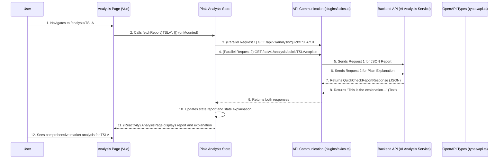

# Chapter 9: AI Market Analysis

Welcome back! In [Chapter 8: AI Investment Advisor](08_ai_investment_advisor_.md), we explored how our application provides *personalized* investment recommendations for a specific stock, taking into account your unique [Investment Profile](07_investment_profiles_.md). That's great for making a decision about *your* money.

But sometimes, you just want to understand what's happening in the market for a particular stock, regardless of your personal profile. You want to know the facts: what's the technical picture, what are the forecasts saying, and what's the general sentiment from the news? This is where the **AI Market Analysis** comes in!

### What Problem Does AI Market Analysis Solve?

Imagine you're trying to understand a company like Tesla (`TSLA`). You could spend hours digging through charts, reading financial news articles, and trying to make sense of complex economic indicators. It's like sifting through a huge library of information just to get the main points.

The **AI Market Analysis** component is designed to be your super-smart research assistant. It solves the problem of **information overload** by quickly compiling and summarizing all relevant market data for *any* given stock ticker. It brings together:
*   **Technical Analysis:** What do the price charts and trading patterns tell us?
*   **Forecasting:** What are the predictions for future price movements?
*   **News Sentiment:** How is the media generally feeling about this stock?

It's like having a skilled analyst on demand who can instantly give you a digestible, comprehensive overview of a stock's current market position and potential future movements, helping you understand complex market dynamics at a glance.

#### Central Use Case: Getting a Quick, Comprehensive Market Report for a Stock

Let's say you're curious about Tesla (`TSLA`). You want a fast, in-depth look at its market situation. You'd enter `TSLA` into our application, and in moments, you'd receive a detailed report covering technical aspects, future predictions, and news sentiment, along with a simple, plain-language explanation of what it all means. This report isn't personalized advice, but rather a summary of objective market information.

### Key Concepts of AI Market Analysis

Let's break down the main ideas behind this powerful research assistant:

1.  **Comprehensive Data Gathering:** The AI Market Analysis isn't just one type of analysis; it's a blend. It fetches data from different sources and applies various AI models to generate a multi-faceted view.
    *   **Technical Analysis:** Looks at historical price and volume data to identify patterns, trends (like moving averages), and indicators (like RSI). This helps understand the stock's "behavior" on charts.
    *   **Forecasting:** Uses predictive models to estimate future price directions or probability distributions for short, medium, or long-term horizons.
    *   **News Sentiment:** Analyzes recent news articles related to the stock to determine if the overall tone is positive, negative, or neutral. This gauges market sentiment and public perception.

2.  **Structured Report (The Data):** The result of this analysis is a structured report, often in a machine-readable format (JSON). This report contains all the detailed findings from the technical, forecasting, and news analyses.

3.  **Summarized Explanation (The Plain English):** Critically, the AI also provides a natural language explanation alongside the structured report. This is like the AI writing a short article or summary, making complex data easy for anyone to understand without needing to be a financial expert.

4.  **Analysis Store (The Research Desk):** Just like other features, all the data and logic for fetching and displaying market analysis reports are managed in a dedicated [Pinia Store](06_state_management__pinia_stores__.md) called `analysisStore` (`src/stores/analysisStore.ts`). This keeps our application's data organized and reactive.

### How to Use AI Market Analysis (Solving the Use Case)

You'll interact with the AI Market Analysis on a dedicated page in our application, typically at a dynamic route like `/analysis/TSLA`.

#### 1. Input Ticker and Fetch Analysis

The user would navigate to the analysis page for a specific ticker (e.g., `/analysis/TSLA`). The page would trigger the `analysisStore` to fetch both the structured report and its plain-language explanation.

```vue
<!-- src/pages/analysis/[ticker].vue (simplified) -->
<template>
  <v-container>
    <h1>Market Analysis for {{ route.params.ticker }}</h1>

    <v-card v-if="analysisStore.isLoading" class="mt-4 pa-4">
      <v-progress-circular indeterminate color="primary"></v-progress-circular>
      <p class="ml-2">Analyzing market data and generating report...</p>
    </v-card>

    <v-alert v-else-if="analysisStore.error" type="error" class="mt-4">{{ analysisStore.error }}</v-alert>

    <div v-else-if="analysisStore.report">
      <v-card class="mt-4 pa-4">
        <v-card-title class="text-h5">Comprehensive Report Overview</v-card-title>
        <v-card-text>
          <!-- Display the plain language explanation first for quick understanding -->
          <p class="text-body-1">{{ analysisStore.explaination }}</p>

          <v-divider class="my-4"></v-divider>

          <h2>Technical Insights</h2>
          <p>Trend: {{ analysisStore.report.technical_report?.daily_report?.trend_report?.overall_strength?.strength || 'N/A' }}</p>
          <p>RSI Status: {{ analysisStore.report.technical_report?.intraday_report?.current_status_report?.rsi_status || 'N/A' }}</p>
          <!-- ... more technical details from analysisStore.report.technical_report ... -->

          <h2>Forecasting</h2>
          <div v-for="forecast in analysisStore.report.forecasting_report?.forecasts" :key="forecast.task_name">
            <p>Task: {{ forecast.task_name }} - Prediction: {{ forecast.prediction[0] }} {{ forecast.units }}</p>
          </div>
          <!-- ... more forecasting details from analysisStore.report.forecasting_report ... -->

          <h2>News Sentiment</h2>
          <p>Positive News: {{ analysisStore.report.news_report?.summary?.num_positive_sentiment || 0 }}</p>
          <p>Negative News: {{ analysisStore.report.news_report?.summary?.num_negative_sentiment || 0 }}</p>
          <!-- ... more news details from analysisStore.report.news_report ... -->
        </v-card-text>
      </v-card>
    </div>
  </v-container>
</template>

<script setup lang="ts">
import { useRoute } from 'vue-router/auto'; // For getting ticker from URL (Chapter 1)
import { useAnalysisStore } from '@/stores/analysisStore'; // Our analysis research desk
import { onMounted } from 'vue'; // Vue lifecycle hook (Chapter 3)

const route = useRoute('/analysis/[ticker]');
const analysisStore = useAnalysisStore();

onMounted(() => {
  const ticker = route.params.ticker as string;
  if (ticker) {
    // Call the analysis store action to fetch both the structured report and the explanation
    analysisStore.fetchReport(ticker, {}); // {} for default query params
  }
});
</script>
```
When this component loads (`onMounted`), it gets the `ticker` from the URL parameter. It then calls `analysisStore.fetchReport(ticker, {})`. This action in the Pinia store will communicate with the backend to retrieve all the analysis data.
*   `analysisStore.isLoading`: This reactive property controls the loading spinner, providing user feedback.
*   `analysisStore.explaination`: Displays the plain-language summary first, making it easy to grasp the overall picture.
*   `analysisStore.report`: This object contains the detailed technical, forecasting, and news sentiment reports, which are then selectively displayed in a user-friendly format.

### Internal Implementation: How it Works Behind the Scenes

The AI Market Analysis feature relies on the `analysisStore` to orchestrate the fetching of complex data from the backend and present it clearly to the user.

#### The Analysis Workflow



In this sequence:
1.  The `AnalysisPage` component initiates the process by calling `analysisStore.fetchReport()` when it mounts.
2.  The `AnalysisStore` then makes *two parallel API calls* using [Axios](05_api_communication__axios___openapi_types__.md): one to get the full structured report, and another to get the plain-language explanation. This parallel fetching makes the process faster.
3.  The `BackendAPI` processes these requests and sends back the data.
4.  Once both responses are received, `AnalysisStore` updates its `state.report` and `state.explaination`.
5.  Due to Vue's reactivity, the `AnalysisPage` automatically updates its display to show the newly fetched data to the user.

#### Deep Dive into the Code

Let's look at the actual files that make this process happen.

1.  **The `analysisStore` (`src/stores/analysisStore.ts`)**
    This Pinia store is specifically designed to manage the market analysis data.

    ```typescript
    // src/stores/analysisStore.ts (simplified excerpt)
    import { defineStore } from "pinia";
    import axios from "@/plugins/axios"; // Our API waiter from Chapter 5
    import type { components } from "@/types/api"; // Our API recipe book from Chapter 5

    type AnalysisReport = components['schemas']['QuickCheckReportResponse'];

    interface State {
      report: AnalysisReport | null;
      explaination: string; // The plain language explanation
      isLoading: boolean;
      error: string | null;
    };

    export const useAnalysisStore = defineStore('analysis', {
      state: (): State => ({
        report: null,
        explaination: '',
        isLoading: true, // Default to true as fetching starts on mount
        error: null
      }),
      actions: {
        async fetchReport(ticker: string, queryParams: Record<string, any>) {
          this.$reset(); // Important: Reset state before a new fetch for a new ticker
          this.isLoading = true;
          try {
            // Make two API calls in parallel using Promise.all
            const jsonPromise = axios.get(`/analysis/quick/${ticker}/full`, { params: queryParams });
            const textPromise = axios.get(`/analysis/quick/${ticker}/explain`, { params: queryParams, headers: { 'Accept': 'text/plain' } }); // Request text/plain explicitly

            const [jsonResponse, textResponse] = await Promise.all([jsonPromise, textPromise]);

            this.report = jsonResponse.data;          // Structured report
            this.explaination = textResponse.data;    // Plain language explanation (string)
          } catch (e: any) {
            this.error = `Could not fetch analysis for ${ticker}. Error: ${e.message}`;
          } finally {
            this.isLoading = false;
          }
        },
      },
    });
    ```
    *   `state`: Defines `report` (for the structured data), `explaination` (for the plain text), and `isLoading`/`error` for UI feedback.
    *   `this.$reset()`: This is a useful Pinia method that resets the store's state to its initial values. It's called at the start of `fetchReport` to clear any old report data or errors when fetching a *new* ticker.
    *   `Promise.all([jsonPromise, textPromise])`: This is key! It tells JavaScript to send both API requests at the same time and wait for *both* to finish before proceeding. This is more efficient than fetching them one after another.
    *   `axios.get(`/analysis/quick/${ticker}/full`)`: This fetches the detailed, structured JSON report.
    *   `axios.get(`/analysis/quick/${ticker}/explain`, { params: queryParams, headers: { 'Accept': 'text/plain' } })`: This fetches the plain text explanation. We explicitly set the `Accept` header to `text/plain` to ensure the backend sends us a string.
    *   `this.report = jsonResponse.data;` and `this.explaination = textResponse.data;`: These lines update the store's state with the received data, which automatically updates the UI due to reactivity.

2.  **API Type Definitions (`src/types/api.ts`)**
    The structure of the `QuickCheckReportResponse` and the endpoint for the plain explanation are defined here, thanks to [OpenAPI Types](05_api_communication__axios___openapi_types__.md).

    ```typescript
    // src/types/api.ts (excerpt - DO NOT MODIFY MANUALLY)
    export interface components {
        schemas: {
            QuickCheckReportResponse: { // The main structured report
                ticker: string;
                technical_report: components["schemas"]["TechnicalReport"];
                forecasting_report: components["schemas"]["ForecastingReport"];
                news_report: components["schemas"]["NewsAnalysisReport"];
                // ... other details ...
            };
            // ... definitions for TechnicalReport, ForecastingReport, NewsAnalysisReport ...
        };
        operations: {
            get_ai_full_quick_analysis_api_v1_analysis_quick__ticker__full_get: {
                // ... input parameters ...
                responses: {
                    200: { content: { "application/json": components["schemas"]["QuickCheckReportResponse"]; }; };
                };
            };
            get_ai_quick_analysis_plain_api_v1_analysis_quick__ticker__explain_get: {
                // ... input parameters ...
                responses: {
                    200: { content: { "text/plain": string; }; }; // Explicitly returns a string!
                };
            };
        };
    }
    ```
    This snippet clearly shows that the `/analysis/quick/{ticker}/full` endpoint returns a `QuickCheckReportResponse` object, which itself contains `technical_report`, `forecasting_report`, and `news_report` sub-objects. The `/analysis/quick/{ticker}/explain` endpoint, on the other hand, is designed to return a simple `string` for the natural language explanation. This type safety helps ensure our `analysisStore` correctly handles the data.

3.  **Routing (`src/typed-router.d.ts`)**
    As learned in [Chapter 1: Routing & Navigation](01_routing___navigation_.md), our routing system automatically creates dynamic paths.

    ```typescript
    // src\typed-router.d.ts (excerpt - DO NOT MODIFY THIS FILE)
    declare module 'vue-router/auto-routes' {
      export interface RouteNamedMap {
        '/analysis/': RouteRecordInfo<'/analysis/', '/analysis', /* ... */>,
        '/analysis/[ticker]': RouteRecordInfo<'/analysis/[ticker]', '/analysis/:ticker', { ticker: ParamValue<true> }, { ticker: ParamValue<false> }>,
        // ...
      }
    }
    ```
    This entry ensures that `/analysis` maps to a general analysis page (if it existed), and `/analysis/TSLA` maps to our specific detail page (`src/pages/analysis/[ticker].vue`), allowing us to easily get the `ticker` from `route.params.ticker`.

### Conclusion

In this chapter, we've explored **AI Market Analysis**, a powerful feature that acts as your smart research assistant. We learned how it provides comprehensive insights into any stock by combining **technical analysis, forecasting, and news sentiment**. We saw how it delivers both a **structured report** with detailed data and a **summarized explanation** in plain language, making complex market dynamics understandable at a glance. The entire process is efficiently managed by the `analysisStore` ([Pinia Store](06_state_management__pinia_stores__.md)), which orchestrates parallel API calls using [Axios](05_api_communication__axios___openapi_types__.md) and benefits from the strong type definitions provided by [OpenAPI Types](05_api_communication__axios___openapi_types__.md).

Now that we understand how our AI can analyze the market and provide both personalized advice and general insights, our next step is to dive into the building blocks that empower this AI: **Trading Rules & Nodes**!

[Next Chapter: Trading Rules & Nodes](10_trading_rules___nodes_.md)

---

Generated by [AI Codebase Knowledge Builder](https://github.com/The-Pocket/Tutorial-Codebase-Knowledge)