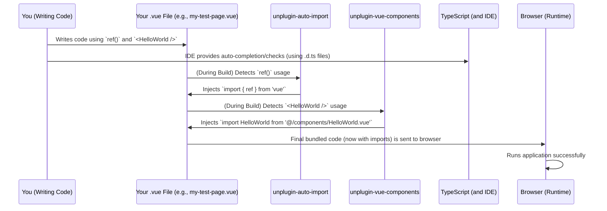

# Chapter 11: Automated Imports & Components

Welcome back! In [Chapter 10: Trading Rules & Nodes](10_trading_rules___nodes_.md), we wrapped up our deep dive into the core features of our application, understanding how our AI constructs its logic and provides transparent explanations. Throughout these chapters, you might have noticed something quite magical in our code examples: we often used powerful Vue features or custom components *without explicitly importing them*. How did that happen?

### What Problem Does Automated Imports & Components Solve?

Imagine you're building a house. Every time you want to use a hammer, you have to write a note saying "Get Hammer from Toolbox." Every time you want a nail, "Get Nail from Nail Box." This would be incredibly repetitive and slow!

In web development, many common functions (`ref`, `onMounted`) or reusable UI pieces (like a `<v-card>` from [Chapter 2: UI Framework (Vuetify)](02_ui_framework__vuetify__.md) or our own `<AppFooter>`) are used constantly. Traditionally, at the top of every single Vue file, you'd have to write lines like:

```typescript
import { ref } from 'vue'; // For reactive variables
import { onMounted } from 'vue'; // For running code when a component loads
import MyCustomButton from '@/components/MyCustomButton.vue'; // For a custom button component
```

This is called **boilerplate code** – repetitive, standard code that you have to write over and over again. It clutters your files, takes up time, and can be a source of errors if you forget an import.

**Automated Imports & Components** solves this problem by acting like a super-smart assistant. Instead of you manually writing those import notes, special tools in our project *automatically detect* when you use a common Vue function or one of our custom components. They then *automatically add the necessary import statements* behind the scenes during the build process, so you never have to think about them.

This saves developers a huge amount of time, reduces clutter, and makes your code cleaner and easier to read.

#### Central Use Case: Using `ref` and a Custom Component Without Manual Imports

Throughout this tutorial, you've seen `ref` used to create reactive variables, and components like `<v-card>` and even our own custom components like `RuleNodeDisplay` (from [Chapter 10: Trading Rules & Nodes](10_trading_rules___nodes_.md)). Our goal for this chapter is to understand *how* we could use `ref` and a simple custom component like `<HelloWorld>` (a component that might just display "Hello World!") in a Vue file *without writing any import statements for them*.

### Key Concepts of Automated Imports & Components

Let's break down the magic behind this automated system:

1.  **Implicit Availability (The "Global Toolbox"):** Certain common functions (like Vue's `ref`, `computed`, `onMounted`, and Pinia's `defineStore`, `useAuthStore` etc.) are so fundamental that our project makes them available everywhere without needing an explicit `import`. Think of them as tools always on your workbench.

2.  **Automatic Component Registration (The "Pre-assembled LEGOs"):** Any `.vue` file you create in specific directories (like `src/components/`) is automatically recognized and registered by Vue. This means you can use `<MyButton />` in any template without importing `MyButton.vue` at the top of your `<script setup>` block. These are like pre-assembled LEGO models you can just grab and use.

3.  **Build-Time Transformation:** The "magic" doesn't happen *live* in your browser. It happens when your code is processed by our development tools (Vite, in our case) before it's sent to the browser. The tools scan your code, see you using `ref` or `<HelloWorld>`, and then *inject* the correct `import` lines into your code before it's bundled. The browser always sees the complete, correctly imported code.

4.  **TypeScript & IDE Support:** How does your code editor (like VS Code) know about these "invisible" imports and provide helpful suggestions or error checks? Our project generates special "declaration files" (`.d.ts` files). These files tell TypeScript and your editor what's implicitly available, so you still get full type safety and auto-completion benefits.

5.  **Key Plugins:** Two main plugins make this possible in our project:
    *   **`unplugin-auto-import`**: Handles the automatic importing of functions (like `ref`, `onMounted`, `defineStore`).
    *   **`unplugin-vue-components`**: Handles the automatic importing and registration of Vue components (like custom components or Vuetify's `v-card`).

### How to Use Automated Imports & Components (Solving the Use Case)

Let's revisit our central use case: using `ref` and a custom component like `<HelloWorld>` without manual imports.

Imagine you have a new page, `src/pages/my-test-page.vue`, and you've created a simple component, `src/components/HelloWorld.vue`.

#### 1. Create a Simple Custom Component: `src/components/HelloWorld.vue`

```vue
<!-- src/components/HelloWorld.vue -->
<template>
  <div class="hello-world">
    <p>Hello from a reusable component!</p>
  </div>
</template>

<script setup lang="ts">
  // No imports needed here!
</script>

<style scoped>
.hello-world {
  padding: 10px;
  border: 1px solid #ccc;
  border-radius: 5px;
  background-color: #f9f9f9;
  margin-top: 10px;
}
</style>
```
*   Notice: There are *no* `<script setup>` imports here. `unplugin-vue-components` takes care of making this component globally available.

#### 2. Use `ref` and `<HelloWorld>` in a Page: `src/pages/my-test-page.vue`

```vue
<!-- src/pages/my-test-page.vue -->
<template>
  <v-container>
    <h1>Automated Imports Demo</h1>
    
    <p>Count: {{ count }}</p>
    <v-btn @click="increment">Increment</v-btn>

    <!-- Using our custom component without explicit import -->
    <HelloWorld />
  </v-container>
</template>

<script setup lang="ts">
  // ✨ Notice! We don't need to import 'ref' or 'HelloWorld' here!
  // import { ref } from 'vue'; // NOT NEEDED
  // import HelloWorld from '@/components/HelloWorld.vue'; // NOT NEEDED

  const count = ref(0); // Using ref directly

  function increment() {
    count.value++;
  }
</script>
```
*   `const count = ref(0);`: We use `ref()` directly, as if it were a globally available function. `unplugin-auto-import` will automatically add `import { ref } from 'vue';` during the build process.
*   `<HelloWorld />`: We use our custom component directly in the template. `unplugin-vue-components` will automatically add `import HelloWorld from '@/components/HelloWorld.vue';` during the build.
*   `v-container` and `v-btn`: Similarly, these Vuetify components also benefit from `unplugin-vue-components` auto-importing, as explained in [Chapter 2: UI Framework (Vuetify)](02_ui_framework__vuetify__.md).

This simplicity is the core benefit: you focus on writing your application's logic and UI, and the build tools handle the repetitive importing tasks.

### Internal Implementation: How it Works Behind the Scenes

The "magic" behind automated imports and components happens at the build stage, before your code ever reaches the browser. Special plugins integrated into our project's build system (Vite) modify your code.

#### The Automation Workflow



In this sequence:
1.  **You (the Developer)** write Vue code naturally, using `ref`, `onMounted`, or custom components like `<HelloWorld>`, *without* writing any explicit import statements.
2.  Your **TypeScript Compiler** (and IDE, like VS Code) *still understands* what `ref` and `HelloWorld` are, thanks to special `.d.ts` files that are automatically generated (we'll see these next). This provides valuable auto-completion and error checking.
3.  During the **build process** (when you run `npm run dev` or `npm run build`), `unplugin-auto-import` scans your `<script setup>` blocks. When it sees `ref()`, it automatically adds `import { ref } from 'vue';` to that file's `<script setup>` block.
4.  At the same time, `unplugin-vue-components` scans your `<template>` blocks. When it sees `<HelloWorld />`, it automatically adds `import HelloWorld from './components/HelloWorld.vue';` to the file's `<script setup>` block.
5.  The final, *modified* code (which now contains all the necessary import statements) is then bundled and sent to the **Browser**.
6.  The **Browser** runs the application, completely unaware that you didn't manually write those imports!

#### Deep Dive into the Code

The actual configuration for these plugins is handled in our `vite.config.ts` file, but for a beginner tutorial, it's more important to see the *results* of this configuration in the generated files.

1.  **Automatic Imports for Functions: `src/auto-imports.d.ts`**
    This file is *automatically generated* by `unplugin-auto-import`. It tells TypeScript that certain functions are available globally, even without an explicit import.

    ```typescript
    // src\auto-imports.d.ts (excerpt - DO NOT MODIFY MANUALLY)
    declare global {
      // ... many other auto-imports ...
      const defineStore: typeof import('pinia')['defineStore']
      const onMounted: typeof import('vue')['onMounted']
      const ref: typeof import('vue')['ref']
      const computed: typeof import('vue')['computed']
      const useRoute: typeof import('vue-router')['useRoute']
      const useRouter: typeof import('vue-router')['useRouter']
      // ...
    }
    // for type re-export
    declare global {
      // @ts-ignore
      export type { Ref } from 'vue' // Also exports types like Ref
      import('vue')
    }
    ```
    *   `declare global { ... }`: This tells TypeScript that the following declarations are available everywhere in your project.
    *   `const ref: typeof import('vue')['ref']`: This line is key! It declares that a constant `ref` exists globally, and its type is the same as the `ref` function imported from the `vue` library. This is how your editor knows what `ref` is, even if you don't explicitly import it.
    *   Similarly, `defineStore`, `onMounted`, `computed`, `useRoute`, and `useRouter` (which you've seen heavily in [Chapter 6: State Management (Pinia Stores)](06_state_management__pinia_stores__.md) and [Chapter 1: Routing & Navigation](01_routing___navigation_.md)) are all made globally available this way.

2.  **Automatic Imports for Components: `src/components.d.ts`**
    This file is *automatically generated* by `unplugin-vue-components`. It tells TypeScript about all the Vue components available in your `src/components/` directory (and others, like Vuetify components).

    ```typescript
    // src\components.d.ts (excerpt - DO NOT MODIFY MANUALLY)
    declare module 'vue' {
      export interface GlobalComponents {
        AppFooter: typeof import('./components/AppFooter.vue')['default']
        ConfigEditor: typeof import('./components/advisor/ConfigEditor.vue')['default']
        HelloWorld: typeof import('./components/HelloWorld.vue')['default'] // Our example component!
        RouterLink: typeof import('vue-router')['RouterLink'] // Vue Router's built-in component
        VBtn: typeof import('vuetify/components')['VBtn'] // Example of a Vuetify component
        // ... more components ...
      }
    }
    ```
    *   `declare module 'vue' { ... }`: This extends Vue's global component interface.
    *   `HelloWorld: typeof import('./components/HelloWorld.vue')['default']`: This line declares that `HelloWorld` is a valid global component, and its type is derived from the `HelloWorld.vue` file. This is how your editor gives you auto-completion when you type `<Hello` in your template and checks if you're using it correctly.
    *   You can also see other components like `AppFooter`, `ConfigEditor`, and even specific Vuetify components like `VBtn` (which is `v-btn` in your template) being recognized here.

3.  **Project `README.md` and `src/components/README.md`:**
    Our project's top-level `README.md` mentions that it "Leverage the latest Vue 3 and Vuetify 3 for a modern, reactive UI development experience," which implies these developer-friendly tools. More specifically, `src/components/README.md` explicitly describes `unplugin-vue-components`:

    ```markdown
    --- File: src\components\README.md ---
    # Components

    Vue template files in this folder are automatically imported.

    ## 🚀 Usage

    Importing is handled by [unplugin-vue-components](https://github.com/unplugin/unplugin-vue-components). This plugin automatically imports `.vue` files created in the `src/components` directory, and registers them as global components. This means that you can use any component in your application without having to manually import it.

    The following example assumes a component located at `src/components/MyComponent.vue`:

    ```vue
    <template>
      <div>
        <MyComponent />
      </div>
    </template>

    <script lang="ts" setup>
      //
    </script>
    ```

    When your template is rendered, the component's import will automatically be inlined, which renders to this:

    ```vue
    <template>
      <div>
        <MyComponent />
      </div>
    </template>

    <script lang="ts" setup>
      import MyComponent from '@/components/MyComponent.vue'
    </script>
    ```
    This `README.md` directly confirms and illustrates exactly what we've discussed: you write less, and the tool does the heavy lifting of injecting the imports.

4.  **`env.d.ts` for Global References:**
    Finally, the `env.d.ts` file ensures that these generated type files are included in our project's global type definitions, so TypeScript always knows about them.

    ```typescript
    --- File: env.d.ts ---
    /// <reference types="vite/client" />
    /// <reference types="unplugin-vue-router/client" />
    /// <reference types="vite-plugin-vue-layouts-next/client" />
    ```
    While `auto-imports.d.ts` and `components.d.ts` aren't directly listed here, they are typically picked up by TypeScript automatically if they are in the project root or configured paths, or explicitly referenced in `tsconfig.json`. The principle is the same: these `/// <reference>` directives ensure all necessary type information (including from these auto-generated files) is available to your development environment.

These automatically generated files, combined with the build-time plugins, are the powerful engine that makes your development experience smooth and efficient.

### Conclusion

In this chapter, we've demystified **Automated Imports & Components**. We learned that this system eliminates tedious boilerplate by automatically injecting import statements for common Vue functions (`ref`, `onMounted`) and custom components (like `<HelloWorld>`) during the build process. This is powered by tools like `unplugin-auto-import` and `unplugin-vue-components`, which significantly clean up your code, save development time, and maintain full type safety and IDE support through generated `.d.ts` files.

This final foundational chapter completes our tour of the `frontend` project's architecture. From routing and UI to state management, API communication, and the AI's core logic, we've covered the essential building blocks that make this application powerful and a pleasure to develop.

Thank you for joining this tutorial! You now have a solid understanding of how the `frontend` project is structured and operates.

---

Generated by [AI Codebase Knowledge Builder](https://github.com/The-Pocket/Tutorial-Codebase-Knowledge)